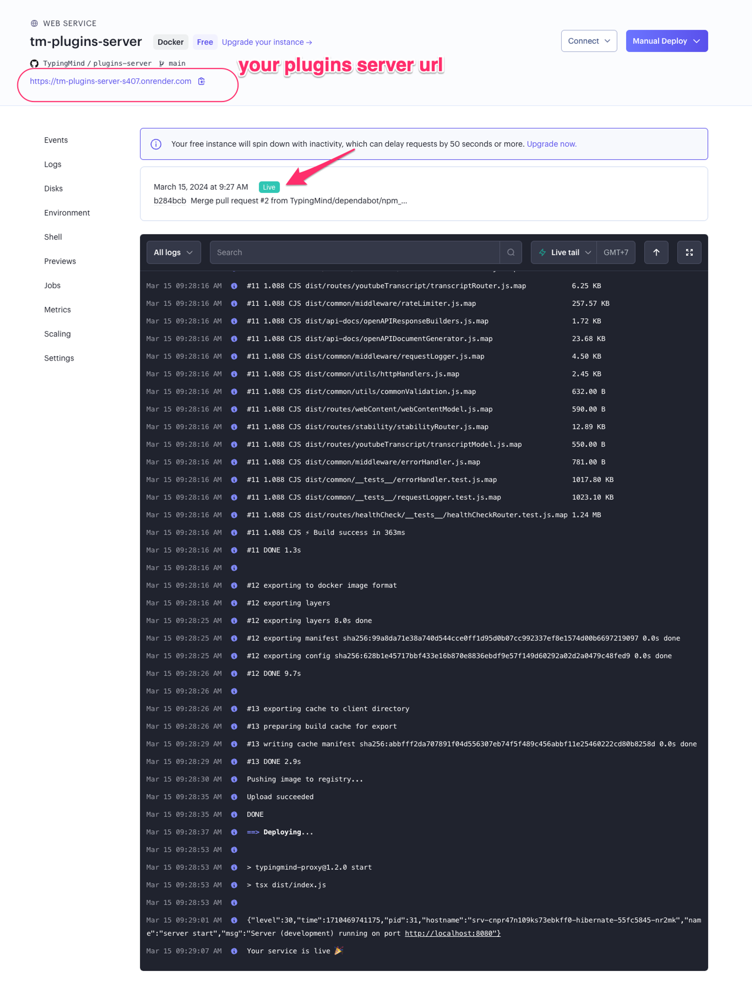

# Web Page Reader

You can use Web Page Reader plugin to let the AI models read the content of your provided URLs and analyze or summarize it.

Here’s how to set it up on TypingMind.

- This plugin requires a plugin server to be set up. Here’s the detailed guideline on setting up a Plugin server via Render: [https://docs.typingmind.com/plugins/plugins-server/how-to-deploy-plugins-server-on-render](https://docs.typingmind.com/plugins/plugins-server/how-to-deploy-plugins-server-on-render)

- After completing your setup, please copy your plugin server URL into Web Page Reader settings to use the plugin

Here’s an example chat:

