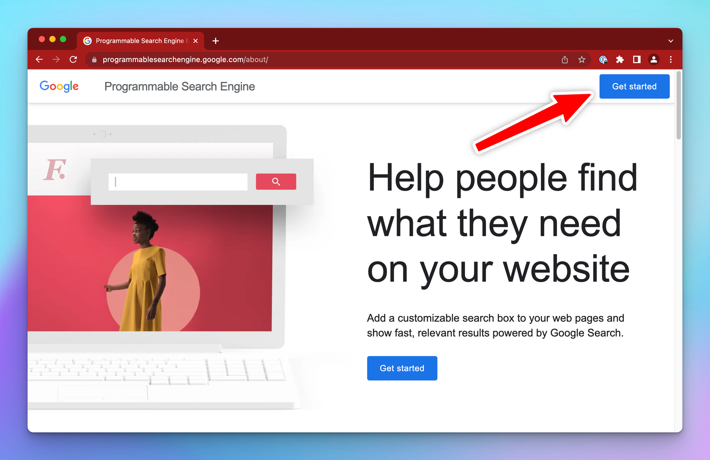
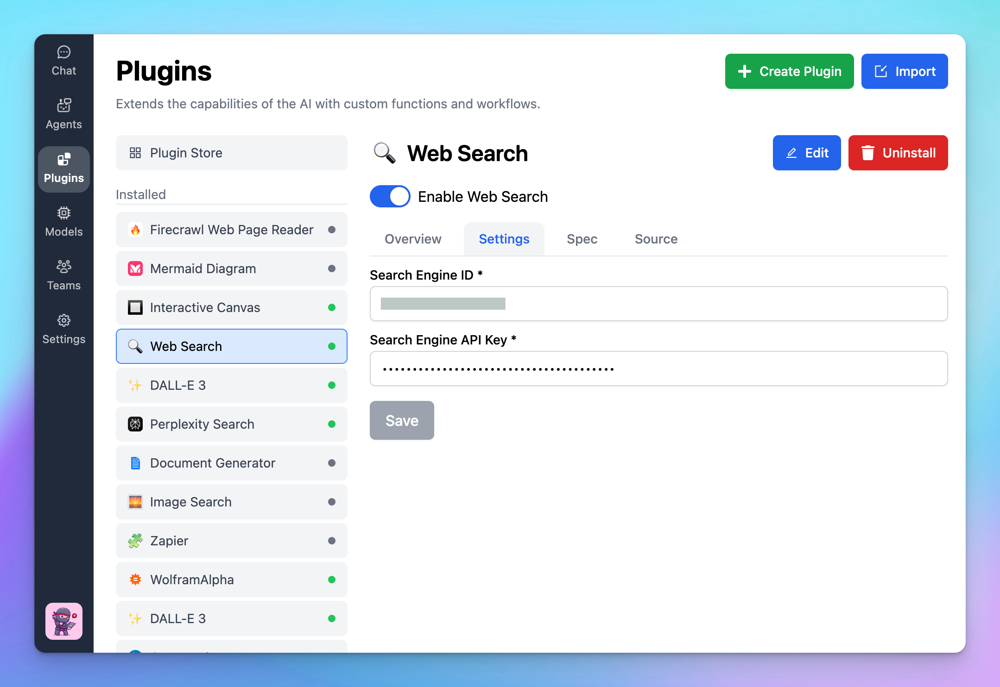

To enable the Web Search feature on [TypingMind.com](http://TypingMind.com) with the Programmable Search Engine, you need to get the following info:

- Search Engine ID.
- Custom Search API Key.

Here is how to do it.

1. Go to [https://programmablesearchengine.google.com](https://programmablesearchengine.google.com/about/), click **Get Started.**

1. Create a new search engine and give it a name

In the **Want to search?** section, select **Search the Entire web**

1. Once your new search engine is created, click **Customize**

1. **Copy the search engine ID** and save it into a safe place for later use on TypingMind

1. Scroll down, under the **Search features** section, enable **both Image Search and Web Search.**

1. Scroll down to “**Programmatic Access**” and click “**Get started**”

1. Click “**Get a Key**” to get your search API key

1. **Create a new project**

1. Click **Next**, an API key will be generated, copy and also save into a safe place.

1. **Enter the Search Engine ID and API key on TypingMind**

- Click the **Plugin** menu on the left workspace bar
- Choose **Web Search** to open the plugin settings
- Switch to the tab **Settings** and enter your Search **Engine ID and API key**.

<aside>
  🚨

  `“Error: Plugin execution failed: Error: Requests from referer null are blocked.”`

  If you encounter this error even when you set up the key and search ID properly, please kindly check if there’s any restriction to your API key:

  
</aside>