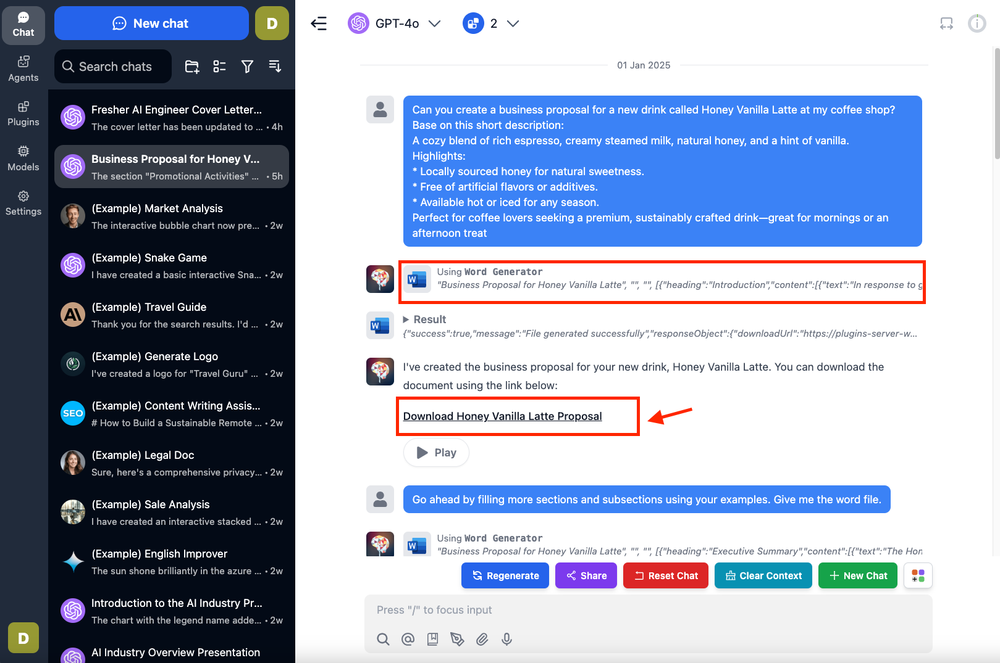
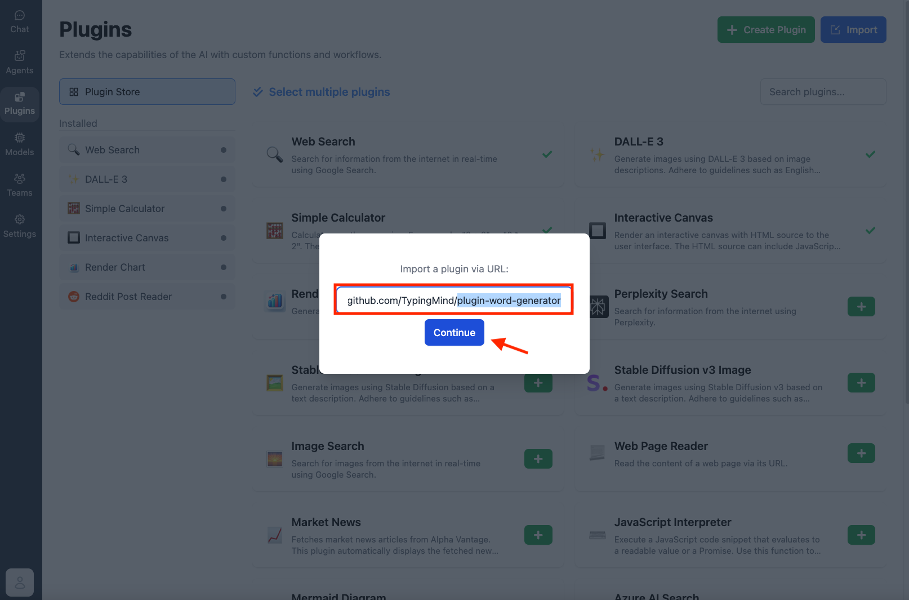
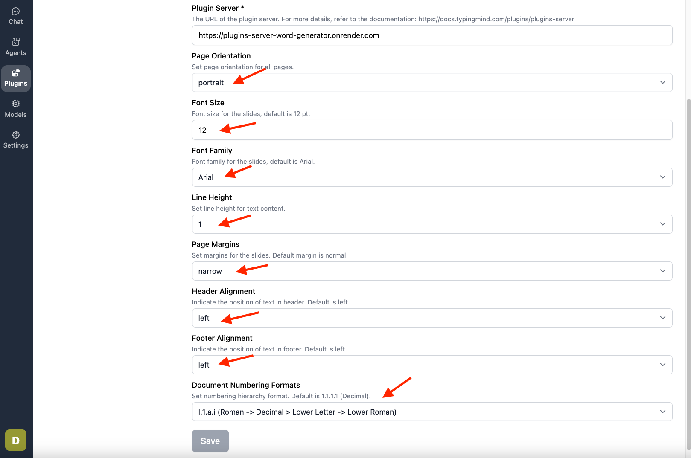
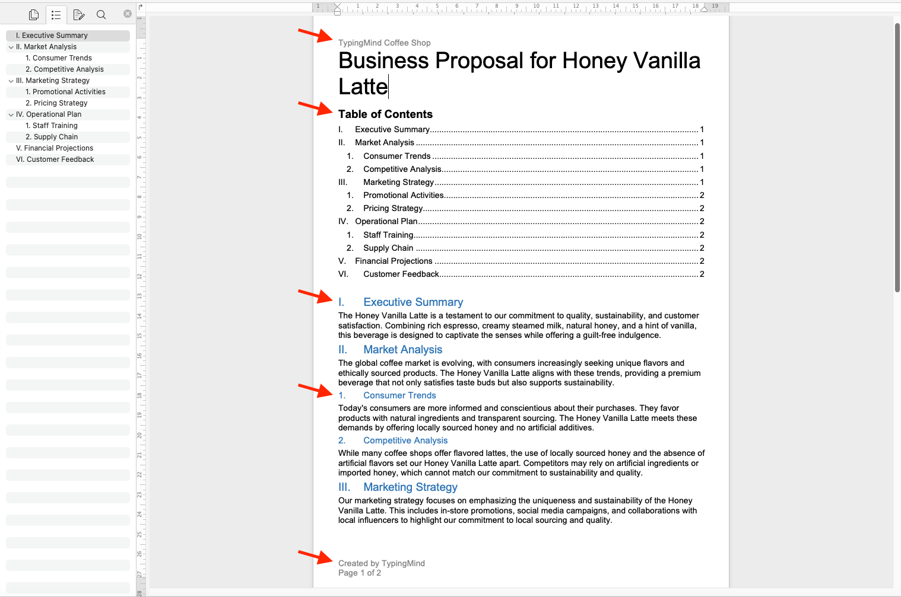

<Warning>
  Plugin has been removed because it relied on a legacy plugin server. Please use Code Sandbox to generate files instead.
</Warning>

This plugin enables you to generate Word documents straight from your conversations. This tutorial will guide you through the setup process step by step. 

After completing this guide, you will learn how to generate Microsoft Word documents (.docx) like the business proposals example below.

Let's get started!

## **Step 1: Set up Plugin Server**

Before using this plugin, you will need to set up a [Plugin Server](https://docs.typingmind.com/plugins/plugins-server). 

For step-by-step instructions on setting up a plugin server through Render, visit: https://docs.typingmind.com/plugins/plugins-server/how-to-deploy-plugins-server-on-render

## **Step 2: Set up the plugin on TypingMind**

- Go to [**typingmind.com**](http://typingmind.com/)
- Click on the **Plugins** menu on the left side panel
- Import the plugin from this Github Repository: [https://github.com/TypingMind/plugin-word-generator](https://github.com/TypingMind/plugin-word-generator) or directly install “Word Generator” from the plugin store

- Enable the Plugin —> go to Plugin Settings —> enter your **Plugin Server URL** from step 1.

- You can also configure the document settings (optional):
    - Select portrait or landscape page orientation
    - Choose page margin presets: Normal, Narrow, or Wide
    - Set line height (Single, 1.15, 1.25, 1.5, or Double)
    - Adjust font size
    - Select font family
    - Configure header numbering format
    - Set text alignment for headers and footers

### **Step 3: Start Creating Your Documents**

- Let's ask the AI to create a proposal for a new drink called "Honey Vanilla Latte," which is shown in the introduction image. The plugin will help you create a downloadable link in the AI responses so you can download quickly.

- You can modify the document content in several ways, including
    - Adding sections and subsections to organize your content.
    
    
    
    - Adding tables to the document
    
    
    
    - Enable header numbering, add custom header/footer text, and display page numbers
    
    
    
    - Adding a table of contents to the first page
    
    
    
    - Adding page breaks to better organize your content
    
    
    
- Here is your final document. Let's take a look!

### **Important Notes**

- The generated Word files will be automatically removed after one hour. Make sure to download your documents before they expire.
- Upcoming features and enhancements under development:
    - Embedding images
    - Adding statistical charts
    - Supporting multiple columns
    - Adding citations and footnotes

TypingMind Plugin is a powerful system. To learn more about it, read our documentation at

Share your ideas at our [Awesome TypingMind Github Repo](https://github.com/TypingMind/awesome-typingmind)