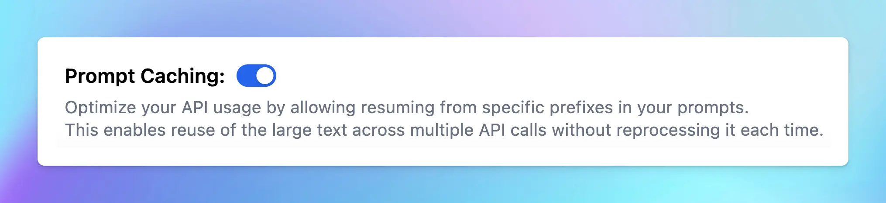

Prompt Caching allows users to make repeated API calls more efficiently by reusing context from recent prompts, resulting in a reduction in input token costs and faster response times.

The Prompt Caching option is now available for Claude, OpenAI and Google Gemini models.

## **Challenges with Current AI Context Handling**

Previously, when interacting with an AI model, the entire conversation history must be sent to the LLM for each new query to maintain the conversation context for the AI model.

This repetitive processing may lead to slower responses, increased latency, and higher operational costs, especially during long conversations or when dealing with complex tasks.

Using the prompt caching feature, you can pass some content to the model once, cache the input tokens, and then refer to the cached tokens for subsequent requests.

## **How Prompt Caching Works**

**Prompt Caching** improves AI efficiency by allowing Claude, OpenAI or Google Gemini to store and reuse stable contexts, such as system instructions or background information.

When you send a request with Prompt Caching enabled:

1. The system checks if the start of your prompt is already cached from a recent query.
2. If it is, the cached version is used, speeding up responses and lowering costs.
3. If not, the full prompt is processed, and the prefix is cached for future use.

This is especially useful for recurring queries against large document sets, prompts with many examples, repetitive tasks, and long multi-turn conversations.

By reusing cached information, the AI models can focus on new queries without reprocessing the entire conversation history, enhancing accuracy for complex tasks, especially when refining previous outputs.

## Time to Live (TTL) for Cache Storage

- [For OpenAI:](https://platform.openai.com/docs/guides/prompt-caching) cached prefixes generally remain active for 5 to 10 minutes of inactivity. However, during off-peak periods, caches may persist for up to one hour.
- [For Claude:](https://docs.anthropic.com/en/docs/build-with-claude/prompt-caching) the cache has a 5-minute lifetime, refreshed each time the cached content is used.
- [For Gemini](https://ai.google.dev/gemini-api/docs/caching?lang=python#generate-content): the default TTL is 1 hour.

## Supported Models

With Claude, Prompt Caching is currently supported on:

- Claude 3.5 Sonnet
- Claude 3 Haiku
- Claude 3 Opus

With OpenAI, Prompt Caching is supported on the latest version of:

- GPT-4o
- GPT-4o mini
- o1-preview
- o1-mini
- Fine-tuned versions of the above models.

With Google Gemini, Context / Prompt Caching is currently supported on:

- Gemini 1.5 Pro
- Gemini 1.5 Flash

<aside>
  💡

  **Note:** Support for prompt caching is continuously evolving. While this list includes the latest models at the time of writing, **new model releases may add or change caching behavior**.
</aside>

## **Why Use Prompt Caching?**

### For Claude

With Prompt Caching for Claude models, you can get up to **85% faster response times for cached prompts** and potentially **reduce costs by up to 90%.**

Discounts are as follows:

- Claude 3.5 Sonnet: 90% off input tokens, 75% off output tokens
- Claude 3 Opus: 90% off input tokens, 75% off output tokens
- Claude 3 Haiku: 88% off input tokens, 76% off output tokens

<aside>
  💡 *Please note: while creating the initial cached prompt incurs a 25% higher cost than the standard API rate, subsequent requests using the cached prompt will be up to 90% cheaper than the usual API cost.*
</aside>

Prompt Caching Costs

Reduce cost and latency

Here’s what you need to know:

- The cache has a lifetime (TTL) of about 5 minutes. This lifetime is refreshed each time the cached content is used.
- The minimum cachable prompt length is 1024 tokens for Claude 3.5 Sonnet and Claude 3 Opus, and 2048 tokens for Claude 3.0 Haiku (support for caching prompts shorter than 1024 tokens is coming soon)
- You can set up to 4 cache breakpoints within a prompt.

### For OpenAI

You can get a 50% discount on input tokens when using cached prompts. Plus, it can also reduce up to 80% in latency!

Here’s what you need to know:

- The minimum catchable prompt length is 1024 tokens and increases in increments of 128 tokens.
- Cached prefixes generally remain active for 5 to 10 minutes of inactivity. However, during off-peak periods, caches may persist for up to one hour.

### For Gemini

Gemini has a complex pricing structure with costs including:

- Regular input/output costs when the cache is missed
- 75% discount on input costs when the cache is used
- Cache storage costs

Unlike OpenAI and Anthropic, Gemini charges for cache storage. For details, refer to [here](https://cloud.google.com/vertex-ai/generative-ai/pricing#context-caching), and for an example cost calculation, visit [this page](https://cloud.google.com/vertex-ai/generative-ai/pricing#example-cached-cost-calculation).

Some important notes:

- The _minimum_ input token count for context caching is 32,768, and the _maximum_ is the same as the maximum for the given model.

## **How Prompt Caching Can Be Used?**

Prompt caching is useful for scenarios where you want to send a large prompt context once and refer back to it in subsequent requests:

This is especially useful for:

- **Analyze long documents**: process and interact with entire books, legal documents, or other extensive texts without slowing down.
- **Help in coding**: keep track of large codebases to provide more accurate suggestions, help with debugging, and ensure code consistency.
- **Set up hyper-detailed instructions**: allow for the inclusion of numerous examples to improve AI output quality.
- **Solve complex issues**: address multi-step problems by maintaining a comprehensive understanding of the context throughout the process.

More applications can be referred at [Prompt Caching with Claude](https://www.anthropic.com/news/prompt-caching) and [Prompt Caching with OpenAI](https://cookbook.openai.com/examples/prompt_caching101)

## **How To Enable Automatic Prompt Caching on TypingMind**

If you are using Prompt caching for OpenAI models, then you do not need to take any further action. **The prompt caching will be automatically applied on the latest versions of GPT-4o, GPT-4o mini, o1-preview and o1-mini.**

If you are using Prompt caching for Claude and Gemini models, here’s the detail guidelines:

- Go to **Model Settings**
- Expand the **Advanced Model Parameter**
- Scroll down to enable the “**Prompt Caching**” option

<aside>
  💡 Important notes:

  * Avoid using Prompt Caching with Dynamic Context via API, as changing system prompts cannot be cached.
</aside>

## Best Practices for Using Prompt Caching

To get the most out of prompt caching, consider following these best practices from OpenAI:

- Place reusable content at the beginning of prompts for better cache efficiency.
- Prompts that aren't used regularly are automatically removed from the cache. To prevent cache evictions, maintain consistent usage of prompts.
- Regularly track cache hit rates, latency, and the proportion of cached tokens. Use these insights to fine-tune your caching strategy and maximize performance.

## **Final Thought**

Prompt Caching can bring huge benefits that can resolve core limitations in other AI models.

By reducing the need for repetitive processing, Prompt Caching helps improve efficiency, reduce costs, and unlock new possibilities for how AI can be applied in real-world scenarios.