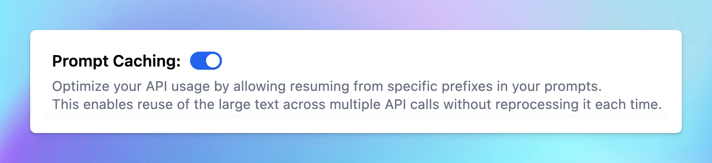

Prompt Caching allows users to make repeated API calls more efficiently by reusing context from recent prompts, resulting in a reduction in input token costs and faster response times.

The Prompt Caching option is now available for Claude, OpenAI and Google Gemini models.

## Challenges with Current AI Context Handling

When interacting with an AI model, the relevant conversation history and instructions need to be sent with each new query so the model can maintain context.

For long conversations or complex tasks, repeatedly processing the same context may lead to higher input token costs and slower responses.

With Prompt Caching, supported AI providers can reuse stable prompt content from recent requests instead of processing it again from scratch.

## How Prompt Caching Works

**Prompt Caching** helps AI models reuse stable context, such as system instructions, large documents, background information, examples, or earlier conversation turns.

When you send a request with Prompt Caching enabled or supported automatically:

1. The provider checks whether the beginning of your prompt matches recently cached content.
2. If a matching prompt prefix is found, the cached tokens are reused.
3. If no match is found, the request is processed normally, and eligible content may be cached for future requests.

This is especially useful for recurring queries against large document sets, prompts with many examples, repetitive tasks, and long multi-turn conversations.

To improve cache hits, keep stable content at the beginning of your prompt and place changing content, such as new user questions, toward the end.

## Time to Live (TTL) for Cache Storage

Cache lifetime varies by provider and model:

- [For OpenAI:](https://developers.openai.com/api/docs/guides/prompt-caching) cached prefixes using in-memory retention generally remain active for 5 to 10 minutes of inactivity, up to a maximum of 1 hour. Some newer models also support extended cache retention for up to 24 hours.
- [For Claude:](https://docs.anthropic.com/en/docs/build-with-claude/prompt-caching) the default cache lifetime is 5 minutes and is refreshed each time the cached content is reused. Claude also supports a 1-hour cache duration at additional cost.
- [For Gemini:](https://ai.google.dev/gemini-api/docs/caching) prompt caching is handled automatically on supported Gemini models. There is no configurable or documented TTL, and cache hits are more likely when requests with similar prefixes are sent within a short period of time.

## Supported Models

Prompt Caching support changes over time as providers release new models and retire older ones. Refer to each provider's official documentation for the latest model-specific availability.

### OpenAI

OpenAI Prompt Caching is automatically available for supported recent models, starting with GPT-4o and newer model families. Prompt Caching applies to eligible prompts of at least 1,024 tokens.

### Claude

Claude Prompt Caching is supported on current Claude model families, including supported Claude Opus, Sonnet, and Haiku models.

The minimum cacheable prompt length depends on the specific Claude model.

### Google Gemini

Google Gemini Prompt Caching Automatically enabled by Google for Gemini 2.5 and newer models.

## Why Use Prompt Caching?

### For Claude

With Prompt Caching for Claude models, repeated input context can be processed at a significantly lower cost.

For the default 5-minute cache:

- Writing content to the cache costs 25% more than standard input tokens.
- Reading cached content costs 10% of the standard input token price.
- The cache lifetime is refreshed each time the cached content is reused.

<Frame>
  
</Frame>

Here’s what you need to know:

- The default cache lifetime is 5 minutes and is refreshed whenever the cached content is reused.
- The minimum cacheable prompt length varies by model.
- You can set up to 4 cache breakpoints within a prompt.

### For OpenAI

OpenAI Prompt Caching is applied automatically on supported models when an eligible prompt is sent.

OpenAI states that Prompt Caching can reduce input token costs by up to 90% and latency by up to 80%, depending on the model and cache hit.

Here’s what you need to know:

- The minimum cacheable prompt length is 1,024 tokens.
- Cache hits require an exact matching prompt prefix.
- Stable content should be placed at the beginning of the prompt to improve cache efficiency.
- Cached token usage is included in the API response for supported requests.
- Cache retention depends on the model and selected retention policy.

### For Gemini

Gemini has a complex pricing structure with costs including:

- Regular input/output costs when the cache is missed
- 75% discount on input costs when the cache is used
- Cache storage costs

Unlike OpenAI and Anthropic, Gemini charges for cache storage. For details, refer to [this page](https://cloud.google.com/vertex-ai/generative-ai/pricing#context-caching), and for an example cost calculation, visit [this page](https://cloud.google.com/vertex-ai/generative-ai/pricing#example-cached-cost-calculation).

Some important notes:

- The _minimum_ input token count for context caching is 32,768, and the _maximum_ is the same as the maximum for the given model.

## How Prompt Caching Can Be Used?

Prompt caching is useful for scenarios where you want to send a large prompt context once and refer back to it in subsequent requests:

This is especially useful for:

- **Analyze long documents**: process and interact with entire books, legal documents, or other extensive texts without slowing down.
- **Help in coding**: keep track of large codebases to provide more accurate suggestions, help with debugging, and ensure code consistency.
- **Set up hyper-detailed instructions**: allow for the inclusion of numerous examples to improve AI output quality.
- **Solve complex issues**: address multi-step problems by maintaining a comprehensive understanding of the context throughout the process.

More applications can be referred at [Prompt Caching with Claude](https://www.anthropic.com/news/prompt-caching) and [Prompt Caching with OpenAI](https://cookbook.openai.com/examples/prompt_caching101)

## How To Enable Automatic Prompt Caching on TypingMind

If you are using supported OpenAI models, you do not need to take any further action. Prompt Caching is automatically applied by OpenAI when your prompt is eligible.

If you are using Prompt caching for Claude and Gemini models, here’s the detail guidelines:

- Go to **Models in the left sidebar.**
- Expand the **Advanced Model Parameter**
- Scroll down to enable the “**Prompt Caching**” option

<Warning>
  Important notes:

  - Avoid using Prompt Caching with Dynamic Context via API, as changing system prompts cannot be cached.
</Warning>

## Best Practices for Using Prompt Caching

To get the most out of prompt caching, consider following these best practices from OpenAI:

- Place reusable content at the beginning of prompts for better cache efficiency.
- Prompts that aren't used regularly are automatically removed from the cache. To prevent cache evictions, maintain consistent usage of prompts.
- Regularly track cache hit rates, latency, and the proportion of cached tokens. Use these insights to fine-tune your caching strategy and maximize performance.

## Final Thought

Prompt Caching can bring huge benefits that can resolve core limitations in other AI models.

By reducing the need for repetitive processing, Prompt Caching helps improve efficiency, reduce costs, and unlock new possibilities for how AI can be applied in real-world scenarios.