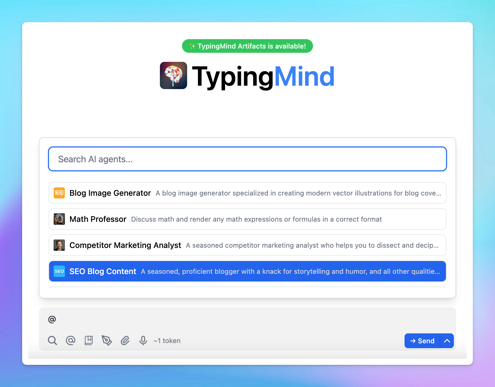

When working on **TypingMind**, using **Message Syntax** provides a quick and efficient way to help you input your messages faster.

These syntaxes act as shortcuts to help reduce manual effort and streamline the process of feeding inputs to the AI.

## 1. Mention AI Agent syntax

- **Format:** `@[agent name]`
- **Purpose:** this syntax is used to mention or tag a specific AI agent in the message. When you type `@` followed by the agent's name, the AI Agent will be brought into the conversation.
- **When to use**: when you want to bring the AI Agent into a conversation to help for specific tasks. This can be used within the regular messages or queued messages (for [Prompt Chaining](Prompt%20Chaining%208df56c7b52e347218ac657a998c8015f.md))
- **Example:** `@[Marketing Expert], can you help create a business plan for this quarter?`



## 2. Queue message syntax

- **Format:** `----`
- **Purpose:** this is used to separate different sections of a queue, especially in more complex interactions involving multiple steps.
- **When to use**: typically used in [Prompt chaining](Prompt%20Chaining%208df56c7b52e347218ac657a998c8015f.md), where multiple prompts are lined up for sequential execution.
- **Example:**

```markdown
**Task 1: Complete the report
----**
Task 2: Schedule a meeting
```


## 3. Template variable syntax

- **Format:** `{{variable_name}}`
- **Purpose:** used within message templates to define and refer to specific variables. By placing the variable name inside double curly braces `{{}}`, the system knows that this is a placeholder for dynamic content.
- **When to use:** used for Prompt templates - which allows you to create flexible and reusable prompts. You can also use the **Tab** key to quickly jump between variables when filling out templates.
- **Example:**

<aside>
  💬

  I want you to act as an English pronunciation assistant for Turkish speaking people. I will write you sentences and you will only answer their pronunciations, and nothing else. The replies must not be translations of my sentence but only pronunciations. Pronunciations should use Turkish Latin letters for phonetics. Do not write explanations on replies. My first sentence is **"'\{\{your content}}'”**
</aside>


We will continuously update the message syntax list to help your chat experience even better!

## 4. Search syntax

Type `/` to quickly search for AI Agents, Prompts, or Open AI Model Settings.

