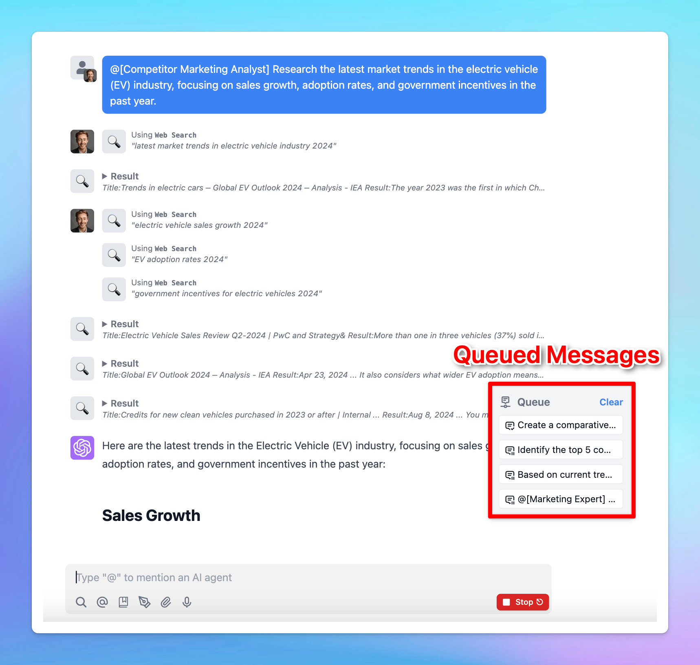

# Prompt Chaining

Prompt chaining feature on TypingMind has been upgraded!

Now, not only can you chain simple prompts, but you can also bring different AI Agents into your workflow to create an automated system to streamline complex tasks. 

This option allows you to generate workflows for multiple AI agents to make the process of solving tasks faster and more efficient, and enhance the model reasoning to get more accurate and relevant answer.

## What is Prompt Chaining?

**Prompt chaining on TypingMind** is a method that allows you to link multiple prompts together in a sequence, so that when one AI response is completed, the next prompt is automatically triggered. 

Instead of manually entering each new prompt after the AI provides an answer, prompt chaining automates this process to provide you with smoother and faster interactions.



This significantly boosts the AI's reasoning abilities and saves you from time-consuming back-and-forth interactions.

And we call this “Flow.”

## How does Flow for Prompt Chaining work on TypingMind?

There are two ways to activate Flow for prompt chaining on TypingMind:

- At the bottom right of the message area, within the send button, click the toggle icon and select "Queue message."


- Or, simply use the syntax `----` (four dashes) to queue your next message.


One of the most exciting part is the ability to involve multiple AI agents in your workflow by mentioning **@[AI Agent name]**:

- You can direct specific agents to take charge of different parts of your workflow.
- Each agent brings its own settings like AI models, parameters, and plugins to the table to allow you to create more powerful, dynamic processes.


## Use cases

### 1. For content automation

We will create a prompt chain where:

- Step 1: Write a product description
- Step 2: Mention @[SEO Blog Content] to help write a blog about this product optimized for SEO, targeting keywords
- Step 3: Mention @[Blog Image Generator] to help create a blog cover image for that article


### 2. For research automation

We will create a prompt chain where:

- Step 1: Mention @[Competitor Marketing Analyst] to help gather market trends in a specific industry (e.g., electric vehicles).
- Step 2: visualize the gathered data.
- Step 3: analyze potential competitors based on the trends.
- Step 4: generate insights and predictions for future growth.
- Step 5: Mention @[Marketing Expert] to help provide actionable recommendations for a business strategy.


## Key facts and best practices for optimizing “Flow” usage on TypingMind

### **1. Save and re-use chains**

Add your chain of prompts to the [Prompt Library](https://www.notion.so/Prompt-library-9a8683f866754a9e831202fa791a637a?pvs=21) for easy access and re-use. To quickly find a saved prompt, type `/` in the message input box and search by its name.


### **2. Mention syntax (`@`)**

To mention an AI Agent, use the format `@[exact agent name]`. The name inside the brackets must be case-sensitive and an exact match to the agent in your library. If two agents share the same name, the first one in the list will be selected.

When typing `@`, your AI Agent list will automatically pop up, which allows you to search and select the agent you need easily.


<aside>
💡

Please note that the mention syntax also works in regular messages or prompts, not just in queued messages.

</aside>

### **3. One agent per message within a queue**

You can only mention one agent per message.


### **4. Optimize Agent settings**

Each AI agent works with its own settings, including its AI model, parameters, dynamic context, and plugins, you can optimize these settings separately for each agent to ensure it can deliver high-quality responses.


## For TypingMind Team: Create Prompt Chain Templates For Your Members

Currently, you have the ability to implement prompt chaining at the Admin Level, which allows you to build a customizable prompt chain template for your team members. This also allows them to easily adapt the template to their own specific use cases.

**To set up prompt chaining that works best for your team members**, you can use the variable syntax `{{variable_name}}`. This creates placeholders in your prompts that can be filled with context-specific information. For example:

```
Step 1: write blog content for {{topic}}
----
Step 2: generate a cover image for this article
----
Step 3:....
```


<aside>
💡

Your members can use the Tab key to quickly jump between variables when filling out templates.

</aside>

After finalizing your prompt chain, it can be added directly to your Prompt Library, where your users can access these prompts for usage. Please note that you have full control over [prompt access](../TypingMind%20Team/Branding%20and%20Customizations/Build%20a%20Shared%20Prompt%20Library%2014c8456cf11843c88e429abe1e64c7c0.md) and [usage restrictions](../TypingMind%20Team/Branding%20and%20Customizations/Restrict%20Prompt%20Access%206c7993b8f2074e189f8787b689784242.md) for your team members.