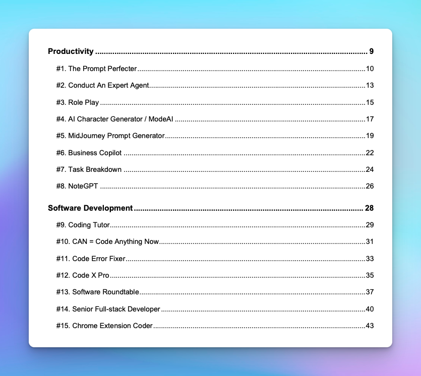

# Prompt Examples

Some ready-to-use prompts that are built by TypingMind team or collected from multiple sources. There are 2 main sources that our team will update pre-built prompts:

## Prompt Ebook

Ebook: “**50+ Super Advanced ChatGPT Prompts: Expertly Tested & Proven for Success"** 

This eBook including 50+ ChatGPT Advanced Prompts with 8 categories:

- **Productivity** – Save time and increase your output
- **Software development** – Help developers work more efficient
- **Business decision -** Provide insights for better decision-making
- **Marketing strategy -** Build effective marketing plans tailored to target audiences.
- **Marketing content creation -** Create engaging, tailored content for various
    
    platforms
    
- **Copywriting -** Generate persuasive and compelling copies to boost conversions
- **Entertainment -** Just for funny things or entertainment purposes
- **Learn something new -** Offer learning resources based on your interests

<aside>
💡 Free Download: [https://typingmind.com/ebook](https://typingmind.com/ebook)

</aside>

We will continuously update new prompts into the ebook! 

## Blog Post

We also update pre-built prompts on our blog page at [blog.typingmind.com](https://blog.typingmind.com/). 

Here’s an example: [https://blog.typingmind.com/9-proven-successful-chatgpt-prompts-for-marketing](https://blog.typingmind.com/9-proven-successful-chatgpt-prompts-for-marketing)

