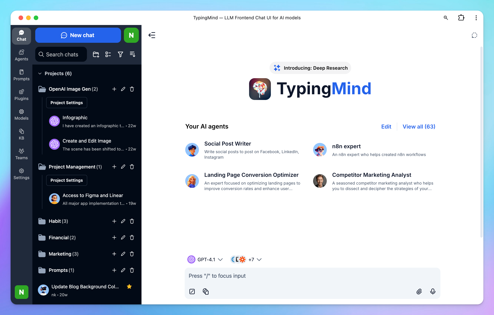

# Get started with TypingMind

## What is TypingMind?

[TypingMind.com](http://TypingMind.com) is a dedicated chat interface designed to make working with large language models (LLMs) like ChatGPT, Claude, Gemini or open-source models easier, more flexible, and more organized. Instead of switching between different apps or websites, you can connect your own API keys and access everything in one unified platform.

### **1. Fully-featured Chat Interface**

- **Chat Organization** – Create folders, add tags, and search across all past conversations.
- **Conversation Forking** – Branch off a chat into a new direction without losing the original thread.
- **Multi-Tab Support** – Keep several chats open at once, like browser tabs.
- **Search Within Chats** – Quickly find specific content inside long conversations.
- **Projects -** Manage your workspace with **Projects** to better organize your work. Each Project serves as a container for related chats, files, and prompts, making it easy to separate different areas of focus.
- **Artifacts** - Preview your code implementation via a dedicated panel that renders outputs directly inside the chat

### 2. Model Management

- **Multi-Model Support** – Connect and use different LLMs (OpenAI ChatGPT, Anthropic Claude, Google Gemini, Mistral, Grok, OpenRouter, Azure OpenAI, and more) in one place.
- **Model Switching** – Swap models instantly within a conversation or workspace.
- **Multi-model Chat** - Chat with multiple models in parallel to compare the outputs and find the best-performing models for your use cases
- **Custom Parameters** – Adjust temperature, frequency penalty, presence penalty, etc. per model.
- **API Key Integration** – Add your own API keys for direct access to LLM providers.

### 3. Build your Prompt Library or Agent collection

- **Prompt Library** – Save, organize, and reuse custom prompts for repeated workflows.
- **AI Agent** - Build AI assistants with custom instruction and training data

### 4. Interact with your documents/knowledge base

- **File Uploads** – Attach documents or videos for the model to reference directly within the conversation
- **Connect your knowledge base via external sources** - Connect with your Google Drive, Notion, Github, etc. or directly upload your files to the knowledge hub so AI can retrieve your knowledge base for relevant answers.

### 5. Integrations & Extensibility

- **Plugin Support** – Extend AI functionality with external tools. For example, search real-time information via Web Search, generate and edit images via GPT Image Editor, create interactive elements from your code with Interactive Canvas, etc.
- **Custom Tools** – Build your custom plugins by integrating with your own APIs or workflows.
- **Model Context Protocol (MCP)** - Connect to external tools through MCP servers like Notion, Zapier, Make, and Atlassian.

### 6. Privacy & Data Control

- **Local Storage by Default** – All chats are saved on your device, not on TypingMind’s servers.
- **Optional Cloud Sync** – Backup and access your chats across devices via TypingMind Cloud.
- **Data Export** – Export conversations or entire workspaces for backup or migration.

## Get started with TypingMind

Get started with TypingMind in just a few simple steps!

### **Step 1: Activate License key and enter API keys to get the app working**

#### **1. Activate your License Key**

You can use the app without a license key, but you won't have access to advanced features, such as:

- Multi-model chats
- Use plugins such as Web Search, Image Generator, etc.
- Use Projects and Artifacts
- And more!

We highly recommend purchasing a license key to unlock these features. There are three available plans: Standard, Extended, and Premium.  [View a quick comparison among these plans](TypingMind%20License%20Plans%20225b9e3717314cf6b1539cae5f34ac51.md).

Once you've made your purchase, the license key will be automatically added and activated on your device, unlocking advanced features based on the plan you choose.

To manage and retrieve your license key, visit [Manage License Key](../Manage%20License%20&%20Devices%20182d2a8c7a0c4f31883327e2b769eb3b.md)

### **2. API Keys**

To start chatting with AI models on TypingMind, you'll need to enter your API keys.

TypingMind supports a variety of AI models, including:

- [Models from OpenAI](../Manage%20&%20Connect%20AI%20Models/OpenAI%20\(GPT-5,%20GPT-4%201\)%2097b6ce8cbb6642a9934e81f7b7365575.md): o1-preview, o1-mini, GPT-4o, GPT-4 Mini, GPT-4 family, GPT-3.5 family and other latest OpenAI models.
- [Models from Anthropic](../Manage%20&%20Connect%20AI%20Models/Anthropic%20Claude%20a13efc63000c4dbcb1629507a52e4cf9.md): Claude 3.5 Sonnet, Claude 3 family, and other latest Claude models.
- [Models from Google](Get%20started%20with%20TypingMind%20fa103fd29211485f8fad739f24e9bd0a.md): Gemini 1.5 Flash 002, Gemini 1.5 Pro 002, and all other latest models from Google.
- [Models from other AI providers](https://docs.typingmind.com/manage-and-connect-ai-models): Mistral, DeepSeek, Grok, etc. (need custom setup - official support soon)

<aside>
  💡

  **Note**: You get the API key directly from the AI provider, not for each specific model. For example, if you want to use all GPT models, you only need to enter the API key from OpenAI.
</aside>

After obtaining the API keys for these models, head over to [TypingMind.com](http://typingmind.com/) and follow these steps to enter them:

- Click on **Models** at the left sidebar
- Click on the gear icon next to the AI provider you want to connect with to configure your API keys

- Enable models you want to use.

<aside>
  💡 **Important notes:**

  * You will need to top up API credits within each AI provider's console to activate a paid account and use their API key.
  * You can check here: [https://docs.typingmind.com/manage-and-connect-ai-models](https://docs.typingmind.com/manage-and-connect-ai-models) for detailed guide on how to add API keys from the models you want to use.
  * Note that:
    * An OpenAI API paid account is different from a ChatGPT Plus subscription. [Learn more](https://blog.typingmind.com/higher-usage-cap-for-gpt-4/).
    * Claude API paid account is also separate from the Claude AI subscription. [Learn more](https://blog.typingmind.com/bypass-claude-ai-usage-limit/).
    * You **do not** need a ChatGPT Plus or Claude AI subscription to use TypingMind.
</aside>

## **Step 2: Sync & Backup your data (optional)**

Your data is saved locally on your browser by default and you are not required to enable cloud sync option.

However, to protect your data against potential loss, we recommend you to use TypingMind Cloud to backup your chats. This will not only secure your data but also allow for synchronization between devices.

When you log into the app via email, it means you enable Cloud Sync for your account:

This cloud sync feature allows you to:

- Save your data including chats, prompts, agents, plugins, license key, API keys and other settings
- Store up to 50MB of your data for free (extra storage can be purchased later)
- Sync your data across devices for a seamless experience

You can log out of your account to disable Cloud sync or use [TypingMind extensions](https://docs.typingmind.com/typing-mind-extensions) to connect to your own cloud storage.

Learn more on [Cloud Sync and Backups](../Cloud%20Sync%20&%20Backup/Cloud%20Sync%20&%20Backup%20Overview%20eb531bc4034e4e77824944ade959891e.md)

## **Step 3: Start your first conversation**

Once your API keys and License key are set up, you can start interacting with AI models.

- Select an AI model you want to start with. Please note that you can only access to the models that you already provided the API keys, if you have not set up API key for that model yet, you can not access and use them.
- Simply enter any questions or commands in the message area, and the AI assistant will generate responses based on the specific model you’re using (ex., GPT-5.4 or Claude 4.6 Sonnet).
- You can ask anything, from simple factual queries to complex instructions, and the assistant will respond accordingly.

**Tip:** To get the most out of your AI assistant, start with clear and concise instructions. If the response isn’t as expected, you can refine your prompt for better accuracy.

## Step 4: Guide the overall AI behavior

**System Instructions** define the AI’s behavior throughout the conversation, including its tone, personality, and scope of knowledge. Go to **Models (left workspace bar) → Global Settings** to set up System Instruction.

These instructions are configured at the start of a session and are **persistent**, meaning the AI will follow them even when old messages are forgotten due to context length limitations.

<aside>
  💡

  Unlike prompts, when you set up the system instruction, the AI model will always remember it through out the conversation, even when your context length is reached.

  * **Context length** refers to the amount of information (tokens, words, or characters) that an AI model can "remember" or process in a single conversation or interaction. In other words, it defines the maximum amount of input data (including both the user’s messages and the AI’s responses) that the model can consider when generating a response.
  * Each model has its own context length limit. The longer the context length, the more information the AI can retain in a conversation.
  * For example: If GPT-4o has a context length of 128,000 tokens, it can only take into account the last 128,000 tokens of conversation. Anything beyond this limit will be automatically "forgotten" by the model unless it's reintroduced by the user in the current interaction.
</aside>

Learn more on [System Instruction](../System%20Prompt/System%20Instruction%208226727031644d9992d16e2b2225c923.md)

## Step 5: Get more high-quality responses from AI models

If you want more refined responses or access the external tools, here are some methods:

### 1. Build your own prompt library

- Access the **Prompt Library** by clicking the Prompt menu on the left workspace bar.
- The library contains prebuilt prompts, but you can also create your own custom prompts for frequently asked questions or tasks.

Learn more about [Prompts](../Prompts/Use%20Prompt%20Library%20a4fc26777d12484eb3d185c8f95862ff.md)

Creating a prompt library allows you to save time on recurring queries and makes sure consistent responses across similar tasks.

<aside>
  💡

  **Tip:** When creating custom prompts, be specific with instructions. For example, instead of asking *"Explain machine learning,"* a more detailed prompt like *"Explain the basics of machine learning with examples of supervised and unsupervised learning"* will provide a richer and more focused response.
</aside>

### 2. Upload and chat with your documents/videos

You can also upload documents to provide the AI with specific context by clicking the **attach icon** or dragging and dropping files to message area.

When you upload a document, the AI reads and analyzes it, allowing you to ask questions related to the content of the file.

**For example:** If you upload a research paper or company report, you can ask the AI to summarize it, explain specific sections, or answer questions based on the document’s content.

Providing the AI with your own documents makes it easier to get personalized and context-aware answers, especially when dealing with complex data.

<aside>
  💡

  **Tip:** To get the most accurate results, make sure the document you upload is well-structured and relevant to the task you want the AI to help with. This approach is highly effective for knowledge-based tasks, like analyzing reports or summarizing long texts.
</aside>

Learn more about [Chat with Files or Videos](../Upload%20and%20Chat%20with%20Files%203712c130aaad48d6985385575ae33137.md)

### 3. Extend the AI assistant capabilities with Plugins

You can get the AI model to access the internet or generate images with the plugin system. You can find all the plugins by clicking on the Plugins section on the left-side panel.

Some plugins may require set up, you can refer to [Plugins](https://docs.typingmind.com/plugins) to get a more detailed guideline on how to set up each plugin, for example:

- Search the internet: [Web Search](https://docs.typingmind.com/plugins/web-search-and-image-search)
- Generate images: [GPT Image Editor](https://docs.typingmind.com/plugins/gpt-image-editor)
- Deep research your complexed tasks: [Deep Research](https://docs.typingmind.com/plugins/deep-research)
- Render charts or code: [Interactive Canvas](https://docs.typingmind.com/plugins/interactive-canvas-\(artifacts\))

You can also connect your own third party systems or MCP servers via our [Custom Plugins](https://docs.typingmind.com/plugins/build-a-typingmind-plugin)

### 4. Connect with your knowledge base system for RAG

Retrieval-Augmented Generation (RAG) is a technique that enhances Large Language Models (LLMs) by allowing them to access and incorporate external knowledge sources, like databases or documents, to generate more accurate and contextually relevant responses.

TypingMind supports a built-in RAG system with the **Knowledge Base** feature. You can upload files to TypingMind and then allow AI models to access these files and get more context to answer your questions more accurately during the conversation.

- Open TypingMind, then click the “KB” (Knowledge Base) tab.
- Click **Add Data Source** and start uploading your files or connect your data sources from Google Drive, Github, Notion, Websites, etc.

### 5. Build custom AI Assistants - AI Agents with custom instructions and training data

**AI Agents are your personal AI assistants that** allow you to create advanced setups for your custom tasks by visiting the Agents section on the left side panel.

Similar to the system instruction but AI Agent provides a more in-depth level of training where you can:

- Assign a base chat model (ex., GPT-4).
- Equip the AI Agent with plugins for web search, text-to-speech, or custom tools.
- Connect with your knowledge base or upload specific training data.
- Use few-shot learning to provide example prompts and responses to train the agent.

You can get started with our prebuilt AI Agents for your needs or your can choose to build with your own custom AI Agent.

AI Agents are great for specific, repetitive tasks where the AI needs to retain certain skills or knowledge. For example, you could build an AI Agent that specializes in customer support by uploading company FAQs and setting up relevant plugins for quick information retrieval.

Learn more on [AI Agents](../AI%20Agents/AI%20Agents%20Overview%20f325ffdfa14f4a2ba9ccb2f63f812c82.md)

## **Step 6: Organize your workspace**

The left-side panel will show up all of your chat history, you can easily:

- Drag and drop your chats into a folder
- Pin them to the top or delete them for better management and navigation later.

- or You can create **Projects** with custom instructions, model and AI Agents so all chats starting within your projects will follow the same guidelines. You can set up multiple Projects for your workspace.

Learn more on [How to organize chats](../Chat%20Management/Organize%20chats%20788fcb21625846f9af8f8d7861f0db43.md)

## **Step 7: Share your chats with everyone**

Share your chats with ease to help others learn from you, improve your prompts for better results, or pick up where you left off.

Click on the Share button right above the message area and choose the expected formats to share your chats:

- Secret link
- Markdown
- JSON
- HTML Webpage
- PDF

