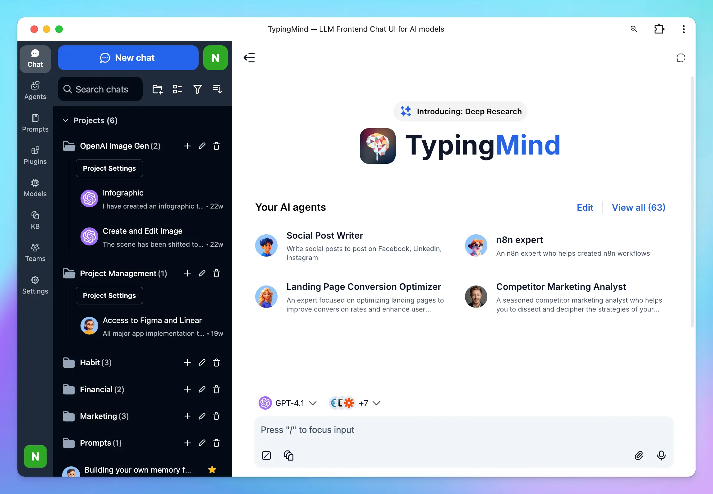

## Two main products

Currently, we are offering two main products for TypingMind:

- TypingMind License version at [typingmind.com](https://www.typingmind.com/)
- TypingMind Team version at [custom.typingmind.com](https://custom.typingmind.com/)

TypingMind License and TypingMind Custom serve different use-cases and are built to accommodate varied requirements. Let's see which solution is the best fit for your needs!

## Self-host versions

In addition to the main products, we offer a self-host version of each product with equivalent features:

- TypingMind License → TypingMind Static Self-host
- TypingMind Custom → TypingMind Custom Self-host

In total, there are 4 versions:

|  | Cloud host | Self-host |
|---|---|---|
| **License Version** | [TypingMind](https://www.typingmind.com) | [TypingMind Static Self-host](/static-self-host) |
| **Custom Version** | [TypingMind Custom](https://custom.typingmind.com) | [TypingMind Custom Self-host](https://custom.typingmind.com/features/self-host) |

## Comparison

| **Features** | **TypingMind (and Static Self-host)** | **TypingMind Team (and Team Self-host)** |
|---|---|---|
| **Link** | [typingmind.com](https://www.typingmind.com/) | [custom.typingmind.com](https://custom.typingmind.com/) |
| **Pricing structure** | One-time Purchase (starts at $39/Standard license) | Monthly Subscription (starts at $99/month to $299/month) |
| **Plans** | Standard, Extended, Premium | Starter, Growth, Professional, Custom (for Enterprises) |
| **Self-host** | Yes — Free ([Static Self-host](/static-self-host)) | Yes — Custom Quote ([TypingMind Custom Self-host](https://custom.typingmind.com/features/self-host)) |
| **Target users** | Best for Individuals | Best for Teams, Businesses |
| **Purpose** | Provides a better Chat UI to interact with different AI models, with fine-tuning options for better AI responses. See [full feature list](/feature-list). | Also provides a better Chat UI that works like TypingMind.com, but manageable via an Admin Panel. Admins can pre-set API keys, pre-build Prompts/Plugins/AI Agents, connect company knowledge, restrict member access, invite members via email, and customize themes, brain name, and custom domain. |
| **Access to [all chat features](/feature-list)** | Yes (based on [different plans](https://www.typingmind.com/pricing)) | Yes |
| **Connect to your knowledge base** | Upload documents and connect external sources (Web Scraper, Notion, Intercom, etc.) | Upload documents and connect external sources (Web Scraper, Notion, Intercom, etc.) |
| **Team management** | No | Yes (via Admin Panel) |
| **Login option** | No login needed — enter License key and API key to use the app | Email, SSO, JWT |
| **License key requirements** | Yes | No license key needed |
| **Where to buy license key?** | Can only buy from [typingmind.com](https://www.typingmind.com) (both self-host and cloud-host versions) | No license key needed |
| **Need an API key?** | Yes | Yes |
| **Number of users / devices** | 5 devices or users per license key | 5 users included by default per chat instance — additional users at $8/user/month |
| **Custom domain** | No | Yes |
| **Custom branding** | No | Yes |

## TypingMind.com

TypingMind is a professional chat UI designed to work with **multiple Large Language Models (LLMs)** such as GPT, Claude, and Gemini. It enhances your AI chat experience by giving you more flexibility and control.

With TypingMind, you can:

- Access and interact with **multiple AI models** from a single interface.
- Keep your AI workspace organized using **folders and tags**.
- Manage your work more effectively by creating **multiple projects** within the same workspace.
- Fine-tune outputs using **System Instructions, AI Agents, and Prompts**.
- Extend AI capabilities with **Plugins** to search real-time information, generate images, render charts, research complex tasks, and more.
- Connect to your own **knowledge base** for context-aware answers.

<Tip>
  Check out the [full feature list](/feature-list)
</Tip>

TypingMind license version comes in three different plans: Standard, Extended, and Premium, with a **one-time purchase** starting at $39.

To use the app, simply input your API key and License Key.

## TypingMind Team

**TypingMind Team** is built for **teams, businesses, and communities**. It delivers the same AI workspace as **TypingMind.com**, but with powerful admin tools and advanced customization via the **Admin Panel**.

With **TypingMind Team**, admins can:

- Pre-configure API keys (no license key required for users).
- Create and share **pre-built Prompts, Plugins, and AI Agents**.
- Upload large datasets or connect to external sources (e.g., **Notion, Google Drive**).
- Invite team members by email, single sign-on, OAuth 2.0, and more.
- Control **feature visibility** in the chat UI.
- Restrict access to specific resources.
- Apply a **custom domain and brand theme** for a fully branded experience.

TypingMind Team is offered as a **monthly subscription** starting at $99/month, with plans including **Starter, Growth, Professional, and Business** to suit different organizational needs.

<Tip>
  Check out [TypingMind Custom](https://custom.typingmind.com/features/get-started-on-our-cloud) for more details on what it can do.
</Tip>

## Conclusion

Choosing between TypingMind and TypingMind Custom depends on your needs, team size, and how you intend to use the AI chatbot.

- Get started with [TypingMind License](/quickstart/get-started-with-typingmind)
- Get started with [TypingMind Custom](https://custom.typingmind.com/features/get-started-on-our-cloud)

<Note>
  We offer a **14-day money-back guarantee** — feel free to dive in!
</Note>

Please contact us at [support@typingmind.com](mailto:support@typingmind.com) if you require any further assistance.