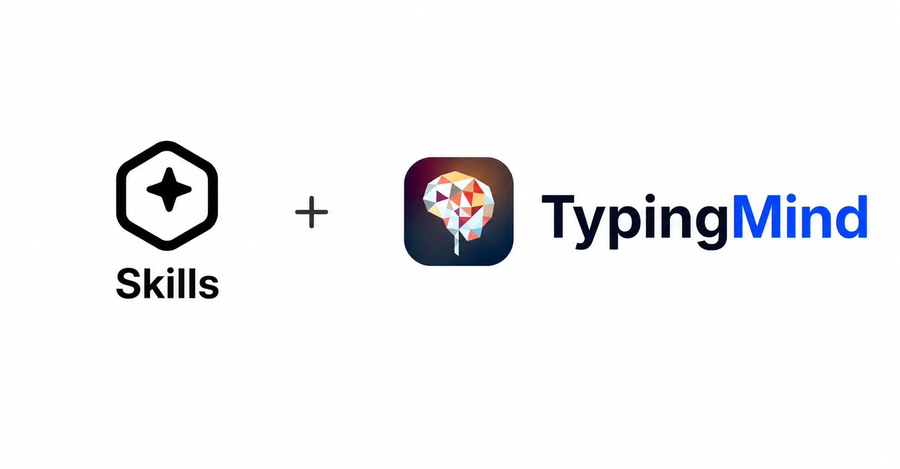
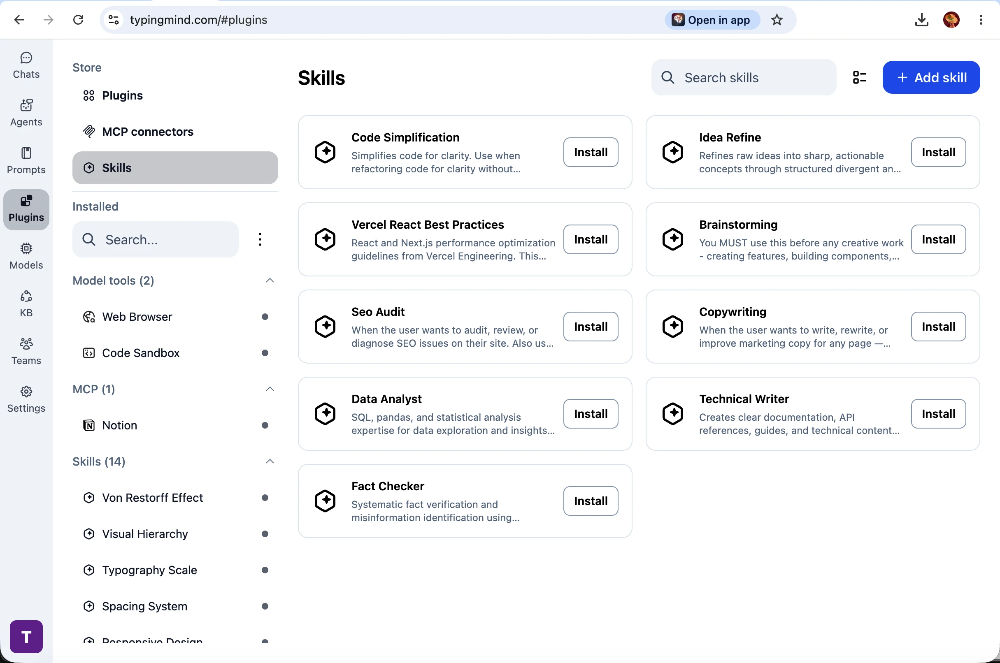
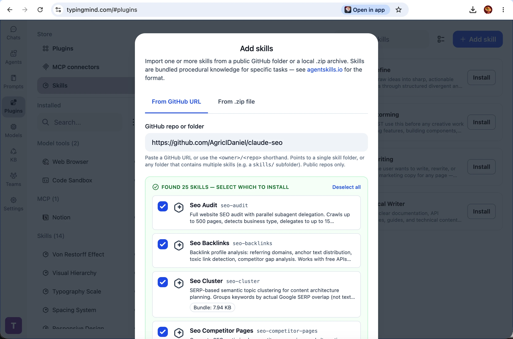
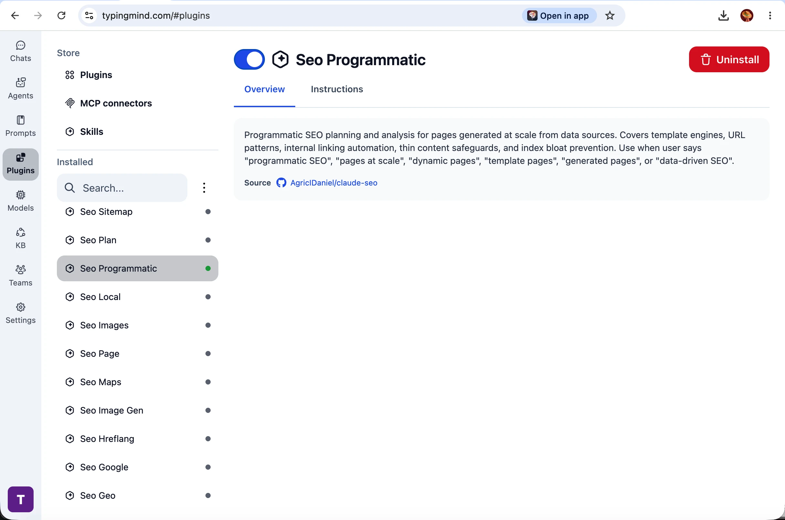
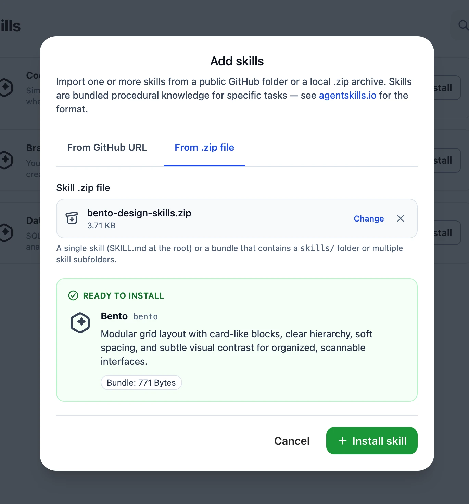
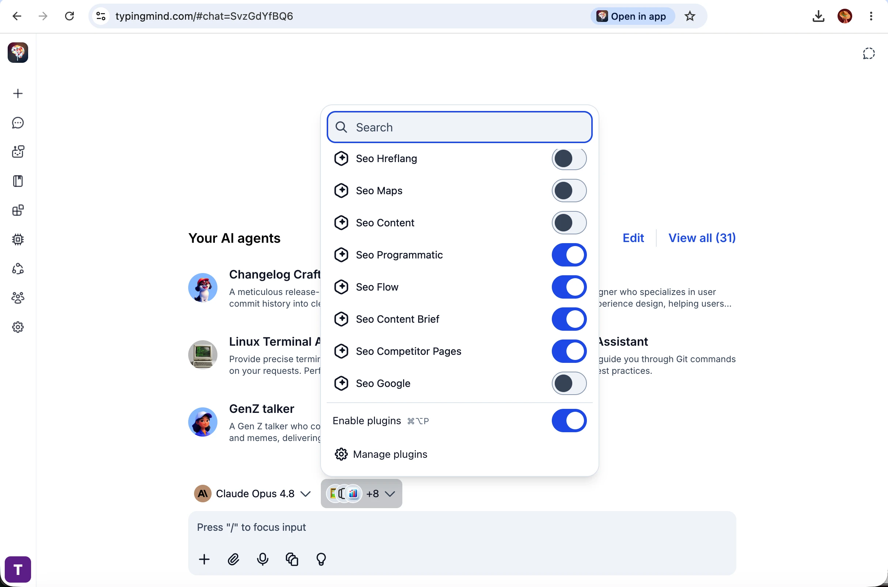
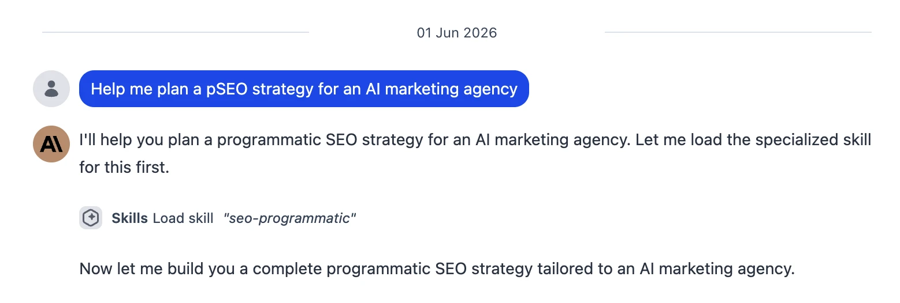
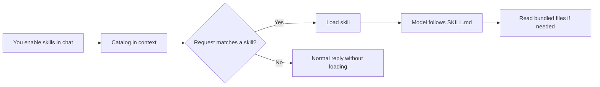

<Frame>
  
</Frame>

**Skills** are bundled procedural knowledge for specific tasks — SEO audits, copywriting, code reviews, brainstorming, and more. Each skill is a package built around a `SKILL.md` file (instructions plus optional reference files), following the open [Agent Skills](https://agentskills.io) standard.

<Info>
  Skills are supported in the **Personal** version of TypingMind only. The [Team version](https://custom.typingmind.com) does **not** support Skills at the moment.
</Info>

In TypingMind, Skills sit next to **Plugins**, **MCP connectors**, and **model tools** under **Plugins** in the sidebar. You install them once, then turn them on or off per chat when you need them. Skills load on demand — the model only reads full instructions when your task matches a skill you've enabled.

<Frame>
  <video
    controls
    className="w-full aspect-video"
    src="skills/using-skills-in-typingmind.mp4"
  >
    Your browser does not support the video tag.
  </video>
</Frame>

## Browse and install from the Skills store

TypingMind includes a **Skills** store with curated skills you can install in one click.

To open it:

- In the left sidebar, click **Plugins**
- Under **Store**, select **Skills**
- Search or scroll the grid, then click **Install** on any skill

<Frame>
  
</Frame>

To install several skills at once, use **Select multiple** (checklist icon), pick the skills you want, then confirm **Install N skills**.

<Frame>
  
</Frame>

After installation, skills appear under **Installed → Skills**. Each install is a **frozen snapshot** from the source — it does not auto-update when the store listing changes. To get a newer version, uninstall and install again.

<Frame>
  
</Frame>

## Add skills from GitHub or a .zip file

You can import community skill packs or your own private skills.

- On the Skills store page, click **+ Add skill**
- Choose **From GitHub URL** or **From .zip file**
- For GitHub: paste a public repo URL, folder URL, or shorthand like `owner/repo` (single skill folder or a folder with many skills, e.g. `skills/`)
- Click **Continue**, select which skills to install, then **Install skill** or **Install N skills**

<Frame>
  
</Frame>

<Info>
  Installing from GitHub requires you to be signed in to **TypingMind Cloud Sync** (free account). If you are not signed in, use the **From .zip file** tab instead. Only **public** GitHub repositories are supported.
</Info>

For the skill package format and how to author your own skills, see [agentskills.io](https://agentskills.io).

## Manage an installed skill

Select any skill under **Installed → Skills** to open its detail page:

- Use the **toggle** at the top to enable or disable the skill in your plugin list
- **Overview** — what the skill does, when to use it, and source link (often GitHub)
- **Instructions** — the full text the model receives when the skill loads
- **Resources** — bundled files included with the skill (if any)

Click **Uninstall** to remove a skill. Unlike custom JavaScript plugins, skills cannot be edited inside TypingMind — reinstall or re-import an updated package if you need changes.

## Use skills in a chat

Skills only run when **plugins** are enabled for the current chat.

1. At the bottom of the chat, open the **plugins** menu (next to the model selector)
2. Make sure **Enable plugins** is on (default shortcut **⌥⌘P** on Mac — check **Settings → Keyboard shortcuts** to customize)
3. Expand **Skills** and toggle on the skills you want for this conversation
4. Send your message — you do not need to type the skill name

<Frame>
  
</Frame>

If your request matches a skill’s description, the model loads it and you will see a line like **Skills → Load skill `seo-programmatic`** before the detailed answer:

<Frame>
  
</Frame>

Use **Manage plugins** at the bottom of the menu to open the full Plugins page.

### How loading works

Skills use **progressive disclosure** — TypingMind does not inject every skill’s full instructions into every message.

1. **Catalog (always on when skills are enabled)** — For each skill you turned on in the current chat, TypingMind adds a short entry (name + when to use it) to the system context.
2. **Load on demand** — When your request matches a skill, the model calls **Load skill** (for example `seo-programmatic`). You see a **Skills → Load skill** line in the conversation.
3. **Follow instructions** — The model receives the full `SKILL.md` body and follows it for the rest of the reply.
4. **Optional files** — If the skill bundles templates, examples, or data files, the model can read them via **Read skill resource** (you do not open these files yourself).

Skills are **read-only**: bundled scripts are reference material for the model, not auto-run programs on your machine.

### Limits worth knowing

- You can enable at most **50** skills per chat. If you exceed that, send a message only after disabling some skills in the plugins menu.
- Enable only skills relevant to the current task — smaller sets work better and use less context.
- Skills with large file bundles count toward your usual local and cloud storage limits.

## Sync across devices

When **TypingMind Cloud Sync** is enabled, skill metadata (name, description, instructions) syncs with your other plugin data.

Skills that include bundled files also sync their resource archive so another device can download it on first use. Sign in to Cloud Sync before installing from GitHub on any device.

## Troubleshooting

**The model never loads a skill**

- Confirm **Enable plugins** and the specific skill are toggled on in the chat plugins menu
- Read the skill **Overview** for example phrases that trigger it
- Enable fewer skills and try a more capable model

**“Too many skills enabled”**

- Disable skills in the plugins menu until no more than **50** are on for that chat

**GitHub install asks you to sign in**

- Sign in to TypingMind Cloud Sync, or download the repo as a **.zip** and use **From .zip file**

**“No skills were found”**

- Check that the URL points to a folder containing valid `SKILL.md` files and that the repo is public

**Skill files missing on another device**

- Stay signed in to sync, open Plugins or send a chat once so resources can download, or reinstall the skill
