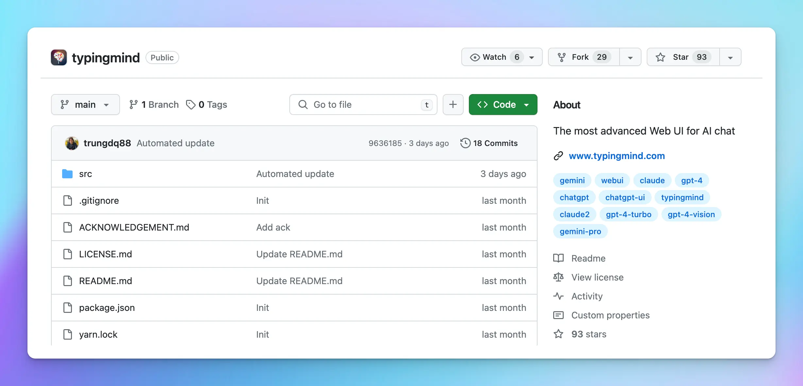

# Static Self-host Package & Updates

## Latest Feature Update:

<Tip>
  👉 **See full change log: [https://www.typingmind.com/changelog](https://www.typingmind.com/changelog)**

</Tip>

## Download the latest Self-host package

Download from GitHub: [https://github.com/TypingMind/typingmind](https://github.com/TypingMind/typingmind)

## Detailed guidelines to set up Self-host

By running the static self-host version, you can use Typing Mind from your private server or from a local device.

**GitHub Repo**: **[https://github.com/TypingMind/typingmind](https://github.com/TypingMind/typingmind)**

## Option 1: Deploy TypingMind on your server

To run the app locally on your device or private server:

1. Clone the repo
2. Install dependencies: `yarn install` or `npm install`
3. Start the server: `yarn start` or `npm run start`
4. App will run at `localhost:3000` by default.
5. To update the app, simply `git pull` and restart your server.

**Note**: if you run the app on hostnames other than `localhost`, you must use HTTPS to make sure all app features work.

## **Option 2: Deploy TypingMind on a static web cloud service**

You can upload to any static web hosting such as Netlify, Vercel, GitHub Pages, Cloudflare Pages, AWS S3, etc. to host the files. 

Here’s the detailed guidelines of deploying the app on Netlify:

1. **Fork the GitHub repo**

1. Log into [**Netlify**](https://app.netlify.com/)
2. Locate the “**Sites**” section 
3. Click on **Add New site** > choose **Import an existing project**

4. Choose **Deploy with GitHub**

5. Choose the TypingMind project that you forked in Step 1. 

6. Enter the **Site name** then scroll down to locate the “**Publish directory**” section, enter “**src**”

7. Click on “**Deploy**” to deploy TypingMind on Netlify
8. To **update the app**, go to your forked repo on GitHub and click on “**Sync fork**”, it will automatically sync the app with the latest update to your TypingMind site on Netlify. 

# **Important note**

1. You must deploy the app at the root level of your domain or subdomain. Deploying under a subfolder will not work. For example: **https://yourdomain.com/** will work, **https://chat.yourdomain.com/** will work, but **https://yourdomain.com/typingmind/** will not work.
2. You are unable to change the branding name and customize the UI.
3. The static self-host version updates are delayed from 1 or 2 versions compared to the latest versions on [www.typingmind.com](https://www.typingmind.com/)