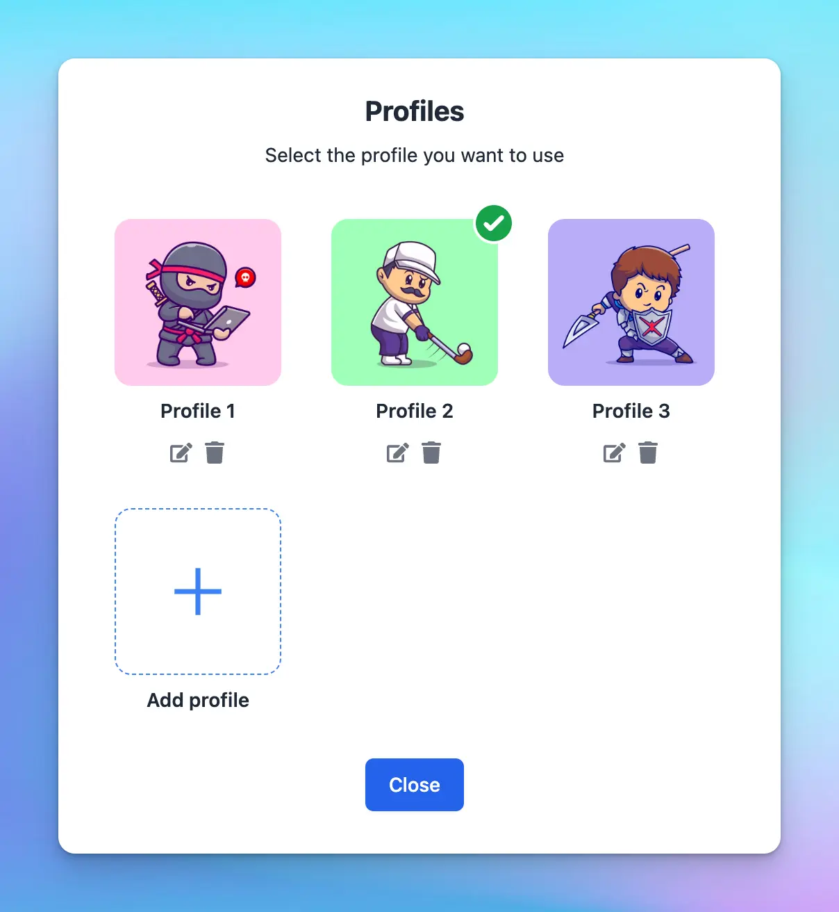

Setting up your profile in TypingMind allows the AI assistant to deliver more personalized, relevant responses according to your specific interests and work context. Let’s check out how to set it up on TypingMind!

## Set up your profile

- Go to [typingmind.com](http://typingmind.com)
- Click **on the Profile icon on the top left corner of the app (within the sidebar) to access profile settings**

<Frame>
  
</Frame>

- Click the \+ icon to add new profile

- Add necessary information:
  - Your profile name
  - Profile image URL (optional)
  - **Your information:** Enter any information you want the AI assistant to remember about you when this profile is active.
  - **Custom instruction:** Tell the AI how to respond when this profile is used.
  - **Assign API keys:** Set custom API keys for each profile. When you switch profiles, the app will automatically use the API keys assigned to the selected profile.

<Tip>
  You can set up multiple profiles on TypingMind, this allows you to switch profile easily for different use cases.

  Example use case: set up 2 profiles for:

  ✅ **Work:** include details like your job, expertise, industry, etc. Instruct the AI to reply in a professional tone. Use with your work API key.

  ✅ **Personal:** share your hobbies and personal projects. Guide the bot to use a friendly tone. Use with your personal API key.
</Tip>

## Benefits of setting up your profile

- **Personalization**: by providing information about your interests and work, the AI model can deliver more personalized and contextually relevant responses.
- **Understanding**: with your work information, the AI can tailor its advice and suggestions to suit your professional context.
- **Ease of use**: providing personal information eliminates the need to explain your background, interest or professional information in every new conversation.
- **Better conversation flow**: with the user profile set up, the AI model better understands the user context, leading to more natural, human-like conversations.

