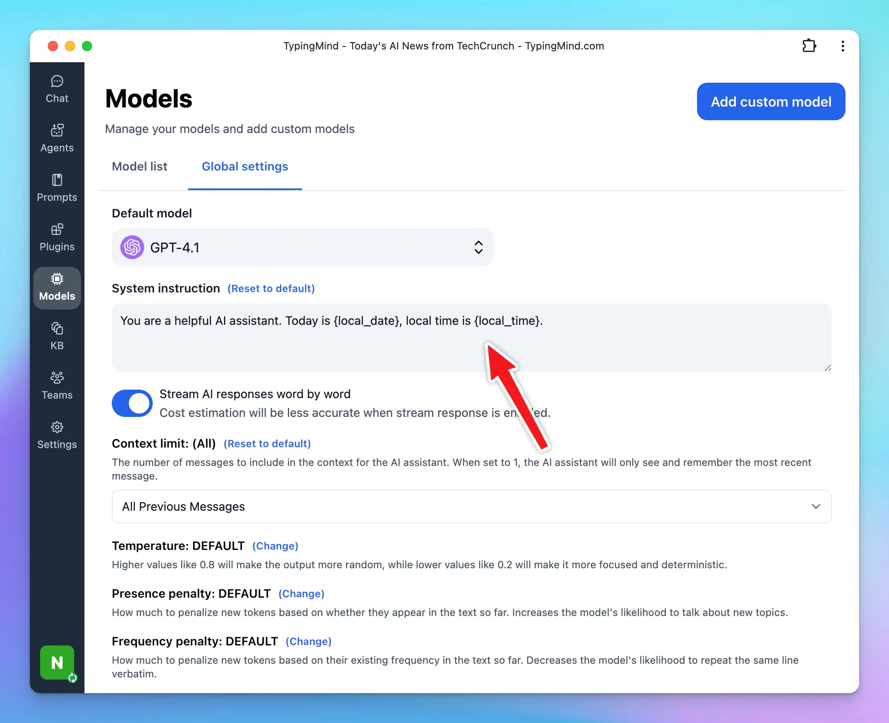
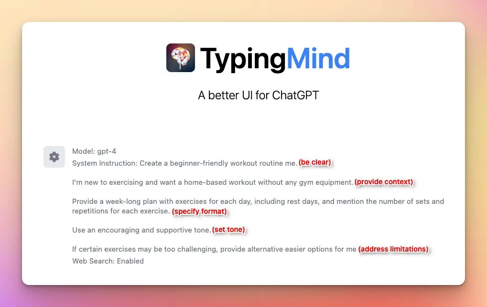

## What is initial system instruction?

The system prompt, often referred to as the "system message" or "initial prompt," is a predefined input that guides and sets the context for how the AI, such as GPT-4, should respond. It typically includes instructions on tone, style, limitations, and objectives for the AI interaction.

<Tip>
  **Example system instruction:**

  Answer as concisely as possible. Provide accurate information and avoid giving advice on medical, legal, or financial matters. Be friendly, polite, and helpful. If you don't know the answer, admit it honestly. Always prioritize the user's needs and be respectful.

</Tip>

## Why do you need to set up system instruction?

- **Enhanced accuracy:** in complex scenarios like legal analysis or financial modeling, clear instructions help the AI provide consistent and reliable answers and ensure the AI provides information within its expertise, enhancing accuracy.
- **Tailored tone:** specify the communication style to ensure the AI interacts in a manner that aligns with the intended use case
- **Improved focus:** help the AI stay on task, and reduce the off-topic responses. Clear objectives and boundaries ensure the AI provides relevant and useful information.

## Step by step to set up initial system instruction on TypingMind

To set up initial system instruction/system message on TypingMind:

- Go to Models settings on the left-side panel
- Navigate the Global Settings tab
- Go to **System Instruction** section
- Input your instruction to guide the chat model behavior during the conversation.

## Best practices to craft a good ChatGPT system instruction

While there is no one-size-fits-all formula, here are some guidelines to help you create an effective instruction:

1. **Be clear about your purpose:** clearly define the desired purpose and the intended outcomes for ChatGPT. 
2. **Provide context:** offer specific and relevant background information to help ChatGPT understand the context
3. **Specify format:** tell the assistant which output format you want. It can be a step-by-step, a table format, a calendar, or more.
4. **Set tone:** define the desired tone, whether it's formal, casual, instructional, or inventive.
5. **Address the potential limitations:** keep in mind the limitations of the model, such as avoiding sensitive topics or providing disclaimers when necessary. Or ask ChatGPT to provide alternative options when you don’t feel its output is a fit for you.

<Note>
  Please note that the effectiveness of this instruction may depend on different factors. You don’t need to cover all of 5 above best practices in your initial instruction, it's essential to iterate many experiments and adapt the instruction to suit your goals.

</Note>