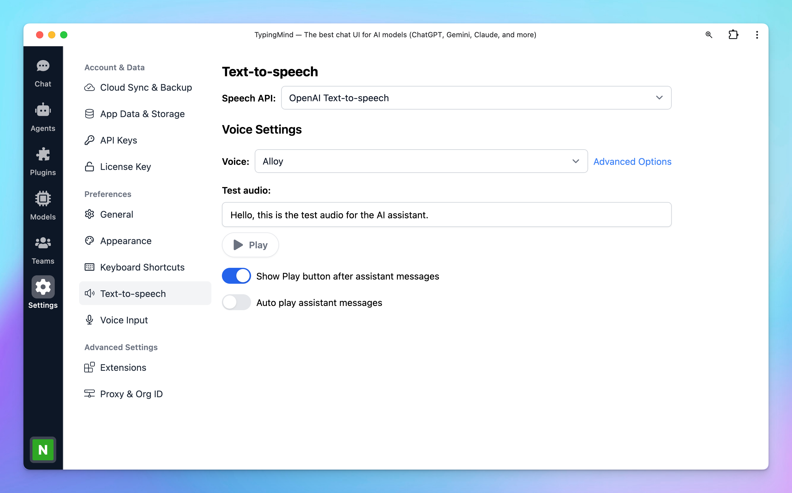
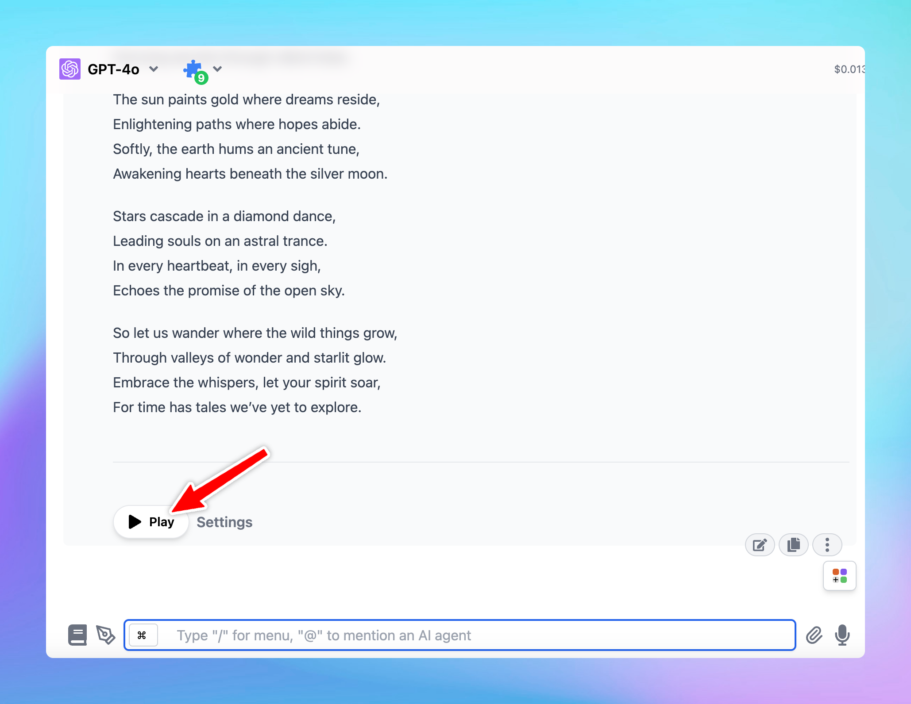

# Use Text-to-speech

Text -to-speech allows you to set up a unique voice for the AI assistant so it can convert written words into speech and communicate with you with its adjustable tone, clarity, and speed like a person.

## Step 1. Set up Text-to-speech

- Click on the **Settings** menu on the left panel
- Select **Text-to-speech** tab to set up a voice for the AI assistant

## Step 2. Select a speech provider

You need to choose a Speech API to enable text-to-speech feature, there’re currently 3 options from the drop-down options:

- Browser (Web Speech API)
- ElevenLabs
- OpenAI Text-to-speech

### **Browser (Web Speech API)**

This option doesn’t require an API key and can be used for free, just choose a voice and start a conversation.

<aside>
💡

Please note that the available voices will also depend on the browser you are using.

</aside>

### **ElevenLabs**

To use voices on ElevenLabs, you will need an API key:

Here’s how to get the API key from ElevenLabs:

- Sign up for ElevenLabs: [https://elevenlabs.io/app/sign-up](https://elevenlabs.io/app/sign-up)
- Click on your profile picture on the bottom left corner of the app and select API keys (or you can directly go to [https://elevenlabs.io/app/settings/api-keys](https://elevenlabs.io/app/settings/api-keys))

- Copy the API Key to TypingMind and click “Check key” to see if the key is working or not.

The ElevenLabs Text-to-speech provides different speech models that are optimized for different purposes. You can select the available models on TypingMind. Click on Advanced options to toggle more settings to select the ElevenLabs models:

Please check the details here: [https://elevenlabs.io/docs/speech-synthesis/models](https://elevenlabs.io/docs/speech-synthesis/models) 

<aside>
💡 Please note that if your usage surpasses the free limit provided by ElevenLabs API, it is necessary to upgrade to a ElevenLabs’ paid plan.

</aside>

### **OpenAI Text-to-speech**

Use voices from OpenAI also requires an OpenAI API key:

This will use your OpenAI API key that you entered via Settings —> API Keys section. If you have already entered the API key outside, then there’s no settings needed for this.

## Step 3. Let the AI speak!

After you done the setup, you can start a conversation, when you receive the AI response, there will be a Play button right below the answer so you can play the audio for the AI assistant manually.

<aside>
💡

Please note that you can:

- Enable/disable the Play button
- Allow auto-play AI message so you don’t need to click manually

</aside>

And that’s it, you’re all set.