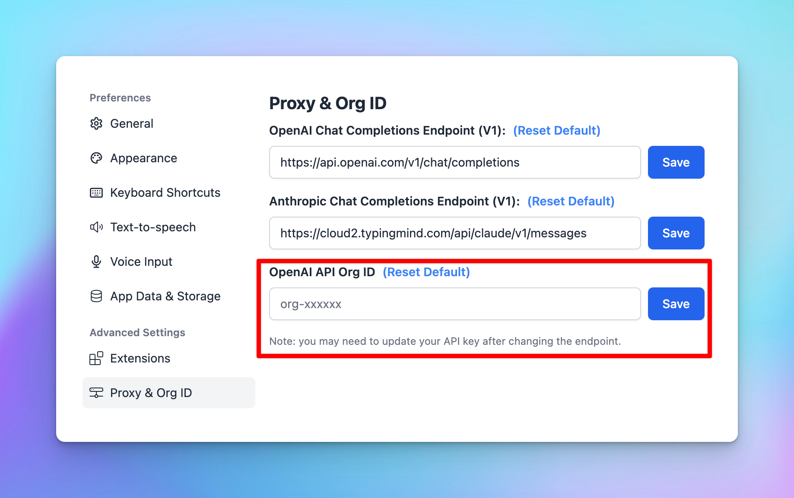

Experiencing issues with our app? Below, you'll find some common issues and our suggested solutions to help you resolve them quickly.

<aside>
💡 Last updated: 19 Mar, 2024

</aside>

# 1. OpenAI API Issues

## **API Key Not Working?**

`Your API key is not working. You need a **paid API account** on OpenAI in order to use the ChatGPT API Key (the free trial won't work). To verify that you have a paid API account, go here and make sure you have your billing info added: https://platform.openai.com/account/billing/overview. Note that you **do not** need to have a ChatGPT Plus subscription, it's **not needed**. If you already have a paid OpenAI account, check to see if you still have sufficient credits. Also, try creating a new API key and trying again. If this problem persists, please contact support.`

**Reason:** Issue with your OpenAI API account **-** Ensure you have a paid OpenAI account (do not need a ChatGPT Plus subscription since OpenAI API and ChatGPT Plus are billed separately.

**Solution:** Please go to [https://platform.openai.com/account/billing/overview](https://platform.openai.com/account/billing/overview) to set up your prepaid billing.

## Unable to access GPT-4

`Sorry, OpenAI has rejected your request. Here is the error message from OpenAI: The model `gpt-4` does not exist or you do not have access to it. Learn more: [https://help.openai.com/en/articles/7102672-how-can-i-access-gpt-4](https://help.openai.com/en/articles/7102672-how-can-i-access-gpt-4).`

**Reason**: Seems your OpenAI credit balance has been run out. 

**Solution**: Please go to [https://platform.openai.com/account/billing/overview](https://platform.openai.com/account/billing/overview) to add extra credit to your OpenAI account.

## **Exceeded Quota (Error Code 429)**

`Error Code 429 - You exceeded your current quota, please check your plan and billing details.`

**Solution:** Please check out the article provided by OpenAI and try their solutions to see if it works: [https://help.openai.com/en/articles/6891831-error-code-429-you-exceeded-your-current-quota-please-check-your-plan-and-billing-details](https://help.openai.com/en/articles/6891831-error-code-429-you-exceeded-your-current-quota-please-check-your-plan-and-billing-details)

## **No such organization error**

`Sorry, OpenAI has rejected your request. Here is the error message from OpenAI: No such organization: sk-….`

**Reason**: This error usually occurs if an API key is incorrectly entered as an organization ID

**Solution:**

- If your API Key is tied to an organization, please check here: [https://platform.openai.com/account/organization](https://platform.openai.com/account/organization) to see if you fill the org ID correctly or not
- If your API Key doesn't tie to any organization, then just remove your API key and leave it empty as following screenshot:

# 2. Claude API

`“Could not connect to Anthropic API. Please try again later. Error code:400”`

**Reason**: This issue may appear when your credit balance is too low to access the Claude API.

**Solution**: Please check and add your credit balance at [https://console.anthropic.com/settings/plans](https://console.anthropic.com/settings/plans)

Since the reason for this issue may vary, please contact [support@typingmind.com](mailto:support@typingmind.com) if you believe the suggested reason above is not the root cause of your issue.

# 3. OpenRouter models

`Invalid API key. Please check your API key and try again.`

**Solution:** Please check your OpenRouter credit balance at [https://openrouter.ai/account#credits?](https://openrouter.ai/account#credits?)

If the credit balance is too low, please top up your credit balance to continue using the app with OpenRouter models.

# 4. Use Custom Models

`*Something went wrong. This could be a temporary network connection issue. Please try again or contact support. Opening the console might help clarifying the issue. Technical details: {"object":"error","message":{"detail":[{"type":"extra_forbidden","loc":["body","presence_penalty"],"msg":"Extra inputs are not permitted","input":0,"url":["https://errors.pydantic.dev/2.5/v/extra_forbidden"](https://errors.pydantic.dev/2.5/v/extra_forbidden)},{"type":"extra_forbidden","loc":["body","frequency_penalty"],"msg":"Extra inputs are notpermitted","input":0,"url":["https://errors.pydantic.dev/2.5/v/extra_forbidden"](https://errors.pydantic.dev/2.5/v/extra_forbidden)}]},"type":"invalid_request_error","param":null,"code":null}*`

The custom model doesn’t support parameters >> Reset all parameter to the default value and try again

# 5. Plugins

## Dall-E

1. **Invalid resolution**

`Error: Invalid resolution setting. Please check your settings.`

**Reason:** Wrong resolution settings, 

**Solution:** please go to Dall-E settings and change the resolution to the correct format. It should be **1024x1024** instead of **1024:1024 or 1024 x 1024** 

1. **Failed to fetch**

`Error: Failed to fetch`

**Reason:** Possibly due to one of your extensions. 

**Solution:** Please turn off all extensions and try again to see if it works. 

1. Invalid OpenAI API key

`Error: Invalid OpenAI API Key. Please check your settings.`

Reason: No OpenAI API Key provided in Dall-E 3 settings

Solution: Open Dall-E 3 plugin setting and enter your OpenAI API Key again

## Web Search

`Error: Missing Web Search plugin configurations. Please open the Web Search plugin setting page and enter your custom Search Engine ID and API key.`

Web Search settings are not configured properly. Please follow the steps in this article to set up Web search on TypingMind:

[https://docs.typingmind.com/plugins/use-web-search-and-image-search](https://docs.typingmind.com/plugins/use-web-search-and-image-search)

## Web Page Reader

`Missing plugin server URL. Please set it in the plugin settings.`

You haven’t set up the Plugin server for Web Page Reader plugin yet. Please follow the guidelines here to set up: 

[Web Page Reader ](../Plugins/Web%20Page%20Reader%202072c09b15e343cc973337514665ec6d.md)

# 6. Account / Data Management

## License key reached activation limit

`This license key has reached the activation limit`

By default, you have the limit of 5 activations, if you reach this limit, you can go to [typingmind.com/license](https://app.lemonsqueezy.com/my-orders/) with your purchase email to deactivate your old activations. 

*Your activations are not counted based on the number of devices but on the number of times you enter your license key and activate it.

## All conversations lost, License key and API key not saving?

Please refer to the article at [https://docs.typingmind.com/troubleshooting/license-key-and-api-key-not-saving](https://docs.typingmind.com/troubleshooting/license-key-and-api-key-not-saving) for more detailed guidelines.

# 7. Chat with AI models

## Your response is cut off or incomplete.

**Solution:** If you encounter the issue that your response is cut off or incomplete, please check the Max token setting and increase this setting to a higher value:

## The AI response generates nonsensical words / get nonsense response

**Reason**: If your AI response generates nonsensical words or poorly formatted., there’s a high potential that the AI model is hallucinated. 

**Solution**: Please adjust the Temperature settings to the default value and try again. (Open Model Settings > Advanced Model Parameters > click “Reset to default” for the Temperature parameter)

## Sorry, .... After the (optional) system message(s),user and assistant roles should alternate

`Sorry, .... After the (optional) system message(s),user and assistant roles should alternate` 

This issue may happen when two AI messages are sent consecutively, in this case, the system message and the AI welcome message. (mostly happen for Custom model - 

Solution:

- If you are using the AI model via AI Agent, remove the Welcome Messages
- If not, please turn off the Support System Role within the Custom model setting and try again.

## Error could not read the file - when uploading the PDF file

`Error could not read the file`

The system extracts text from uploaded files, but it cannot process text from scanned or image-based PDFs.

If you encounter this issue, please verify whether your PDF is image-based.

**Solution**: If it is, you can take screenshots of the images and upload them directly to a vision-supported model instead of uploading the file.

# 8. Export / Import files

## Unsupported format when importing OpenAI chats

It appears that the OpenAI chats you are trying to import into TypingMind are not in a format compatible with the app. 

# 9. Issues on SetApp/MacApp

## Set up custom models

`Unable to use API. Error message: Load failed`

If you're experiencing issues exclusively on the Mac App despite following our documentation and successfully using the Web App, this may be caused by Apple's security policy that blocks `http` requests. To connect using the macOS app, you must set up HTTPS. 

This requirement can be addressed through various methods, such as setting up a [**local HTTPS proxy**](https://www.npmjs.com/package/local-ssl-proxy).

## Audio Input

`Sorry, audio input is not yet supported on your device/browser.`

This is a known issue on MacApp. 

Voice input is currently unsupported on the MacApp. We will find the optimal way to update the app with this option real soon!

# 10. TypingMind Custom

## Failed to send test email

`Failed to send test email. Please check your config. Error details: {"library":"SSL routines","reason":"wrong version number","code":"ESOCKET","command":"CONN"}`

This issue appear when you set up custom email sender via SMTP on the Admin Panel. 

Solution: Please double-check your port setting in the SMTP page or try again with the other port (465, or 587).

## This model is unavailable in your chat instance.

`This model is unavailable in your chat instance. Please contact the admin of the instance for more information.`

This issue appears when you are using the disabled model on the user chat interface.

Solution: In this case, you will need to check your Model settings page on the Admin Panel to see if the model you are using enabled or not. 

## Login email not received

How to resolve OTP login email not received:

1. **Wrong instance URL:** Make sure the user is login to the correct instance URL that they have access to.
2. **Rate limited:** Don't try again in a different browser or restart the computer, these methods don't have any effect on the email delivery and may cause other error (rate limit) due to too many attempts in a short time.
3. **Email get blocked:** try our secondary email sending server by ****clicking the "Alternative Login" link in the OTP screen. This will instruct our system to try sending the OTP email using another email provider, this usually will solve 99% of email delivery issue.
4. **Use different login methods**: we support Login with Google/Facebook/GitHub, SSO, and other methods. Go to Admin Panel → Authentication to setup.
5. **Use a different email:** if the particular email seems to be problematic and no other login methods are available, try asking the customer to use another email if possible.
6. **Use a custom SMTP sender**: if you have your own email sending service that you believe will have a better delivery rate, you can setup your own SMTP sender in the Admin Panel → Portal Settings → Email. This will make sure all email delivered from your instances will be sent using your email SMTP service.

# Contact us

If you continue to face difficulties or believe your issue is unrelated to the above suggestions, please contact us at [https://www.typingmind.com/report-bug](https://www.typingmind.com/report-bug) so our team can help investigate further and provide better support.