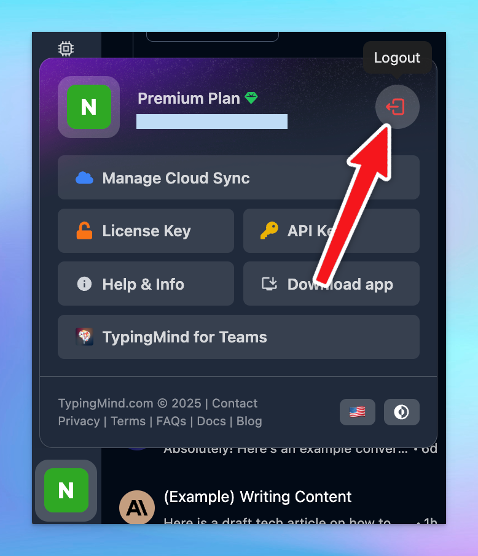

# Does TypingMind work when you log out?

If you're using TypingMind, you may be wondering: **“Do I need to stay logged in for it to work?”** The short answer is **no**—TypingMind continues to work normally even after you log out.

In this article, we’ll explain why TypingMind works independently of your login status, how your data is managed, and when logging in *does* make a difference.

<aside>
💡

This post is also the answer for the question “Can you use TypingMind without cloud sync?”

</aside>

## Works Without Login

TypingMind runs on a **license key system**, not a user login. Once you activate TypingMind with your license key, the core features remain available regardless of your login status. You can log out at any time and still continue using the app without any interruptions.

## Your Data Stays Local by Default

One of the key benefits of TypingMind is that **all your data is stored locally** in your browser. 

Since everything is saved on your device, you maintain full control over your data. Nothing is uploaded to TypingMind’s servers unless you specifically opt in to use cloud features.

## Why Log In?

So, if everything works while logged out, what’s the point of logging in?

Logging in enables one powerful optional feature: **cloud sync**.

Cloud sync is useful if you want to:

- **Back up your data online** in case your browser storage is cleared
- **Access your data across multiple devices**, like your phone, laptop, or tablet
- **Protect against data loss** from browser crashes, cache clearing, or system resets

When you're logged in, TypingMind can securely upload your data to your linked account. That way, even if you switch devices or reinstall your browser, your data will be safely restored.

<aside>
💡

Cloud sync is completely optional and flexible.

- **You can choose which types of data** (e.g., chats, agents, prompts, license key) get synced to the cloud.
- 🔒 **You can disable cloud sync at any time**
</aside>

## Want to Stay Offline or Use Your Private Cloud Sync?

To log out of your TypingMind account:

1. Click on your profile picture in the **bottom-left corner** of the app.
2. You’ll see a logout icon next to your email—click it to sign out.

Once logged out, TypingMind will continue to function as expected. However, keep the following in mind:

- Your data is stored in your browser’s **local storage**.
- **If you clear your browser cache, cookies, or local storage**, or if you switch devices or browsers, you may lose your saved data.
- To avoid accidental data loss, consider backing up your data manually or using a private sync option.

<aside>
💡

If you want to sync data using your own cloud setup (e.g., Dropbox, Google Drive, or a self-hosted solution), you can do so using the [**TypingMind Extension**](https://docs.typingmind.com/typing-mind-extensions).

</aside>