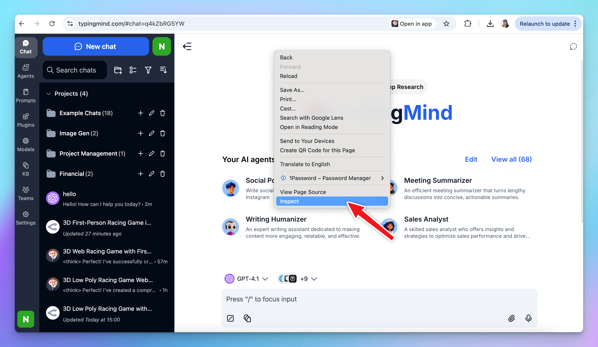
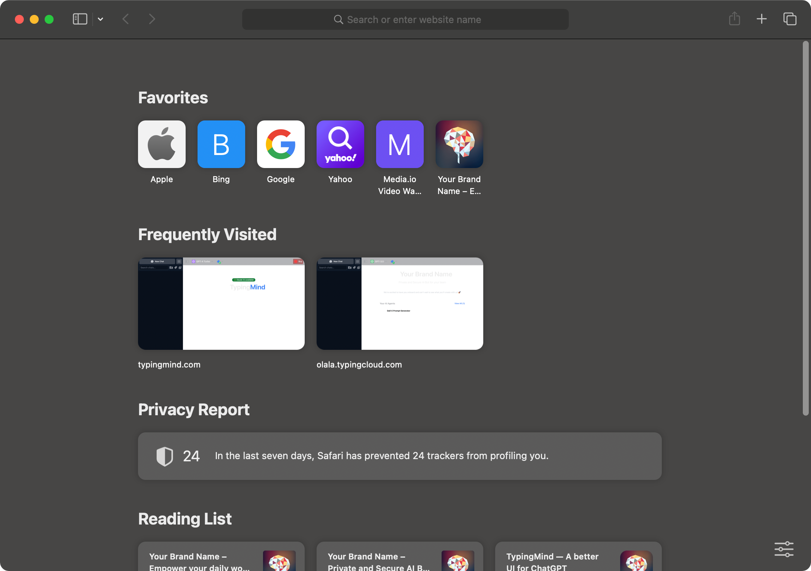

# Get HAR file

When working with TypingMind, we may sometimes ask you to collect a network capture for troubleshooting, which can be used to record the HTTP data traffic of the affected application. We will use this information to figure out what's causing the problem.

## Chrome

Here are the steps on how to do it using Google Chrome Developer Tool:

1. **Go to TypingMind.com**
2. **Open Developer Tools**: right-click anywhere on the webpage and select `Inspect` from the context menu.

1. **Select the Network Tab**: a pane will appear either at the side or the bottom of your screen. In this pane, locate and select the `Network` tab.
2. **Reproduce the issue**: refresh the webpage or reproduce the issue you're experiencing. The network requests are being logged in the Network tab as you do this.
3. **Export HAR:** at the top right corner of the Network tab, click on Export icon to export the HAR file
4. **Share the HAR file:** send the file to **support@typingmind.com** so our team can look into the issue further.
    
    
    

## Safari

<Tip>
    Skip step 1,2,3 if you already had Develop tab on the status bar.

</Tip>

1. Open Safari 

2. Click **Safari** on the status bar and choose **Settings** to open the Safari Setting panel

3. Switch to **Advanced** tab and tick on the checkbox “**Show features for web developers**”. This allows you to access the Develop tab within Safari 

4. Access [TypingMind.co](http://TypingMind.co)m 
5. Click on Develop tab on status bar and click “Show Web Inspector”

6. **Refresh the app**
7. **Reproduce the issue**: refresh the webpage or reproduce the issue you're experiencing. The network requests are being logged in the Network tab as you do this.
8. **Export HAR:** at the top right corner of the Network tab, click on Export icon to export the HAR file

**Share the HAR file:** send the file to **support@typingmind.com** so our team can look into the issue further.

## SetApp

Here are steps to get HAR file if you are using the app through MacApp or SetApp:

1. Open TypingMind app

2. Open Safari (it must be Safari, you can not use other browsers like Chrome)

3. Click **Safari** on the status bar and choose **Settings** to open the Safari Setting panel

4. Switch to **Advanced** tab and tick on the checkbox “**Show features for web developers**”. This allows you to access the Develop tab within Safari (*Skip this step if you already have the Develop tab on the status bar*) 

5. Click on **Develop** > **Select your Macbook** > click on **[setapp.typingcloud.com](http://setapp.typingcloud.com) i**f you are using SetApp or click on [**typingmind.com](http://typingmind.com)** if you are using TypingMind Mac App 

6. **The Web Inspector will appear, switch to Network tab**

7. **Cmd + R** to refresh the TypingMind Macapp

8. **Reproduce** your issue on the app
9. Back to the Network tab within **Web Inspector (step 7)** > click on “**Export**” in the top right corner to get the HAR file
10. Choose a location to save the HAR file and send it in to **support@typingmind.com**

