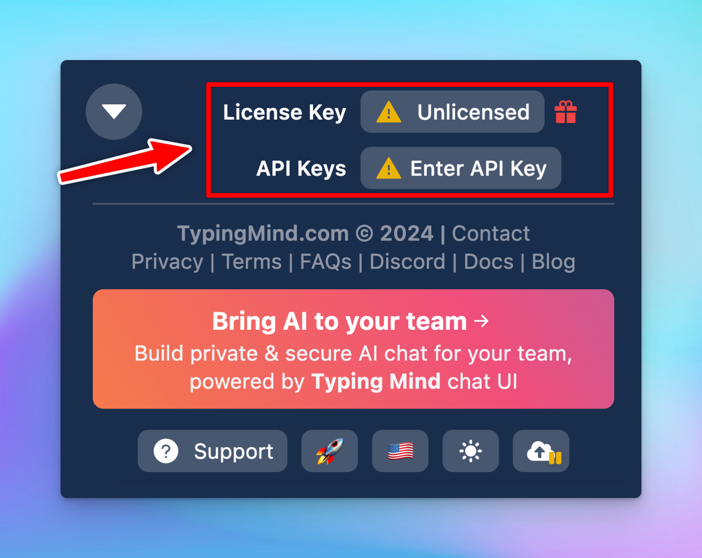

# License key and API key not saving?

If you're repeatedly asked to enter your license key and API, then this article will give you a better understanding of what causing this issue and how to prevent it.

## How do we store your keys?

Not only your keys, but all of your data including chat history, and chat messages are stored locally on your browser (using Local Storage).

## What causes this issue?

This issue can be caused when your browser cache/cookie/storage has been cleared. 

Here are some possible reasons why your browser data might have been cleared:

1. **Manual or automatic browser settings**: your browser's cache, cookies, or local storage might be cleared either manually by you or automatically based on your browser's configured settings.
2. **Browser updates or extensions**: sometimes, browser updates can reset certain settings, which might affect the local storage. Additionally, some browser extensions designed to enhance privacy might automatically clear storage, leading to the loss of stored data.
3. **Switching browsers**: if you're accessing the app from a different browser, you'll need to re-enter your credentials since the local storage is specific to the browser on each device.
4. **Security software**: certain antivirus or security software settings could inadvertently clear browser storage or block data from being saved.
5. **Private browsing mode**: using browsers in "Incognito" or "Private Browsing" mode may prevent the saving of site data once the session ends.

## What happen to your chat data?

Unfortunately, clearing browser storage may also result in the loss of your chat history. 

## The solution

To prevent losing your chat data, license key and API keys, consider the following solutions:

1. **Enable Cloud Sync**: this allows you to securely back up your chat data, License key and API keys. If your local data gets wiped out, simply log into your Cloud account to restore everything quickly.

1. **Add to home screen**: this can also help prevent accidental data loss caused by clearing browser data.

1. **Check browser/extension setting** to not clear site data from [www.typingmind.com](http://www.typingmind.com/). 

There are 3 options to do this:

- Manually delete specific sites that you don’t want to collect data excluding typingmind.com

- Export [typingmind.com](http://typingmind.com) data > Clear all browser data > Re-import data from typingmind.com (this can be done using Chrome extension)
- Use a separate browsing profile for [typingmind.com](http://typingmind.com)

## Conclusion

Re-entering keys can be inconvenient, however, it's a crucial step to ensure your privacy. 

By understanding the potential causes and using our suggested solutions, you can minimize data loss and maintain a seamless experience with TypingMind.