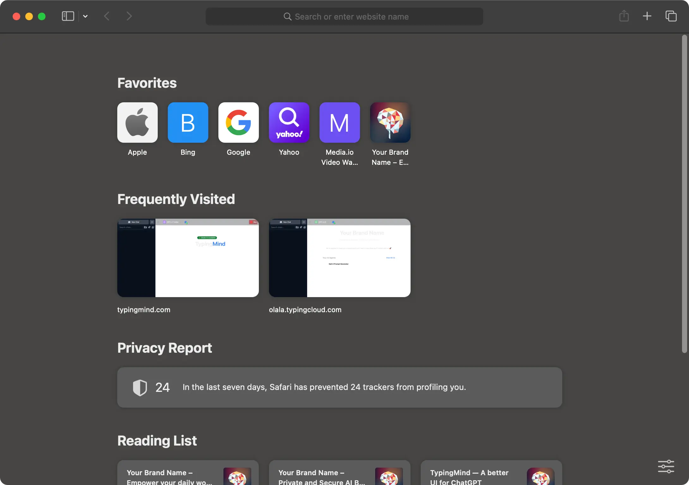

# View Console Logs

When working with TypingMind, we may sometimes ask you to capture a screenshot of your Console logs for troubleshooting to figure out what's causing the problem.

# If you are using Web App…

Here are the steps on how to do it using Google Chrome Developer Tool:

1. **Go to [TypingMind.com](http://TypingMind.com)** and reproduce the issue
2. **Open Developer Tools**: right-click anywhere on the webpage and select `Inspect` from the context menu.

3. **Select the Console Tab**: a pane will appear either at the side or the bottom of your screen. In this pane, locate and select the `Console` tab. 

4. Right-click anywhere in the console output area and select **"Save as..."** from the context menu.
5. Send to **support@typingmind.com**

# If you are using SetApp/MacApp…

Here are steps to get Console log info if you are using the app through MacApp or SetApp:

1. Open TypingMind app

2. Open Safari (it must be Safari, you can not use other browsers like Chrome)

3. Click **Safari** on the status bar and choose **Settings** to open the Safari Setting panel

4. Switch to **Advanced** tab and tick on the checkbox “**Show features for web developers**”. This allows you to access the Develop tab within Safari (*Skip this step if you already have the Develop tab on the status bar*) 

5. Click on **Develop** > **Select your Macbook** > click on **[setapp.typingcloud.com](http://setapp.typingcloud.com) i**f you are using SetApp or click on [**typingmind.com](http://typingmind.com)** if you are using TypingMind Mac App 

6. **The Web Inspector will appear, switch to Console Tab**

7. **Cmd + R** to refresh the TypingMind Macapp

8. Back to the app and reproduce the issue on your app. Then go to the Web Inspector → Right-click anywhere in the console output area and select **"Save as..."** from the context menu.
9. Send it to **support@typingmind.com**