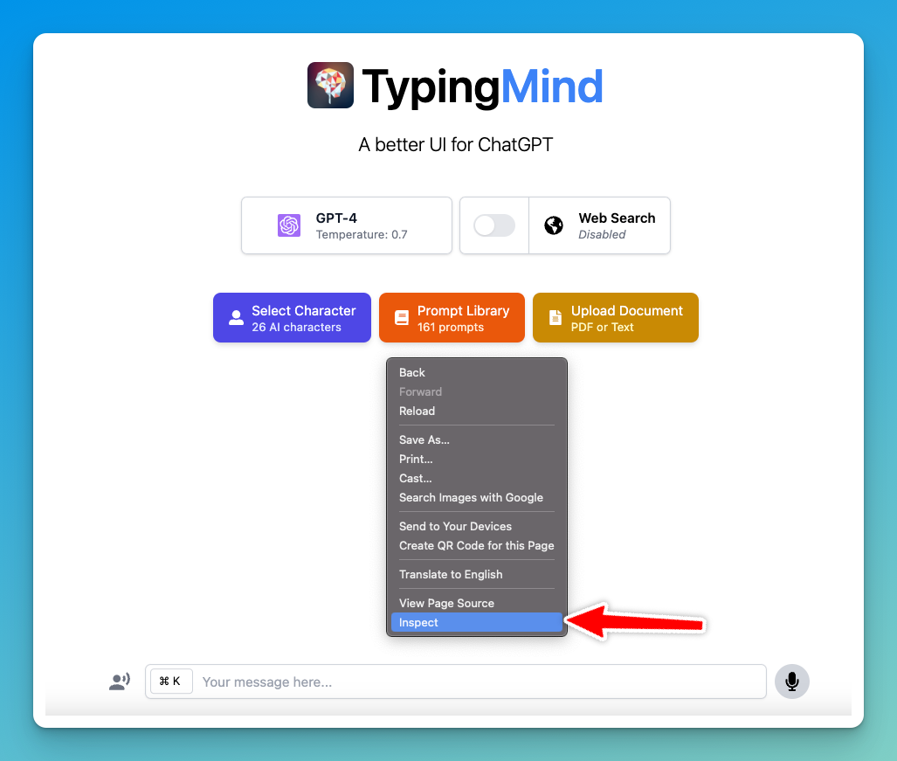

When using TypingMind, we may occasionally ask you to provide a screenshot or a saved copy of your Console logs. This helps us identify the cause of an issue and troubleshoot it more effectively.

## On Web App

Here are the steps on how to do it using Google Chrome Developer Tool:

1. Go to [**TypingMind.com**](http://TypingMind.com) and repeat the steps that caused the issue.
2. **Open Developer Tools**: Right-click anywhere on the webpage and select **Inspect** from the context menu.

3. **Select the Console Tab**: a Developer Tools panel will appear on the side or at the bottom of your screen. Click the **Console** tab.

**Note: Make sure all Console logs are visible -** If the Console sidebar is open on the left, click the **Console sidebar** icon in the top-left corner to close it.

<Frame>
  
</Frame>

4. Right-click anywhere in the Console output area and select **Save as...** to save the logs to your computer.
5. Send to [**support@typingmind.com**](mailto:support@typingmind.com)

## On SetApp

Here are steps to get Console log info if you are using the app through MacApp or SetApp:

1. Open TypingMind app

2. Open Safari (it must be Safari, you can not use other browsers like Chrome)

3. Click **Safari** on the status bar and choose **Settings** to open the Safari Setting panel

4. Switch to **Advanced** tab and tick on the checkbox “**Show features for web developers**”. This allows you to access the Develop tab within Safari (_Skip this step if you already have the Develop tab on the status bar_)

5. Click on **Develop** \> **Select your Macbook** \> click on [**setapp.typingcloud.com**](http://setapp.typingcloud.com)\*\* i\*\*f you are using SetApp or click on [\*\*typingmind.com](http://typingmind.com)\*\* if you are using TypingMind Mac App

6. **The Web Inspector will appear, switch to Console Tab**

7. **Cmd \+ R** to refresh the TypingMind Macapp

8. Back to the app and reproduce the issue on your app. Then go to the Web Inspector → Right-click anywhere in the console output area and select **"Save as..."** from the context menu.
9. Send it to [**support@typingmind.com**](mailto:support@typingmind.com)