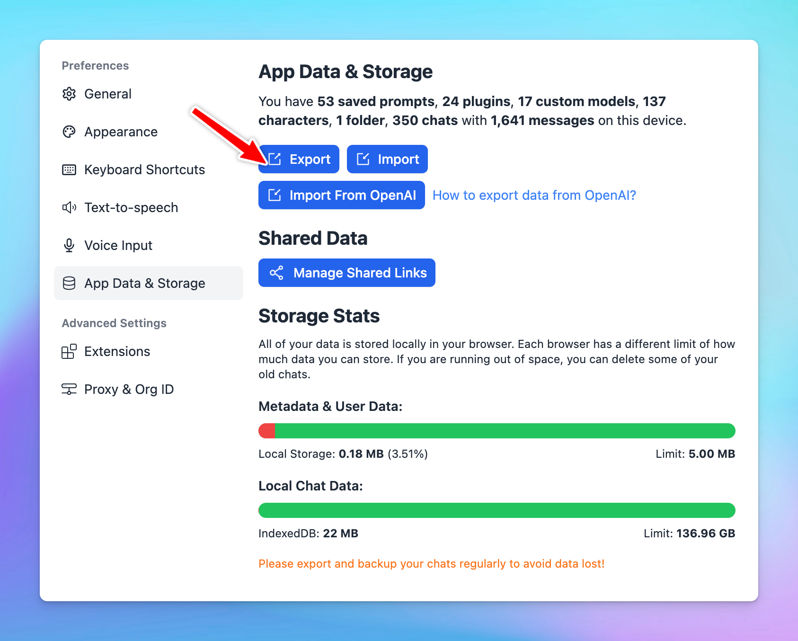

# Your chat data is lost? Causes and Solutions

If you accidentally lose your data, such as chat history, AI Agent collection, or Prompt library, this article will help you understand what causes this issue and how to resolve it.

# How do we store your data?

Your data, including chat history, AI Agents, Prompts, and Settings, is stored locally on your browser using Local Storage. 

If you've enabled TypingMind Cloud Sync, your data is also backed up to the TypingMind Cloud system, which allows you to restore it across different devices and browsers.

# What causes this issue?

Since your data is stored locally**, it can be lost if your browser's cache, cookies, or storage is cleared.** Here are some common reasons why this might happen:

1. **Manual or automatic browser settings**: your browser's cache, cookies, or local storage might be cleared either manually by you or automatically based on your browser's configured settings.
2. **Browser updates or extensions**: sometimes, browser updates can reset certain settings, which might affect the local storage. Additionally, some browser extensions designed to enhance privacy might automatically clear storage, leading to the loss of stored data.
3. **Switching browsers**: if you're accessing the app from a different browser, you'll need to re-enter your credentials since the local storage is specific to the browser on each device.
4. **Security software**: certain antivirus or security software settings could inadvertently clear browser storage or block data from being saved.
5. **Private browsing mode**: using browsers in "Incognito" or "Private Browsing" mode may prevent the saving of site data once the session ends.

# **The solution**

To prevent losing your chat data, consider the following solutions:

### **1. Use Cloud Sync (Recommended)**

This allows you to securely back up your chat data, License key, and API keys. If your local data gets wiped out, log into your Cloud account to restore everything quickly.

### **2. Add to home screen**

This can also help prevent accidental data loss caused by clearing browser data. Here’s the detailed guideline: [**Use TypingMind as a desktop or mobile app**](https://docs.typingmind.com/getting-started/use-typingmind-as-a-desktop-or-mobile-app)

### 3. Export [**typingmind.com**](http://typingmind.com/) data more frequently

Frequently export your data from [TypingMind.com](http://typingmind.com/) to keep a backup.

Guideline to [Export Your Data](https://docs.typingmind.com/cloud-sync-and-backup/export-import-data)

## 4. Use a separate browsing profile for typingmind.com

Consider using a separate browsing profile for TypingMind without any extensions or cache settings to minimize the risk of data loss.

# If you have already enabled Cloud Sync but still encounter this issue…

If you've enabled Cloud Sync and still encounter issues, you simply can click on “Resync everything” to retrieve the most current version of your data. 

In case this still doesn’t work, it’s possibly due to:

1. **Your synced data has been deleted manually**

 If you manually delete your chats, they will also be removed from the sync, making recovery impossible. 

**Solution:** Export your chat data before deleting them completely. Once you want those chats back, you can Import → Import and Clone (Guideline to [Import Your Data](https://docs.typingmind.com/cloud-sync-and-backup/export-import-data))

1. **Chat size exceeds 10MB**

If your chat size is larger than 10MB due to file uploads or images, it won't be synced. The team is working on improving this size limit. 

In the meantime, you can manually delete uploaded images or files via Manage Data, or export your chats to prevent potential losses.

If you've tried all these solutions but are still facing issues, please submit a report through the [Report Bug Form](https://www.typingmind.com/report-bug) so our technical team can investigate further.