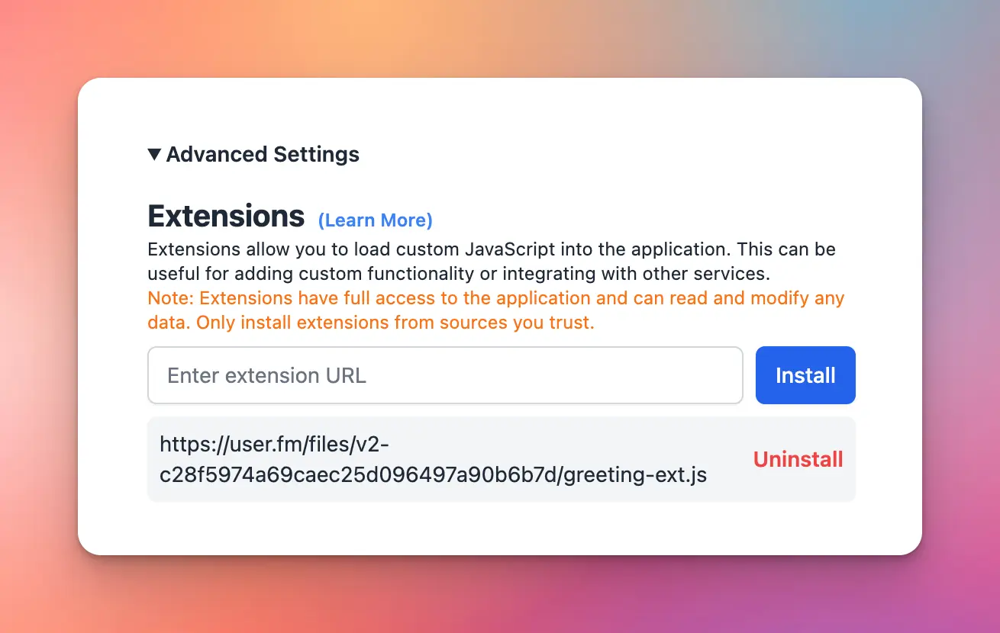

## Overview

<aside>
  👋 Explore and share your awesome extensions here! 👉 [https://github.com/TypingMind/awesome-typingmind](https://github.com/TypingMind/awesome-typingmind)
</aside>

**Typing Mind Extensions** allows users to embed custom JavaScript code into Typing Mind. The JavaScript code will have access to all internal data and application state of Typing Mind, allowing the users to add custom logic and application behavior to fit their workflow.



## How it works

In general, Typing Mind Extensions works like a typical browser extension. The only difference is that you can install the extensions on the macOS app and mobile apps (PWA).

The user installs a new extension by providing a script URL (JavaScript), then Typing Mind will load and execute it when the app is loaded.

<aside>
  💡 This feature is similar to the “**Custom Code**” feature in [Typing Mind Custom](https://custom.typingmind.com).
</aside>

Some facts:

- The URL must be hosted at a publicly accessible endpoint, must have the mime type of `application/javascript` or `text/javascript`, and can be loaded from the Typing Mind web app (proper CORS settings needed).
- Extensions are loaded once when the app starts.
- Extensions are installed locally on the user’s browser.
- Extensions are synced across multiple devices by default (included in the “Preferences” sync group)

## Use cases

- Add additional backup & sync sources (AWS S3, Google Drive, private server, etc.)
- Embed a widget to Typing Mind (e.g., live chat widget)
- Adding custom keyboard shortcuts
- Customize message rendering

## Access Typing Mind’s App UI

Various places on the Typing Mind’s app have `data-element-id` attributed assigned. For example, the **New Chat** button has attribute `data-element-id="new-chat-button-in-side-bar"`

You can use these attribute to target a specific element in the application UI. If you need to access a certain UI elements that do not have a element ID yet, please let us know.

<aside>
  💡 **Note:** Typing Mind UI changes all the time. We do not guarantee the `data-element-id` will stay the same as Typing Mind changes, however, we will try as much as we can to not change any of the existing IDs. You need to keep track of the IDs manually by yourself.
</aside>

## Access Typing Mind’s Data

All of the user’s data is located in the browser’s local data storage:

- [Local Storage](https://developer.mozilla.org/en-US/docs/Web/API/Window/localStorage) - General app settings and preferences
- [IndexedDB](https://developer.mozilla.org/en-US/docs/Web/API/IndexedDB_API) - Chat messages and other user generated data

The data can be inspected in the Developer Tool on the web:


If your extension needs to make use of the app data, here are some best practices:

- All read operations are generally safe.
- If you need to modify/write the user’s data or Typing Mind’s internal data, make sure to test your extension carefully across the multiple devices and browsers. If the internal data get corrupted, the user may not be able to use the app at all (see **No Extensions Mode** to learn how to deal with this case).

<aside>
  🚨 **Disclaimer:** At this time, we do not have a documented data model for the app’s internal data. Typing Mind changes all the time, and the data model/schema will also change.

  If your extension make use of the app data, you will need to keep track of the schema change and update your code accordingly.
</aside>

## Common Issues

| Issues | Reason | How to fix |
| --- | --- | --- |
| “Failed to load extension” with this error in Network Tab: |  |  |
| (failed)net::ERR\_BLOCKED\_BY\_ORB | Your URL does not return the correct mime type for the JS file. | The mime type must be `application/javascript` or `text/javascript` . Update your hosting or server config so that the JS file is served with the correct mine type. |

## Example extension

Below is an example extension that changes the “New Chat” button label to `Good Morning!`, `Good Afternoon!` or `Good Evening!` depends on the time of day.


File **greeting-ext.js:**

```jsx
const hours = new Date().getHours();
const greeting = hours < 12 ? 'Good Morning!' : hours < 18 ? 'Good Afternoon!' : 'Good Evening!';
document.querySelector('[data-element-id="new-chat-button-in-side-bar"]').childNodes[1].textContent = greeting
```

This file is hosted publicly at the following URL:

```markdown
https://user.fm/files/v2-9200e5b1315b2ea15f49d1b6d8621223/greeting-ext.js
```

Install the extension: Go to Typing Mind → Preferences → Advanced Settings → Extensions, then enter the URL, click “Install”


Once installed, you need to **restart the app** for the change to take effect.

## Safe Mode (No Extensions Mode)

Sometimes, your extension crashes or make Typing Mind unusable for the user. You can load Typing Mind in **Safe Mode** to debug and troubleshoot the issue.

In Safe Mode, extensions will not be loaded. The user can uninstall the corrupted extensions to continue using Typing Mind.

To activate Safe Mode, load the app with `?safe_mode=1` in the URL. For example:

```markdown
https://www.typingmind.com/?safe_mode=1
```

When in Safe Mode, you will see a message in the web console “Safe Mode enabled. Skip loading extensions”.

## Get help

We **do not** provide technical support for extensions (even if you are a paying customer).

For general questions about extension, you can also contact [**support@typingmind.com**](mailto:support@typingmind.com), however, note that we will not guarantee a response (based on our customer support capacity).