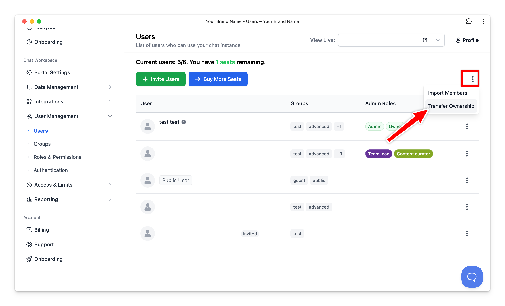

# Change the Owner email

As of now, you can change the owner email following the steps below:

- Log into the Admin Panel
- Under the User Management menu, click on User
- Click the three dot icon on the top right corner of your user list dashboard

Please note that only owner can transfer ownership rights to another admin user.