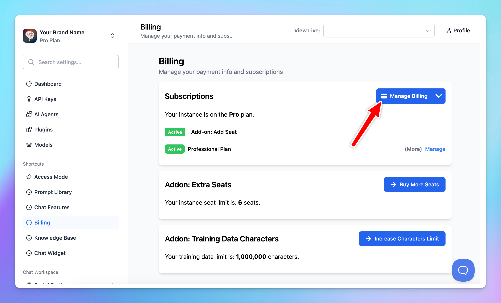
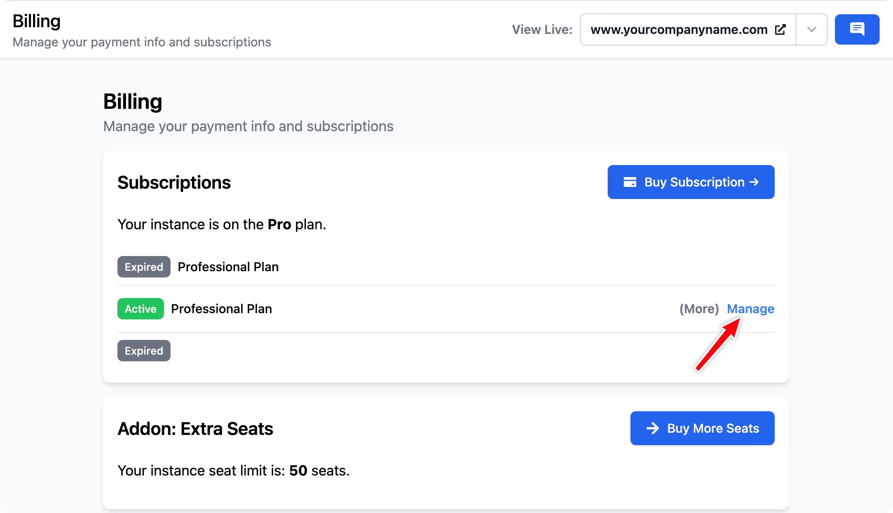

## 1. Upgrade your subscription

You can upgrade your subscription any time to open access to more functionalities within your chat instance.

Here are some simple steps to do it:

- Go to **Billing**

### Purchased Made Via Stripe

- Click on **Manage Subscription**, you will be directed to the Stripe subscription management page.

You can:

- Upgrade or downgrade your current subscription plan
- Increase or Decrease the number of seat subscription
- Cancel your subscription

### Purchased Made Via Lemon Squeezy

- Click on **Manage Subscription**, you will be directed to the Lemon Squeezy subscription management page.

- Click on the three dots (…) icon within your subscription and click **Update**

- **Choose a plan** you want to upgrade
- Click **Save**

