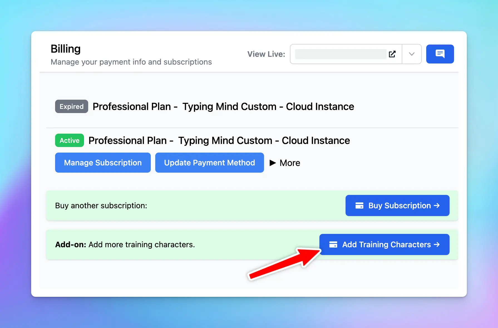

When uploading the knowledge base for your chat instance, you will have 1M training characters to upload by default.

If you mostly exceeds this number and want to upload more data, you also have the option to purchase extra training characters. Here’s how to do it:

- Go to Billing
- Click on “Add Training Characters”

You can purchase from 1M up to 100M characters: 

<aside>
💡 Please note that this is a monthly subscription base. You are billeed every month for extra training characters.

</aside>