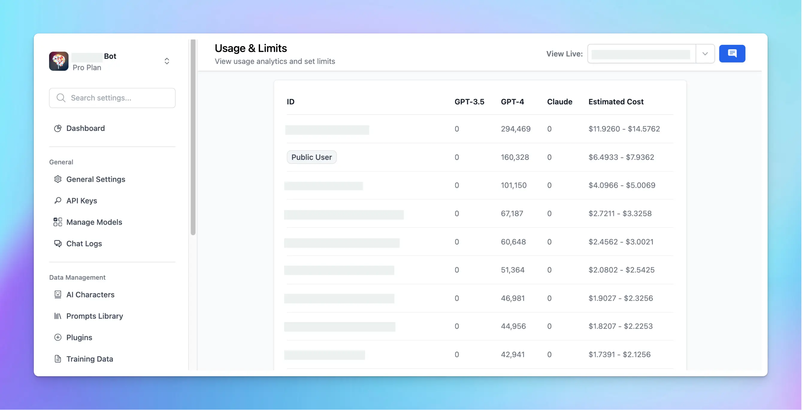

As of now, TypingMind Custom provides insights through several key metrics:

- Token usage per member
- Number of times a Prompt / AI Agents has been used
- User chat history

# Token usage per member

This feature enables tracking of individual member's usage related to specific chat models:

- Go to **Usage & Limit**
- Scroll down to the Token usage section

You'll find a list of your members, along with their token consumption and a cost estimation. It's important to note that this cost estimation is approximate; you'll need to verify the actual costs via your API provider's dashboard for accuracy.

# Number of times a Prompt / AI Agents has been used

The usage frequency of specific Prompts or AI Agents is displayed in two places:

- On the Dashboard

- On the specific Prompt / AI Agents section

# User chat history / Chat logs

This option allows you to view how users interact with your chatbot. By analyzing chat logs, you can refine and enhance the chatbot's response quality for better user engagement. More details at: