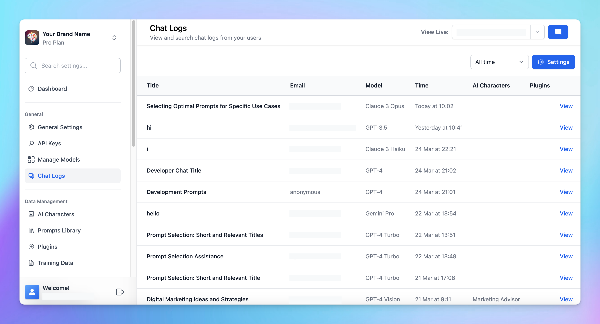

TypingMind Team allows Admins to review chat logs by all users to understand use cases, detect issues, and adjust prompts to better handle user queries.

Let’s check out on how to do that!

# Some simple steps

1. Log in to your chat instance
2. Go to “**Chat Logs**” menu in the General section
3. By default, only [Anonymous chats](https://www.notion.so/a1e5539c082b4ef8a76a7e30677ca66f?pvs=21) are recorded. However, you can choose to record all chats from all users:
    - Click on **Settings**
    - Enable **Record all chats from your users**

# Best practices for monitoring your chat logs

- **Regular reviews**: make it a routine to check the chat logs to quickly identify and address emerging issues or trends.
- **Continuously update training data**: use insights from the chat logs to update FAQs, user guides, or training data for the AI, improving the accuracy and relevance of its responses.
- **User engagement**: gather information within the chat logs to provide users with the resources that they want.