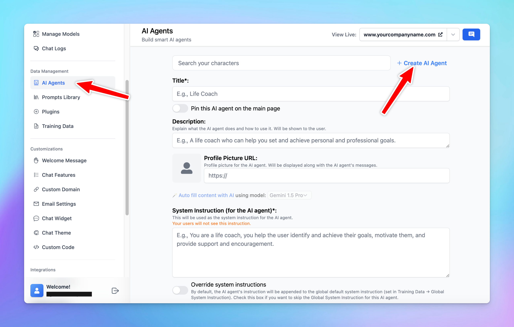

Admins have the option to build AI Agent collection for your chat interface that is shared across your team members.

- Go to **AI Agents**
- Click  **Create AI Agents or Browse Agent** to create your own collection

Your created AI characters will be displayed on the chat interface as follows:

<Tip>
  You have the option to control which users / groups can use the created AI characters, check it here:
</Tip>