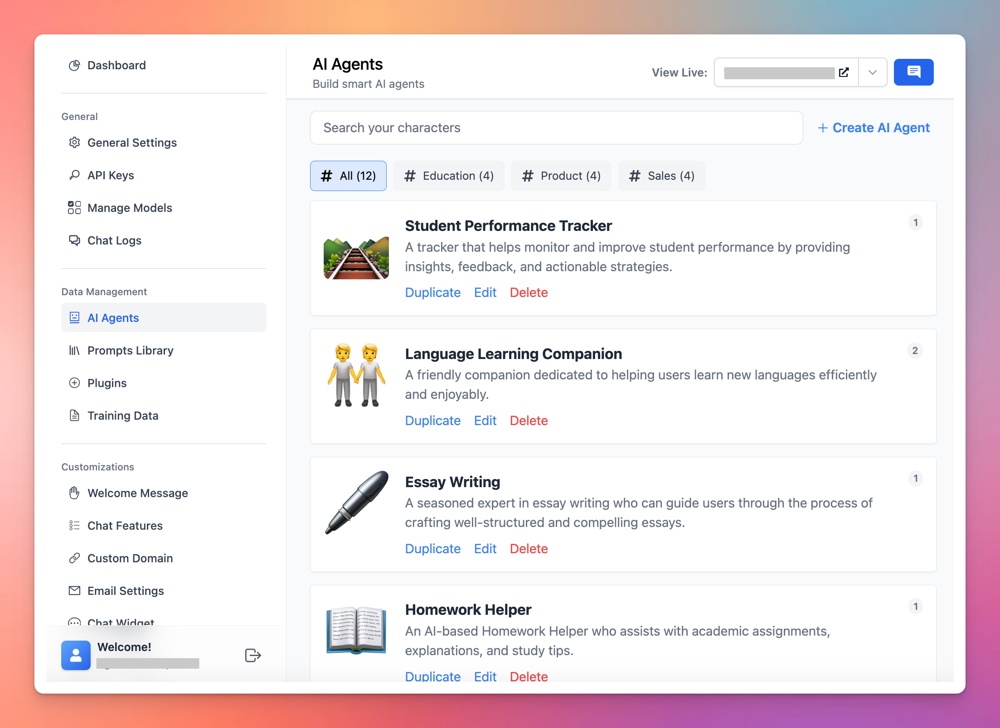
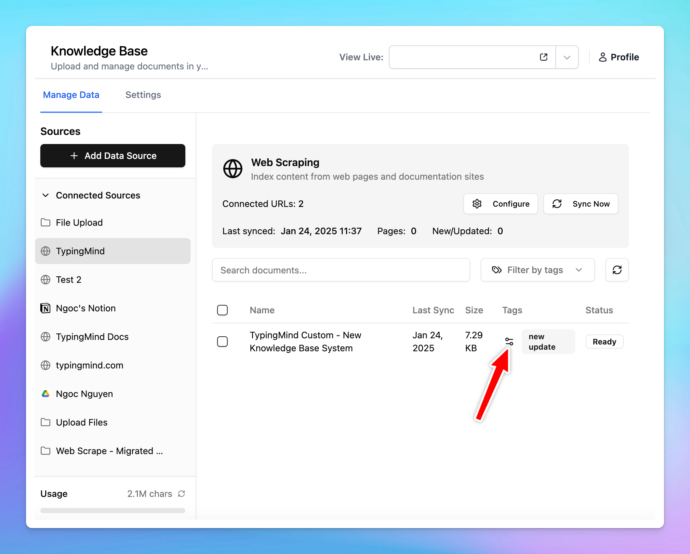

Connect knowledge base to your AI Agents allows you to create multiple AI agents within a single chat instance with its own domain-specific knowledge.

By customizing each AI agent with specific datasets, you can get a wide range of conversational chatbots dedicated to different contexts, or user needs. Here’s how to set this up easily.

Build multiple AI Agents

AI Agents are shown on the chat interface

# **Benefits of setting up multiple AI Agents on TypingMind Custom**

- **Customization**: Personalize interactions by deploying agents trained on specific datasets.
- **Flexibility**: easily switch between different agents to cater to varied user inquiries or tasks.
- **Efficiency**: specialized agents can handle specific topics more adeptly, improving user experience.

# **How to set it up on your chat instance**

## Option 1: Use your uploaded knowledge base

### Step 1: Add tags to your knowledge base

You will need to:

1. Upload your training documents or connect training sources in the Knowledge base menu
2. In the "**Tags**" column, click Adjust icon to add tags to your documents. Use any tag names you want.

### Step 2: Assign training tags to AI Agents

After adding tags to your training docs, please follow these steps to assign those tags to your AI Agents:

1. Go to **AI Agents**
2. Click "**Edit**" your existing AI Agents (or you can create new ones)
3. Navigate the Knowledge section and toggle the **Knowledge base access**, choose from the drop-down list the option "**Only allow access to some knowledge base data based on tags**" to allow your AI Agents to learn from only certain knowledge base data.

## Option 2: Use Dynamic Context API

**Dynamic Context** allows you to retrieve content from an API and inject it into the system prompt. This can be used to add live information to the AI or implement Retrieval-Augmented Generation (RAG) from your own data sources (e.g., vector store database).

Here's more details: [https://docs.typingmind.com/ai-characters/dynamic-context-via-api](https://docs.typingmind.com/ai-characters/dynamic-context-via-api)

# Some use cases

## **For teams**

For teams working across projects, having AI agents tailored to different aspects of project management and team dynamics can streamline processes and communication:

- **Project management agent**: track project timelines, deliverables, and milestones. Trained with data on project management best practices, it can provide recommendations on task prioritization and resource allocation.
- **HR support agent**: offer guidance on human resources questions and company policies, the agent can answer FAQs regarding leave policies, and benefits. It uses a dataset based on the organization’s HR manual.
- **Onboarding agent**: new team members can interact with this agent to get acclimated to their new roles. It provides information on training materials, key contacts, and initial tasks, helping streamline the onboarding process.

## **For education**

Multiple AI Agents can be deployed to manage and streamline administrative tasks within educational institutions, improving efficiency and reducing workload on staff:

- **FAQ agent**: provides potential students and parents with information regarding the admissions process, application deadlines, required documents, and eligibility criteria. Trained with your institution’s admissions guidelines.
- **Course scheduling assistant**: help students in planning their class schedules, inform them about available courses, prerequisites, and timetable conflicts. This agent uses datasets containing course catalogs and scheduling policies.