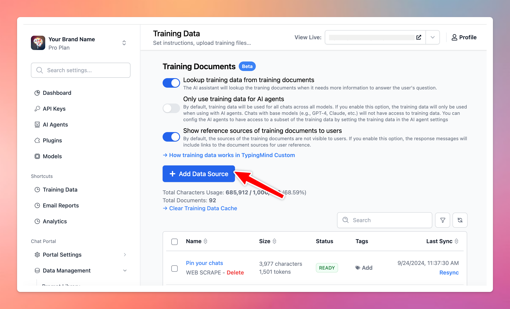

When setting up a **TypingMind Custom** chat instance, you can seamlessly connect your Notion database. This integration allows the AI chatbot to learn from your specific content and make its responses more relevant and personalized to your company's needs.

By leveraging your Notion pages, your AI chatbot will deliver context-aware answers and efficiently handle detailed queries related to your business, team, or community.

## What is TypingMind Teams?

TypingMind Teams is a custom-branded, custom-built version of [TypingMind](/typingmind-team/branding-and-customizations/connect-with-your-notion-pages). You can create and customize a Chat instance that works exactly like [TypingMind.com](http://typingmind.com/) under your own domain. You can offer and control the accessibility of the chat interface to your team members, community, or customers.

By signing up, you will have access to a chat interface to interact with AI models and an Admin Panel to manage every interaction and element on the chat interface.

With TypingMind Teams, Admins (who can log into Admin Panel) have the options to:

- Preset API keys (no license key needed) so your team members don’t need to re-enter API key from chat UI
- Create pre-built Prompts, Plugins, AI Agents
- Upload large training data or connect external sources (Notion, Intercom, Dropbox, etc.)
- Invite members to use the chat UI via email
- Control feature visibility on the chat UI
- Restrict user access to specific resources from the chat UI
- Use your custom domain and brand theme

## Why should you integrate Notion pages on TypingMind?

While AI models can answer general questions, your company will have specific needs and data that can’t be covered without customization.

Integrating Notion pages as a training source enables your AI chatbot to understand and respond with precise, relevant, and personalized answers based on your Notion data. This makes it especially powerful for use cases like internal knowledge bases, customer support, project tracking, and more.

- **Personalized AI responses:** use your Notion content to generate responses that align with your internal processes, customer needs, or community interests.
- **Dynamic database updates:** as your Notion pages are updated, the connected AI chat will be able to provide up-to-date answers and information.
- **Time-saving & increased productivity:** streamline workflows and save time on tasks by quickly accessing structured data directly from your Notion database.

## Connect your Notion pages to train the AI Chatbot

- Go to **Training Data**
- Click **Add Data Sources**

- Pick the specific Notion pages or databases you wish to connect and click **Add** to link them to the chat instance.

- Once added, wait a few minutes while the data syncs from your Notion account to your TypingMind instance.
- After syncing, go to the chat interface to start interacting with your Notion-based training data.

<aside>
  📌

  The quality and relevance of the chatbot’s responses will vary depending on the AI model's performance and capabilities. It's recommended to experiment with different AI models to find the one that interacts best with your training data and meets your needs.
</aside>