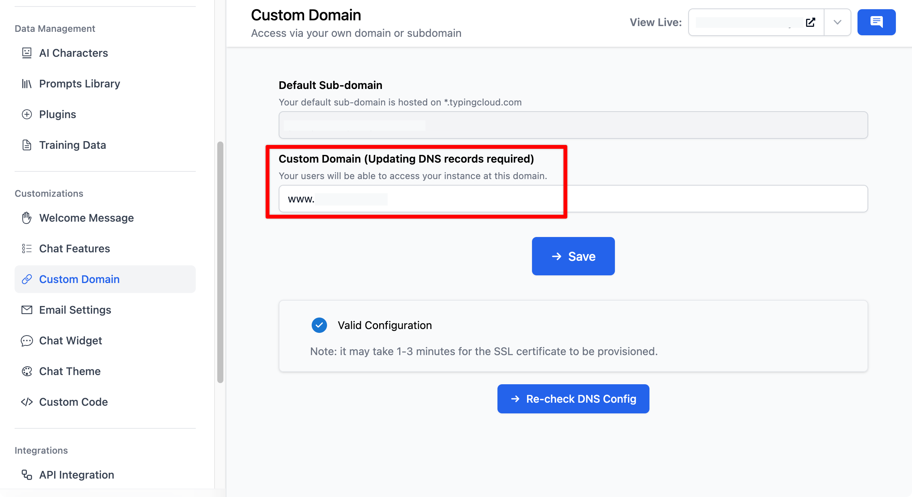

When you connect your domain to your chat instance, you'll need to update the DNS records in your DNS provider. Below are general instructions for updating your DNS records, as well as detailed instructions for the most common DNS providers.

# **Access DNS Record Information**

During the domain connection process with TypingMind Custom, TXT record information will be provided to you. However, you can also find it in the domain settings on your Admin Panel:

- Go to Custom Domain within the Customizations section
- Enter your custom domain. Please note that Custom domain must be a subdomain, example: [chat.yourdomain.com](http://chat.yourdomain.com/). If you want to use the root level domain, use "www" as the subdomain, for example: "[www.yourdomain.com](http://www.yourdomain.com/)".
- You can also find this information in your TypingMind Custom account under domain settings.

# **General Instructions**

1. **Log into your DNS provider account**, such as GoDaddy, Google Domains, or any other provider you use.
2. **Navigate to the DNS management area** for the domain you're updating.
3. **Modify or Add a CNAME Record**: You may either edit an existing CNAME record or create a new one, dependent on your specific needs.
    - In the "Host" or "Name" input, specify the subdomain or specific prefix you wish to connect with TypingMind Custom (such as "www").
    - In the "Points to" or "Target" field, input the CNAME value provided by TypingMind Custom within the Domain settings.
4. **Save the Changes**

# **After Updating Your DNS Records**

- DNS changes can take some time to propagate across the internet. This process may take anywhere from a few minutes to up to 48 hours.
- After making the changes, monitor the status of your domain connection within your TypingMind Custom account.