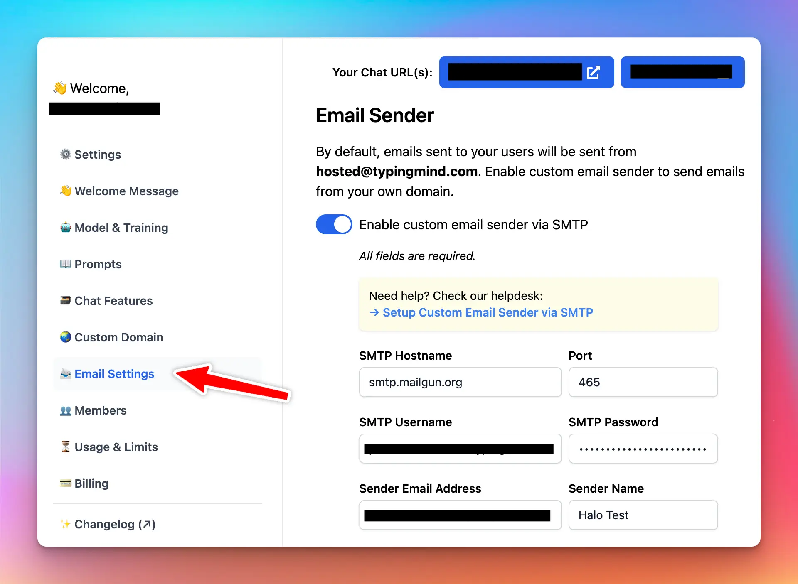

To set up a custom email sender, you will need to obtain SMTP credentials from an online service. There are several providers, both free and paid, that you can choose from.

## Step 1: Choose an Email Service Provider

First, you need to decide which email service provider to use and get SMTP credentials from. Some popular options include:

1. [Gmail (Google Workspace)](https://support.google.com/a/answer/176600?hl=en) - Free for all Google Workspace administrators.
2. [Mailgun](https://www.mailgun.com/) - Offers a free tier for up to 5,000 messages per month
3. [SendGrid](https://sendgrid.com/) - Provides a free tier for up to 6,000 emails per month
4. [Amazon SES](https://aws.amazon.com/ses/) - Offers a pay-as-you-go model and a free tier for up to 62,000 emails per month to AWS customers

Sign up for an account with the provider of your choice and follow their instructions to obtain your SMTP credentials.

### Use Gmail as the sender

Optionally, Gmail provides a free SMTP server for all users. To use the Gmail SMTP server, you can use these details:

- **Gmail SMTP server address**: smtp.gmail.com
- **Gmail SMTP name**: Your full name
- **Gmail SMTP username:** Your full Gmail address (e.g. you@gmail.com)
- **Gmail SMTP password:** The password that you use to log in to Gmail
- **Gmail SMTP port (SSL):** 465

## Step 2: Retrieve Your SMTP Credentials

After signing up, you will receive SMTP credentials that typically include the following:

- SMTP Hostname: The server address that the email service uses (e.g., `smtp.mailgun.org`)
- Port: The port for connecting to the SMTP server (usually 465 for SSL)
- SMTP Username: Your unique username (e.g., `example@email.smtpusername.com`)
- SMTP Password: Your password for authentication

## Step 3: Configure Your App's Email Settings

Once you have your SMTP credentials, navigate to the **Email Settings** of your app and enter the information.

⚠️ Make sure to configure your email service provider properly to avoid your emails hitting the spam folder. Some email services will require you to verify your sender's email address.

Click “Send Test” to send a test email and check if everything is working correctly.

Click "Save" to apply the changes.

## That's it!

You've successfully set up a custom email sender using SMTP in your app. Now, your app will send emails using the specified sender name and email address, providing a consistent sender identity and enhancing the recipient's experience.