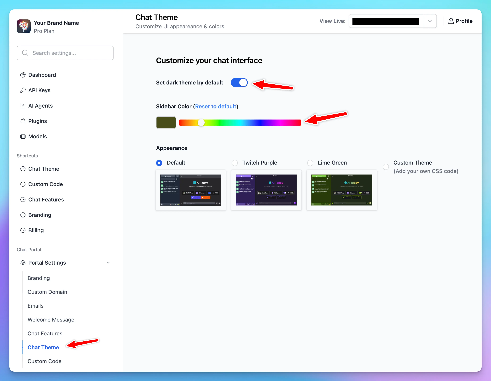
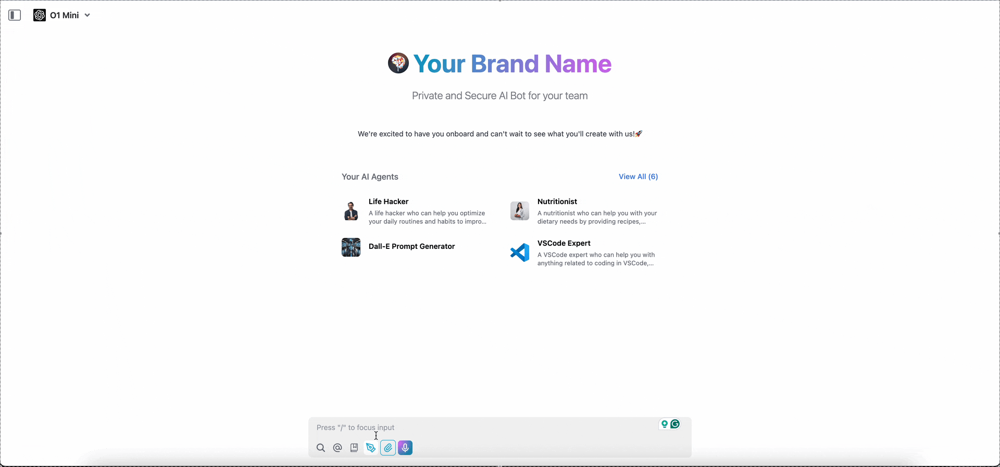
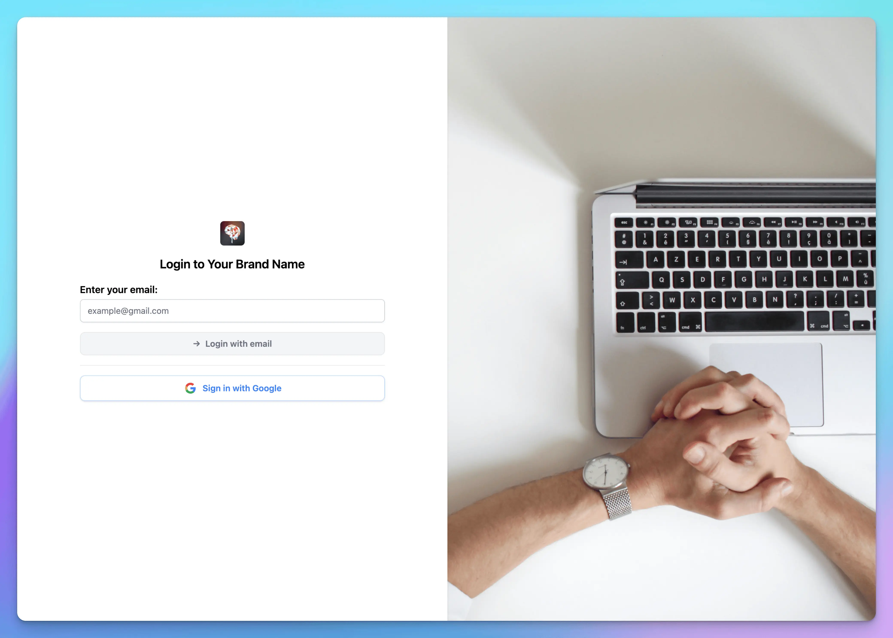
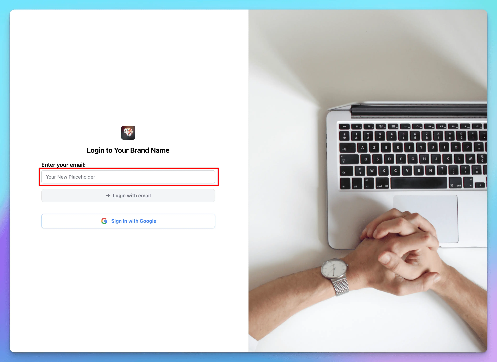

TypingMind Custom lets you customize the appearance of your instance user-facing app to match your preferences.

## 1. Basic customization

In addition to the default theme, you can customize your interface by:

- Enabling dark mode
- Adjusting the sidebar color
- Choosing from built-in themes



## 2. Advanced customization

For more granular control over your chat interface's appearance, you can add custom CSS code. This allows you to modify specific elements of the UI beyond the basic theme options.

### **How to Add Custom CSS**

1. Select the "Custom Theme" option in the Appearance section
2. In the CSS editor that appears, you can add your own CSS code


There is a default template for you to use as an example. You can modify it, save it, and test it on your user-facing app website until you get it right. 

You can also take code from other built-in themes and modify only the parts you need.


### **Tips for Custom CSS**

- Use browser developer tools (Right-click and select "Inspect") to inspect elements and find the correct CSS selectors



- Consider using CSS variables for consistent theming


- Test your changes in small increments to avoid breaking the interface
- Keep a backup of your CSS code in case you need to revert changes
- Remember to follow your brand guidelines when customizing colors and styles

### Custom JavaScript Code (Deprecated)

In addition to Custom CSS, you can also modify the interface using HTML, JavaScript, or any other elements you wish to include in your app.


## 3. Examples

### Modify font sizes

You can change the base font size for the entire page.


Or for only a specific element:


```css
:root {
  font-size: 1.2em;
}

.custom-theme [data-element-id="brand-tagline"] {
  font-size: 1.3rem !important;
}
```

Sometimes, your CSS might not have the highest priority; simply add `!important` after the value.

### Adjust the background, size, etc., of the elements

You can change the background, size, and position of any elements




```css
.custom-theme [data-element-id='login-page-bg'] {
  background-image: url('https://images.unsplash.com/photo-1513530534585-c7b1394c6d51');
  background-size: cover;
  background-position: right bottom;
  padding: 0;
}
.custom-theme [data-element-id='login-container'] {
  height: 100%;
  margin-left: 0;
  flex-basis: 50%;
  border-radius: 0;
  max-width: none;
  display: flex;
  flex-direction: column;
  justify-content: center;
}
.custom-theme [data-element-id='login-container'] > div {
  margin: 0 auto;
  max-width: 500px;
  width: 100%;
}
```

### Change an element’s attribute

Suppose you want to update the email input placeholder on your login page to say `Your New Placeholder`. You can accomplish this by adding a custom script to the Custom Code section.

```html
<script>
	const observer = new MutationObserver(() => { 
		const input = document.querySelector('.custom-theme [data-element-id="login-container"] input'); 
		
		if (input && input.placeholder !== 'Your New Placeholder') { 
			input.placeholder = 'Your New Placeholder'; 
		}
	});
	observer.observe(document.body, { childList: true, subtree: true
	});
</script>
```




**Note:** Always verify that the queried element exists and review the differences before changing its value again to avoid an infinite loop.