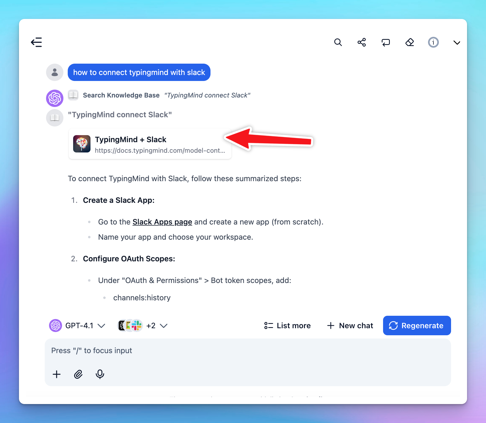

# Enable LLMs to cite sources when using RAG

Large language models (LLMs) have emerged as a widely-used tool for information seeking, but their generated outputs are prone to hallucination.

That’s why getting the AI models to provide sources and citations is the key to improving their factual correctness and verifiability and also making them more reliable to your customers and clients. 

## Why cite sources while using RAG?

Retrieval Augmented Generation (RAG) enhances LLMs by filling gaps in their knowledge with external data. While LLMs can generate text based on prior training, they often lack real-time or domain-specific information. Two primary methods address this: fine-tuning the model or employing RAG.

RAG, however, is more efficient for fact-based tasks because it uses a vector database to store and retrieve relevant data. This ensures that the responses generated by the model are grounded in actual sources to reduce the risk of hallucinations caused by outdated or incomplete knowledge from the AI models. 

TypingMind helps you employ RAG easily by connecting with your external data via **the Knowledge Base dashboard:**


That’s why citations are also crucial because they provide an extra layer of transparency to the AI response. They allow users to trace a response back to its original source, which makes your system more reliable.

## Strategies to get LLMs to cite sources

Below are key strategies to help you improve the citation process while using LLMs.

### 1. Structure your data

It’s crucial to ensure your uploaded training data is well-organized. Here's how you can do it effectively:

- **Title**: use clear, concise titles to help the model understand context and reference sources accurately.
- **Clear and clean text**: maintain a logical structure and consistent formatting.
- **Relevant content**: only include data that is directly relevant to the topic you want the LLM to address.
- **Frequent updates:** regularly update the dataset to include the latest and most reliable information to ensure LLMs has access to current data.
- **Metadata:** add metadata such as publication date, author, and source credibility.

### 2. Get the LLMs to cite sources on TypingMind

### 2.1. Cite links to sources

To allow LLMs to provide source links, you can follow these steps in TypingMind:

- Go to **Training Data**
- Enable the option “**Show reference sources of training documents to users**”


When this option is activated, the AI model will display the document source links (e.g., Notion, OneDrive, web scrapes) provided in your training data, allowing users to access the references.



<aside>
📌

Please note, as long as your connected data includes source links—such as from Notion, Google Drive, Web Scrape, etc.—the AI model can refer to the correct sources.

However, if your data is from uploaded files (e.g., PDFs, TXT files), consider using the method below: **citing the source title only.**

</aside>

### 2.2. Cite the source title only (in your expected format)

When citing source titles without links, effective prompting is key. 

You should craft your prompts to not only direct the model to answer but also provide it with the necessary structure and rules for citing sources accurately.

The key to successful prompting is in **providing direct instructions and examples**. 

Here are some key tips to guide the AI model:

- **Always cite source titles**: include citations in every response to ensure accuracy and credibility.
- **Clarify the format for citing sources**: provide details about the source format you want to AI models to provide.
- **No external links**: links should only be added if they are provided in the sources themselves. (to prevent hallucinations)

To make sure the AI model consistently cites sources, incorporate these guidelines into the system instructions.


**Here’s the example prompt:**

```
You help users by providing insightful answers based on the uploaded training data; ALWAYS cite sources to support your responses.

You are not allowed to add links or sources from sites that are not mentioned in the Training Data.

Format for citing sources:

**Source: Author, Source Title, Date - If any, Link to source - If any, from TypingMind Doc** 

Remove .pdf by the end of the source (if any). 

Here is an example source attribution:

TypingMind is the best AI platform for your team. (**Source: Getting Started with TypingMind, 2024-01-01, from TypingMind Doc**)

Quotations from sources may be used to support your statements, provided they are properly cited.

Avoid using phrases like 'source from training data.' Instead, use 'from TypingMind Doc.'
```

Here’s what you can expect by using this prompt:


Please note that you can modify the source format as long as it meets your company’s criteria.

## Final Thought

The AI model's responses will vary based on the specific model you use, the quality of the training data, and the clarity of the instructions given. Even with well-crafted prompts, challenges in source attribution accuracy, such as hallucinations, may still occur.

To resolve these issues, it's best to test with multiple LLMs and refine your prompts. Testing different models will help identify which LLM best aligns with your requirements for accuracy, citation consistency, and overall reliability.