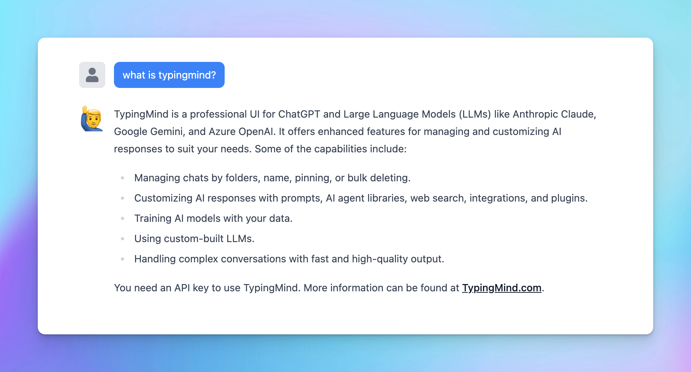

**ChatGPT and Large Language Models (LLMs)** like Anthropic Claude and Gemini are powerful tools for brainstorming ideas, creating content, generating images, and enhancing daily workflows. 

However, they have a major limitation: **LLMs perform best with their training data only.** 

They can't provide specific insights into your unique business needs - like detailed sales reports or tailored marketing strategies - **without access to your personalized information**.

Great news! [**TypingMind**](https://www.notion.so/3af1c17555fa4297beded3bdd98ea66a?pvs=21) can help you fill in that gap by allowing you to connect your own training data to ChatGPT and LLMs. 

# Why train ChatGPT on your data?

Training ChatGPT on your own data can significantly improve its usefulness and effectiveness. Here’s why:

- **Provide more relevant and accurate responses**: training on your specific data makes sure responses are more pertinent and accurate to your context with terminology use and issue address directly relevant to your field or interests.

Plug your training data into the AI Agent to get personalized responses

- **Get more personalized solutions**: generate detailed sales reports, insightful analytics, and personalized marketing strategies, all aligned with your business metrics and market needs.

Get sales forecast customized for your business

- **Gain a competitive advantage**: help analyze interactions and feedback can provide valuable insights into customer preferences, market trends, and areas for improvement to give you a strategic edge over competitors.

Analyze current trends

# **How to train ChatGPT with your data on TypingMind?**

TypingMind allows you to train ChatGPT flexibly through different integration levels:

- **Level 1 - System prompt**: the most basic level that helps you customize the initial system prompt to set the tone and context for ChatGPT’s responses
- **Level 2 - Retrieval-Augmented Generation (RAG) or Tooling:** improve ChatGPT’s responses by integrating external tools and data sources.
- **Level 3- Dynamic context via API:** use dynamic context to continuously update the information ChatGPT uses to generate responses.
- **Level 4 - Build your custom model with the Reinforcement Learning from Human Feedback (RLHF) method**: the highest level of customization by training your own model using the RLHF method.

Let’s dive into the details of different levels, their pros and cons, and how to implement them on TypingMind!

# Level 1: System prompt

The system prompt, often referred to as the "system message" or "initial system instruction" is a predefined input that guides and sets the context for how the AI, such as GPT-4, should respond. It typically includes instructions on tone, style, limitations, and objectives for the AI interaction.

## 1. How it works on TypingMind

When using the system prompt, you provide a specific instruction or context that the AI uses as the basis information for generating responses. This shapes how the AI model answers subsequent queries and interacts throughout the chat session.

<aside>
💡 **Example**: If you are using ChatGPT for customer service, a system prompt could be, "You are a helpful customer service assistant who is knowledgeable about our product range and policies."

</aside>

To set this up on TypingMind, please follow the steps below:

- Go to your Admin Panel
- Navigate the System Prompts menu
- Enter your instruction in the Global System Instruction

<aside>
💡 Best practices to set up System prompts from popular AI providers:

- OpenAI: [6 Promp Engineering Strategies](https://platform.openai.com/docs/guides/prompt-engineering)
- Google Gemini: [Prompt Engineering Guide](https://www.promptingguide.ai/models/gemini)
- Anthropic Claude: [Giving Claude a role with a system prompt](https://docs.anthropic.com/en/docs/build-with-claude/prompt-engineering/system-prompts)
</aside>

## 2. The pros and cons

| Pros | Cons |
| --- | --- |
| **- Quick and easy to implement,** just simply input the preferred context or instruction, and the AI adjusts its responses accordingly. | **- Limit to the model context length**
 |

# Level 2: RAG/Tooling

Retrieval-augmented generation (RAG) is a powerful method used in generative AI to improve the ability to generate text by leveraging external data sources. 

TypingMind provides flexible options for implementing RAG. Let’s check it out!

## 1. How it works on TypingMind

Here’s a typical RAG workflow on TypingMind:

- **Data collection**: you must first gather all the data that is needed for your use cases
- **Data chunking**: split your data into multiple chunks with some overlap. The chunks are separated and split in a way that preserves the meaningful context of the document
- **Document embeddings**: convert chunks into a vector representation, including transforming text data into embeddings, which are numeric representations that capture the semantic meaning behind text. In simple words, the system can grasp user queries and match them with relevant information based on meaning rather than simple word comparisons.
- **Handle user queries**: a chat message sent —> the system retrieves relevant chunks —> provide to the AI model
- **Generate responses with the AI model**: the AI assistant will rely on the provided text chunks to provide the best answer to the user.

](Four%20levels%20of%20data%20integrations/Untitled%203.png)

Diagram that RAG uses semantic search to retrieve relevant and timely context that LLMs use to produce more accurate responses. Source: [Pinecone](https://www.pinecone.io/learn/retrieval-augmented-generation/)

On TypingMind, you can implement RAG in the two following ways:

### Option 1: Directly upload knowledge base

You can directly upload your knowledge base for training through the TypingMind admin panel. 

This method allows you to easily manage and update your data sources. 

- Go to the Admin Panel
- Navigate the Knowledge Base section
- Click on “Add data source” —> Configure to connect with your data

- Select a source of knowledge base to connect with your chatbot

- The AI model will implement RAG via your connected knowledge base.

### Option 2: Implement RAG via a plugin

TypingMind lets you **connect your database via a plugin (function calling)** that allows the AI model to query and retrieve data in real time. 

Azure AI Search plugin allows you connect your vector database in Azure AI Search

This enhances the AI Agent’s capacity to fetch contextually relevant information and compose precise and informative responses.

Here's a **general process for implementing RAG via a plugin**:

- Connect your data to a vector database (e.g., MySQL, PostgreSQL, Cosmos DB, MongoDB, etc.)
- Select a search and information retrieval mechanism that allows for data querying (e.g., Azure AI Search, Elasticsearch, Apache Solr)
- Index your data using the chosen search mechanism.
- Integrate the data indexes with a plugin/function calling in TypingMind (use a built-in plugin or create custom plugins) that allow the AI model to call based on user queries.
- Test the plugin within a conversation.

*Example conversation with Azure AI Search - a built-in plugin allows you to connect with your database in Azure AI Search.*

Azure AI Search plugin retrieves data to answer your queries on TypingMind

<aside>
💡 You can utilize the built-in [Azure AI Search plugin](https://docs.typingmind.com/plugins/set-up-query-training-data-azure-ai-search) to connect with your data or build your own custom plugin to query your data. 

Learn [How to build a plugin on TypingMind](https://docs.typingmind.com/plugins/build-a-typingmind-plugin)

</aside>

## 2. The pros and cons

| Pros | Cons |
| --- | --- |
| - **Improve accuracy**: ensure that the AI model can use up-to-date information and provide relevant and accurate responses

- **Scale more efficiently**: you can add more data sources or upgrade search mechanisms as your needs grow.

- **Quick and easy to connect** (option 1) | - Require **technical expertise (option 2)**

- Sometimes it **affects the overall performance**: you may experience latency in response times, especially with large datasets.

- **Limit context understanding**: restrict the AI model's ability to see the full context picture since it checks keywords within your prompts, finds relevant chunks, and provides answers rather than processing all data at once. |

# Level 3: Dynamic context via API

**Dynamic Context** allows you to retrieve content from an API and inject it into the system prompt. This can be used to add live information to the AI or implement RAG from your own data sources (e.g., vector store database).

## 1. How it works on TypingMind

TypingMind’s API dynamically injects relevant information from your data sources into the AI's context during each interaction. 

This process can be done via an AI Agent set up on TypingMind:

- Go to **AI Agents** → Create or edit an AI Agent → Set up a Dynamic Context via API.
- When the user chats with the AI Agent, the API endpoint will be called.
- The response of the API endpoint will be added to the AI Agent’s system prompt.
- The AI agent will use this additional context to answer the user's questions better.

More details on [How to set up Dynamic Context via API](https://www.youtube.com/watch?v=S08qAngaM-E&t=110s)

Dynamic Context via API

## 2. The Pros and Cons

| Pros | Cons |
| --- | --- |
| - **More accurate responses**: the AI has access to the context at all times in full and with no delay.

- **Up-to-date information**: make sure that the AI's responses are always based on the most current data available. | - **More context length** will be used (limit by model context length)

- **Technical expertise** required |

# Level 4: Use your custom model with the RLHF method - Reinforcement learning from human feedback

Reinforcement Learning from Human Feedback (RLHF) is an advanced technique for training custom AI models. This leverages human feedback to improve the AI’s performance iteratively, thus creating a highly specialized model that aligns closely with specific goals and requirements.

## 1. How it works on TypingMind

RLHF involves a continuous loop of interaction where humans provide feedback on the AI's responses. This feedback is used to fine-tune the model, gradually improving its accuracy and relevance.

- **Initial phase**: begin with a pre-trained model that provides a baseline for behavior.
- **Set it up as a custom model on TypingMind**: you can set this model as a custom model on TypingMind, find the detailed guidelines [here](https://docs.typingmind.com/chat-models-settings/set-up-local-models-with-local-ai-(llama-gpt4all-vicuna-falcon-etc.))
- **Human feedback**: collect feedback from human evaluators who rate the quality and accuracy of the AI's responses.
- **Reinforcement learning**: use this feedback to adjust the model's behavior to enhance its performance iteratively.

](Four%20levels%20of%20data%20integrations/Untitled%207.png)

An overview of the RLHF learning process. Source: [AWS](https://aws.amazon.com/what-is/reinforcement-learning-from-human-feedback/)

<aside>
💡 Your can learn more details on RLHF [here](https://aws.amazon.com/what-is/reinforcement-learning-from-human-feedback/)

</aside>

## 2. The Pros and Cons

| Pros | Cons |
| --- | --- |
| **- High accuracy**: human feedback ensures the model’s responses are closely aligned with desired outcomes

- **High customization:** the custom knowledge has been fully learned and integrated into the AI model which can enhance the model’s reasoning.  | - **Complex implementation**: require expertise in AI and ML training techniques

- **Require significant resources**: requires significant human involvement for providing feedback and fine-tuning, which can be time-consuming and costly. |

# Add-on techniques

### A Mix of the good/bad between training levels

Combining the strengths and addressing the weaknesses of different integration levels can optimize the model’s performance. 

**Example for a customer support AI Agent:**

- Use system prompts for handling general inquiries.
- Implement RAG for retrieving specific order status information.

A combination of system prompt and RAG

### Fine-Tuning

Fine-tuning involves adjusting the pre-trained model with additional domain-specific data to improve its performance in particular tasks or contexts. This helps the model produce outputs that are more aligned with specific needs.

](Four%20levels%20of%20data%20integrations/Untitled%209.png)

Create a fine-tuned model via [OpenAI](https://platform.openai.com/finetune)

### Few-shot prompting

Few-shot learning provides the model with a set number of examples (N) to learn from, guiding it to produce more accurate responses in similar situations.

Add training examples for your AI models

# Final thought

Adopting AI requires dedicated effort and investment, and its effectiveness largely depends on how you utilize it. 

TypingMind comes as a shortcut for businesses to maximize the benefits of AI models by enabling the integration of your custom knowledge base through various methods. 

This customization ensures companies can easily train the LLMs to get more relevant and accurate responses, thereby enhancing the overall value and impact of AI in your business operations.

**Send us an email to support@typingmind.com if you need any further assistance!**