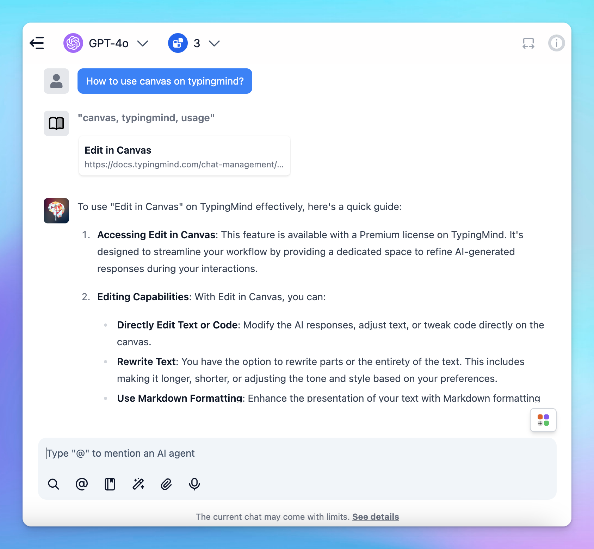

# Get started with Knowledge Base

The Knowledge Base system on TypingMind allows you to integrate your internal data from multiple sources to your AI workspace and implement Retrieval-Augmented Generation (RAG) so that the AI model can generate relevant and accurate response to domain-specific questions.

## **What can you do with the Knowledge Base system?**

### **1. Connect data from multiple sources**

You can link data from various places, such as uploaded documents, Notion, Google Drive, GitHub. etc. 

This keeps all your important information in one place and easy to access.

### **2. Use RAG to boost AI capabilities**

With Retrieval-Augmented Generation (RAG), your AI model can fetch the most relevant information from the Knowledge Base to provide more accurate and helpful answers.

**Learn more:** https://docs.typingmind.com/typingmind-custom/branding-and-customizations/how-knowledge-base-works-in-typingmind-custom

### 3. Cite sources with links

When you enable “Show reference sources of training documents to users”, the system can cite sources with clickable links. This helps users to trace the origin of the AI’s responses to provide more transparency and reliability in the generated responses.

### 4. Connect knowledge base to AI Agent

Assign tags to your connect data so AI Agents can use it effectively. 

Tags let you control which parts of the Knowledge Base the AI can access, making it more flexible and powerful.

Learn more: https://docs.typingmind.com/typingmind-custom/branding-and-customizations/connect-knowledge-base-to-your-ai-agents

## How to get started with Knowledge base

- Go to the **Knowledge Base** section under **Data Management**.
- Click **Add Data Sources** and select a source.

- Follow the steps in the app to connect your data.
- Each source is stored in a folder. To update a connection, click the folder and select **Configure.**

Done! Your data is now connected and ready to use.