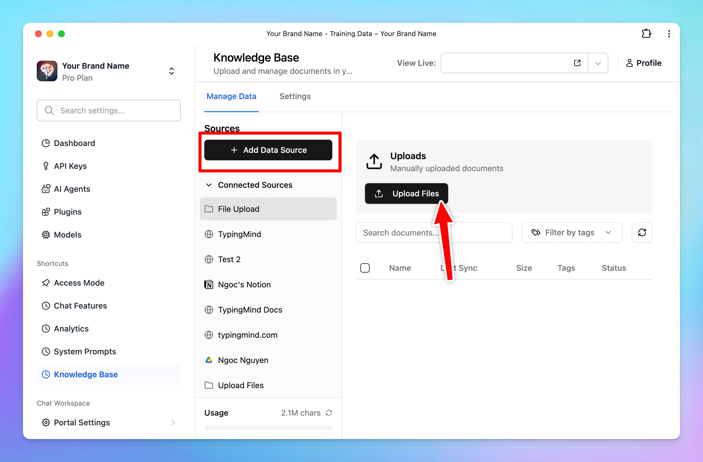

<Note>
  **Note:** The Knowledge Base feature is currently in **Early Access**. Many more changes will be made in the near future on how the knowledge base is done for the AI assistant. We’ll make announcements via email, and via our [changelog](https://feedback.typingmind.com/changelog) when there is any change in this document.
</Note>

Connecting knowledge base as training data helps you train the AI assistant with your domain-specific knowledge and let the AI assistant understand context, respond accurately, and improve over time with your updated data. Let's see how you can set up knowledge base and how these data work with TypingMind Team.

## Setup knowledge base for your chat instance.

Go to the Admin Panel → Knowledge Base. Here you can setup your knowledge base:

1. Upload files up to 50MB per file. Supported format: PDF, DOCX, TXT, CSV, etc.
2. Pulling data from other services (Notion, Google Drive like Google Docs, Google Sheet, etc.)

## How knowledge base is provided to the assistant.

### Knowledge base provided via Uploaded Files

The AI assistant gets the data from uploaded files via a vector database. Here is how the files are processed:

1. Files are uploaded.
2. We extract the raw text from the files and try our best to preserve the meaningful context of the file.
3. We split the text into chunks of roughly **3,000 words** per chunk with some overlap. The chunks are separated and split in a way that preserves the meaningful context of the document. (Note that the chunk size may change in the future, as of now, you can’t change this number).
4. These chunks are stored in a database.
5. When your users send a chat message, the system will try to retrieve up to **5 relevant chunks** from the database (based on the content of the chat so far) and provide that as a context to the AI assistant via the system message. This means the AI assistant will have access to the 5 most relevant chunks of uploaded data at all time during a chat.
6. The “relevantness” of the chunks is decided by our system and we are improving this with every update of the system.
7. The AI assistant will rely on the provided text chunks from the system message to provide the best answer to the user.

All of your uploaded files are stored securely on our system. We never share your data to anyone else without informing you beforehand.

### Knowledge base provided **via connected sources (Notion, Github,…)**

In addition to uploading files, you can also connect external data sources, such as Notion, Intercom, etc., to train your AI assistant.

- **Connect your data source**: link your desired external data source (e.g., Notion, Intercom, etc.) to your AI assistant.
- **Data extraction and chunking**: The process of data extraction and chunking works the same way as it does for uploaded files. The system extracts the raw text, preserves the meaningful context, and splits the text into manageable chunks.
- **Data refresh**: the system will refresh the data from the connected sources once per day. This ensures that your AI assistant always has access to the most up-to-date information.

<Tip>
  There are many options to connect your knowledge base with LLMs on TypingMind, learn more:

  [Four levels of data integrations](/typingmind-team/branding-and-customizations/four-levels-of-data-integrations)
</Tip>

## Be aware of Prompt Injection attacks

By default, all knowledge base are **not visible to the end users**.

However, all LLM models are subject to [Prompt Injection](https://arxiv.org/abs/2306.05499) attacks. This means the user may be able to read **some of your knowledge base**.

## Best practices to provide knowledge base

1. Use raw text in [Markdown](https://en.wikipedia.org/wiki/Markdown) format if you can. LLM model understands markdown very well and can make sense of the content much more efficient compare to PDFs, DOCX, etc.
2. Use both Upload Files and [System Prompts](/system-prompt/system-instruction). A combination of a well-prompted system instruction and a clean knowledge base is proven to have the best result for the end users.
3. Stay tuned for quality updates from us. We improve the knowledge base processing and handling all the time. We’re working on some approaches that will guarantee to provide much better quality overall for the AI assistant to lookup knowledge base. 

## Notes

By default, you will have 1M training characters to upload your data for free. If your uploaded training characters for knowledge base exceeds this number,  please go to Admin \> Billing page to buy more training characters.

**Last update:**  10 Nov 2025.