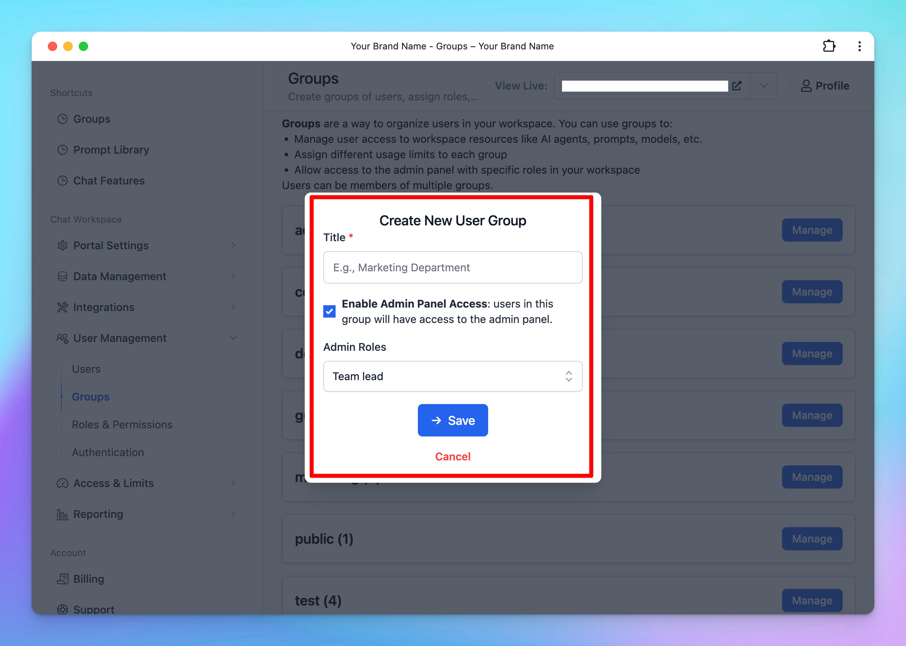
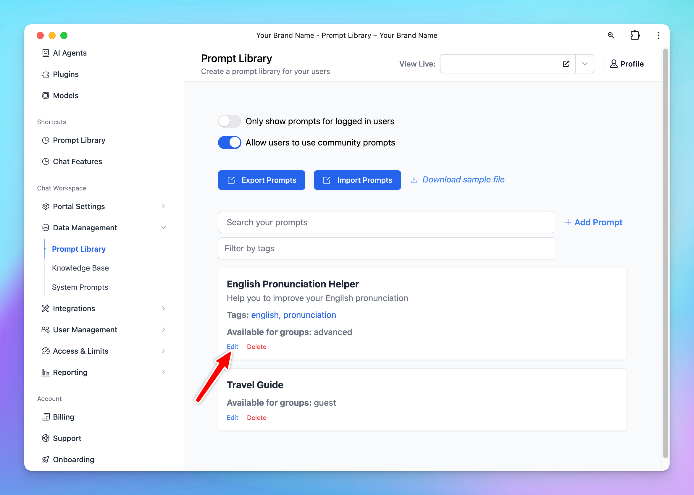

With TypingMind Team, you can restrict the visibility of prompts for certain user groups. This allows you to control which prompts each user group can be used.

You can restrict their access to specific prompts by grouping your team members into different groups and assigning these groups to specific prompts, here's the details.

## **Step 1: Create user groups for your team members**

Creating Groups for your team members allows you to categorize them into different groups of users, for example, Private group, Public group, BOD group, etc.

Please follow these steps to create groups for your members:

- Go to the **Admin Panel** in your workspace.
- Navigate to the **Groups** section under **User Management**.
- Click on **Add New Group**.

/image%2020.png)

- Enter a **Group Name** that reflects the purpose or role of the group.
- *(Optional)* Enable **Admin Access** for this group if they can have access to the admin panel.
    - If you enable this option, ensure you assign appropriate **Admin Roles** to the group. These roles should align with the permissions you’ve defined in the [**Roles and Permissions**](/typingmind-team/user-management/roles-and-permissions) settings.

- Click **Manage** next to the created group
- Click **Add Members**

- Select the users you want to include in this group from the list.

<aside>
💡

Learn more on [User Groups](/typingmind-team/user-management/create-and-manage-user-groups)

</aside>

## **Step 2: Assign User Groups to Prompts**

You can control the prompt visibility to specific user groups as follows:

- Go to the **“Prompts Library”** section from the Admin Dashboard.
- Select **“Add Prompt”** to create a new prompt, or **“Edit”** an existing prompt.

- Scroll down to the **“Visibility”** section and select from the drop-down menu:
    - **“Visible only to users in specific groups”:** once you add groups, users in these certain groups are allowed to use the model
    - or **“Visible to all users except users from specific groups”:** once you add groups, users in these certain groups ARE NOT allowed to use the model.

<aside>
💡

**Example:**
If you want only members in the “Guest” group to access the “Content Improver” prompt, assign the “Guest” group to that prompt. Members in other groups will not have access.

</aside>

## **Use Cases**

### **Restrict Prompt Access for Different Departments / Roles in a Company**

With TypingMind Custom, you can specify which prompts each department of your company can access. This ensures that each department only has access to the prompts relevant to their work.

For example, you can group your marketing team members into a “Marketing” group and assign this group to all prompts specifically designed for marketing tasks.

This way, only the marketing department will see these prompts on their chat interface.

### **Restrict Prompt Access for Different User Levels**

TypingMind Custom can also be used to control the visibility of prompts between:

- Intern / Staff and High-level positions
- Visitors / Guests and Team members

Visitors could be added to “Visitors” group and have access only to basic prompts while Team members who are in the “Member” group can gain access to more advanced prompts.

<aside>
💡

You can also restrict users access to [certain AI Agents](https://custom.typingmind.com/features-old/limit-ai-character-access) and [certain chat models](https://you%20can%20also%20restrict%20users%20access%20to%20certain%20prompts%20and%20ai%20characters/)

</aside>