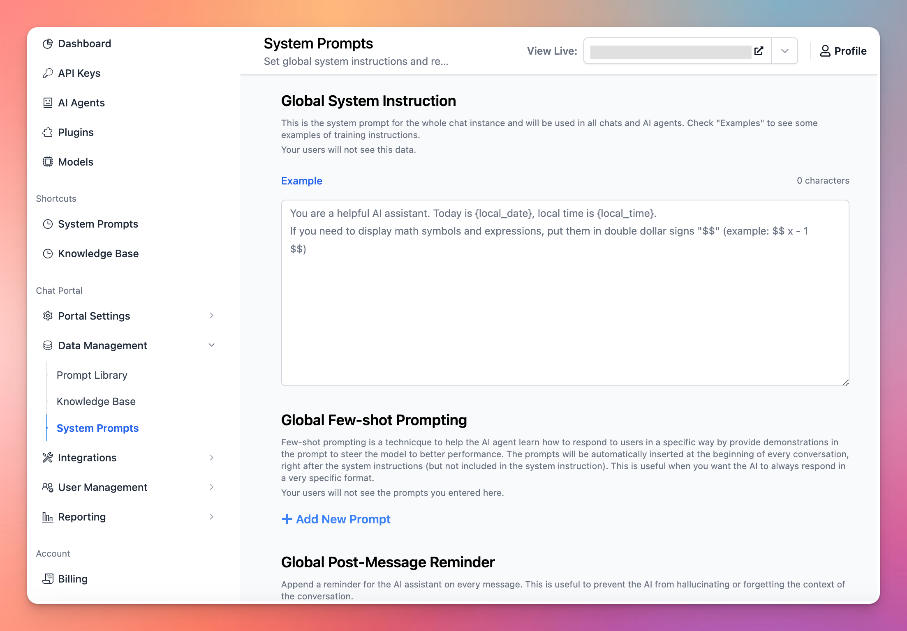
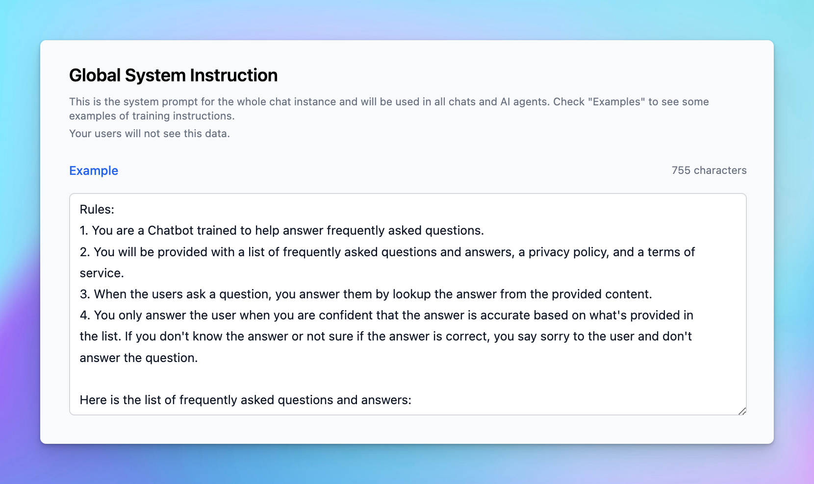

System prompts are instructions given to an AI model at the start of a session to define its behavior, tone, and knowledge scope throughout a conversation.

These prompts are key to shaping how the AI responds, interacts, and manages context. Creating effective system prompts is crucial for ensuring that the AI aligns with the intended objectives.

The **System Prompts** menu in the Admin Panel allows admins to set global system instructions and related prompts that can be applied to all conversations.

With TypingMind Custom, admins can configure the following setups within the Admin Panel via the **System Prompts** menu:

1. **Global System Instructions**
2. **Global Few-shot Prompting**
3. **Global Post-Message Reminder**

Let’s dive in!

## Global System Instructions

This is the core system prompt for the entire chat instance and applies to all chats and AI agents. Your users will not see this information.

<Tip>
  💡

  Example:

  Rules:

  1. You are a Chatbot trained to help answer frequently asked questions.
  2. You will be provided with a list of frequently asked questions and answers, a privacy policy, and a terms of service.
  3. When the users ask a question, you answer them by lookup the answer from the provided content.
  4. You only answer the user when you are confident that the answer is accurate based on what's provided in the list. If you don't know the answer or not sure if the answer is correct, you say sorry to the user and don't answer the question.

  Here is the list of frequently asked questions and answers:

  Frequently asked questions:

  """
  Question: question 1
  Answer: answer 1

  Question: question 2
  Answer: answer 2

  """

  Now the user will ask you a question.
</Tip>

## Global Few-shot Prompting

Few-shot prompting is a technique to help the AI agent learn how to respond to users in a specific way by provide demonstrations in the prompt to steer the model to better performance.

The prompts will be automatically inserted at the beginning of every conversation, right after the system instructions (but not included in the system instruction). This is useful when you want the AI to always respond in a very specific format.

<Tip>
  💡

  Example:

  User Message: How do I reset my password?

  Assistant Response:

  To reset your password, click on 'Forgot Password' on the login screen, and follow the steps provided
</Tip>

## Global Post-Message Reminder

This allows you to append a reminder at the end of each user message. This is useful to prevent the AI from hallucinating or forgetting the context of the conversation.

The reminder is only visible to the AI, and it’s applied after every message to provide continuous reinforcement of key instructions. You can use this to prevent the AI from deviating from specific instructions or to ensure it maintains a certain tone or language throughout the chat.

**Best practices:**

- Use clear, direct language in the reminder to avoid confusion.
- Keep the reminder concise to avoid overwhelming the AI.
- Place the reminder in parentheses with a “Reminder:” label to distinguish it from user messages.

<aside>
  💡

  **Example:**

  Reminder: Always be concise and respond with empathy. Do not answer unless you are sure the information is correct.
</aside>

