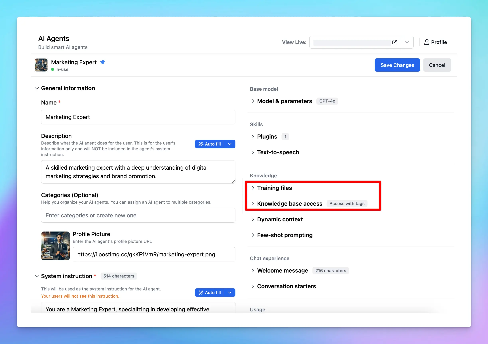

**When setting up [AI Agents](https://docs.typingmind.com/ai-agents/ai-agents-overview) in TypingMind Custom, you might wonder: what’s the difference between “Training Files” and “Knowledge Base Access”?**

These two options help you customize your AI Agent responses with higher quality and more relevant, but they work differently. Let’s see the differences.

## What are Training Files?

Training files let you upload documents that are **directly injected into the system prompt** to provide context for the AI Agent. The information provided in your documents becomes a part of the immediate interaction between the user and the model.

The system will automatically extract texts from your uploaded documents to inject it into the system prompt of the AI Agent, therefore, the file size will be limited by the context length of the base model you choose for the AI Agent.

### Pros

1. **Get highly relevant AI responses:**
   - Since the AI  always "reads" the context in full within the system prompt, responses tend to be more accurate and aligned with the data provided.
2. **Easy to setup**
   - Just one click to upload your training documents.

### **Cons**

1. **Consume more tokens**
   - Embedding training files increases the number of tokens used in each interaction, which leads to higher costs and faster token limits.
2. **Limited by the AI model context window**
   - Models have a finite context window (e.g., 128k tokens for GPT-4o), this means that your uploaded file must be smaller in size compared to the context window.
   - It causes the difficulties in uploading large files.
3. **Restrict in file types**
   - Training files often need to stay to specific formats so the system can easily extract text (e.g., TXT, PDF, XLSX, etc.)

## What is a Knowledge Base?

A knowledge base leverages a **retrieval-augmented generation (RAG)** approach. Instead of embedding all data into the system prompt, the knowledge base retrieves **relevant pieces of information** based on the user’s query.

This is only available via TypingMind Custom:

- You upload the documents or connect your data sources via the Knowledge Base center

- Each data you connect to the center will be managed by tags, assign a specific tag to that data to categorize it
- Assign that tag to the AI Agent so it can access the training data you select.

Here’s a typical RAG workflow on TypingMind:

- **Data collection**: you must first gather all the data that is needed for your use cases
- **Data chunking**: split your data into multiple chunks with some overlap. The chunks are separated and split in a way that preserves the meaningful context of the document
- **Document embeddings**: convert chunks into a vector representation, including transforming text data into embeddings, which are numeric representations that capture the semantic meaning behind text. In simple words, the system can grasp user queries and match them with relevant information based on meaning rather than simple word comparisons.
- **Handle user queries**: a chat message sent —\> the system retrieves relevant chunks —\> provide to the AI model
- **Generate responses with the AI model**: the AI assistant will rely on the provided text chunks to provide the best answer to the user.

### **Pros**

1. **Support large file upload**
   - Unlike training files, a knowledge base allows for the inclusion of large documents or datasets that exceed the model’s context window.
2. **Connect data from multiple sources**
   - You can connect the knowledge base to various sources, such as Google Docs, Sheets, Slack, One Drive, or even scraped data from websites.
3. **Save more cost**
   - By retrieving only the necessary data for a query, it reduces token consumption, thus saving cost.

### **Cons**

1. **Limit context understanding**
   - Restrict the AI model's ability to see the full context picture since it checks keywords within your prompts, finds relevant chunks, and provides answers rather than processing all data at once.
2. **More complicated setup**
   - It takes more steps to set up the Knowledge base to connect with the AI Agent.

## Key differences between Training Files and Knowledge Base

| **Aspect** | **Training Files** | **Knowledge Base** |
| --- | --- | --- |
| **Integration method** | Directly embedded into the system prompt | Retrieves data dynamically using RAG |
| **Context relevance** | Highly relevant answers based on full context | Answers depend on the effectiveness of retrieval |
| **Token consumption** | High, as full context is loaded | Low, as only relevant data is retrieved |
| **Data volume** | Limited by the model's context window | Supports large datasets |
| **Setup complexity** | Simple | More complex |
| **Cost** | Higher, due to token usage | Lower, as fewer tokens are consumed |

## Which options should you use?

The choice between training files and a knowledge base depends on your requirements:

### **1. Use Training Files if:**

- You need the uploaded documents as context that maintain during the conversation
- Your data fits within the model’s context window and token limits.

**_For example_**, to maintain the tone and style for your conversation, provide tone and style documents to make sure the AI writes consistently with your brand’s voice.

### **2. Use Knowledge Base if:**

- You’re dealing with large datasets or need to integrate multiple data sources.
- Cost efficiency is a priority, and you can tolerate occasional incomplete responses.

**_For example_**, connect to a database of product manuals or FAQs for customer support.

## Combine both options

In many cases, combining both methods can provide the best of both worlds:

- Use **training files** to provide critical, concise context that must be included and consistent in the system prompt.
- Leverage a **knowledge base** for supplementary information or large datasets that don’t need to be fully embedded.

## Final thought

Both training files and knowledge bases are great to improve AI responses.

By understanding their strengths and limitations, you can design a solution that optimizes both cost and effectiveness, and make sure that your AI chatbot works smarter and delivers better results.