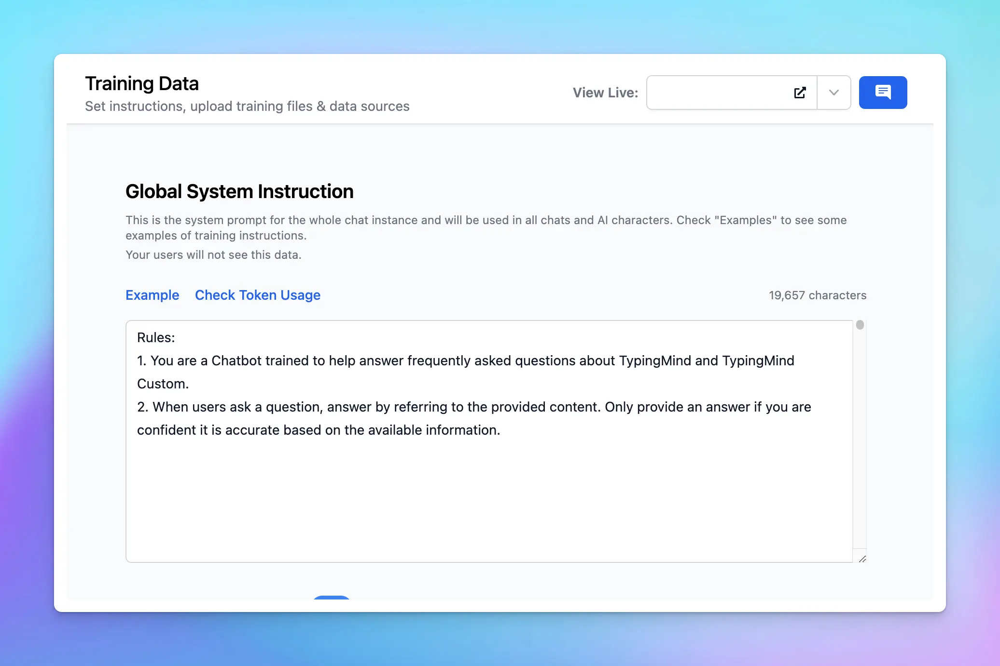

Useful tips to help you improve the response quality for your chat instance, especially in the case of uploading training data.

## 1. Improve the System Instructions for Your Chat Model

Crafting precise instructions will help your chatbot enhance performance and ensure it responds as you expect.

- If you want the bot to answer based only on your provided documents, then specify this to the bot. For example, “You will only provide answers based on my provided data” or “For this… part, just provide answers based on the information from… (document title).”
- It is also beneficial to provide some context about your product/service/expectation to help the bot understand its role and what it should deliver.
- Additionally, if you connect with your website data, creating a concise document that maps out authentic URLs to their corresponding page titles is advantageous. This is particularly useful for chatbots navigating through complex website structures.

## 2. Utilize Chat Logs

The Chat logs feature allows you to view your users' interaction history.

This enables you to track all responses from the chat model and figure out which parts deliver unsatisfactory information. As a result, you can update the instructions within your chat instance accordingly and timely to prevent any cases like that in the future, as well as improve user satisfaction.

## 3. Structure Your Connected Data

It's important to note that only text can be read by the AI model (images, videos, non-textual content will not be supported).

That's why you should improve the readability of your uploaded data.

- Use raw text in [**Markdown**](https://en.wikipedia.org/wiki/Markdown) format if you can. The LLM model understands markdown very well and can make sense of the content much more efficiently compared to PDFs, DOCX, etc.
- Keep the language in your data sources clear and straightforward.
- Remove any irrelevant or redundant information from your data sources.
- If possible, please build different AI Agents and assign specific training data to these characters, which can assist in specific use cases.

## 4. Model Selection

Test different AI models to learn which can deliver the best results for your needs.

You can choose GPT-4 Turbo / Claude 3 Opus as your main model since they have proven to deliver more accurate and comprehensive answers than other models.

