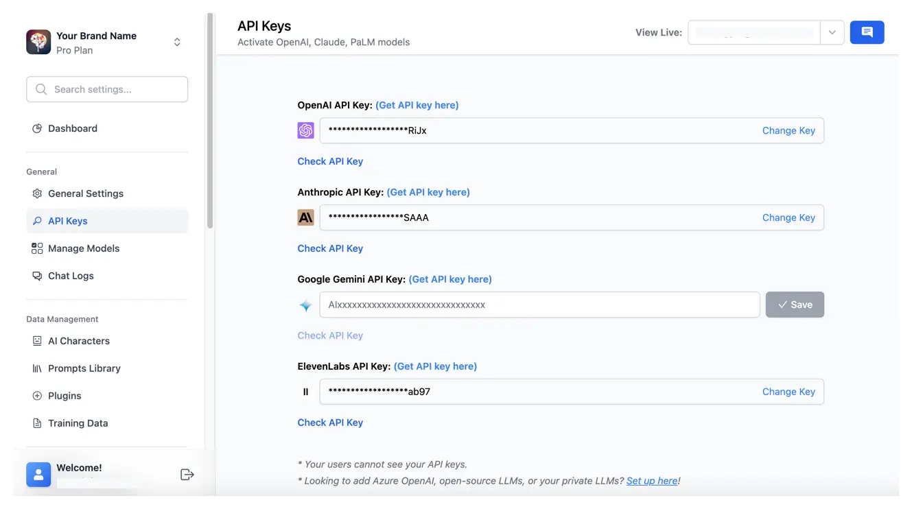

# Set up API keys

TypingMind Team allows admins to preset API keys from their Admin Panel, which enables:

- Users to use the chat instance without manually entering an API key.
- Admins to easily control costs and usage.

<Note>
  💡 Note: you must pre-set the API key from the Admin Panel, there’s no option for your users to enter them manually from the chat UI for now.
</Note>

# Use available models

We provide chat models from the following providers:

- [**OpenAI**:](/manage-and-connect-ai-models/openai-\(gpt-5-gpt-4.1\)) access GPT-4 Turbo, GPT-4, GPT-3.5, GPT-3.5 Turbo, etc.
- [**Anthropic Claude**](/manage-and-connect-ai-models/anthropic-claude): access Claude 3 Opus/Sonnet/Haiku, Claude Instant, Claude 2, etc.
- [**Google Gemini**](/manage-and-connect-ai-models/google-gemini-\(gemini-3.1-nano-banana\)): access Gemini 1.0 Pro, Gemini 1.5 Pro, Gemini 1.0 Ultra, Gemini Pro Vision.

By using these models:

- Go to API keys under the General section
- Enter the API key from Anthropic Claude (for Claude models), OpenAI (for GPT models) or Google Gemini (for Gemini models)

# Use with other models

In case you want to use chat models not available within our provided list above, such as Azure OpenAI, Perplexity, Mistral, etc., you can completely set up these chat models on the Admin Panel by following the steps below:

- Click on "**Manage Models**" under the General section.
- Scroll down to the bottom and click on "**Add Custom Models**".
- Set up the custom models for:
  - [Azure OpenAI](https://docs.typingmind.com/chat-models-settings/use-azure-openai)
  - [Mistral AI](https://docs.typingmind.com/chat-models-settings/use-with-mistral-ai)
  - [Perplexity](https://docs.typingmind.com/chat-models-settings/use-with-perplexity-ai)
  - [OpenRouter](https://docs.typingmind.com/chat-models-settings/use-openrouter-models)

<Tip>
  More guidelines can be found at [https://docs.typingmind.com/chat-models-settings](https://docs.typingmind.com/chat-models-settings)
</Tip>

