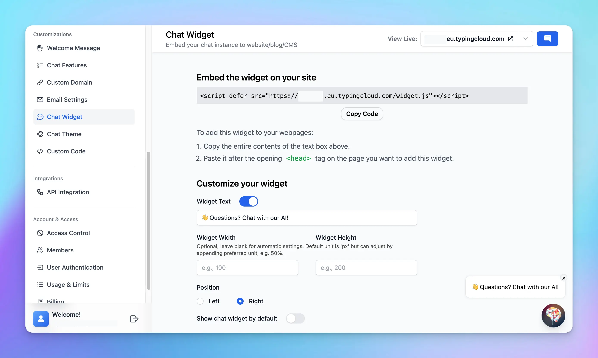

One effective way to boost engagement and provide immediate value to your visitors is by embedding a chat widget on your website. Not only does this offer an interactive element to your site, but it also provides a hub for instant communication and assistance.

Beside embedding the entire chat instance, you have the option to embed an AI Agent as chat widget on your website too!

Here are 4 easy steps to do that:

### **Step 1: Customize Your Chat Widget**

1. Log into your chat instance's Admin Panel.
2. Navigate to the “**Chat Widget”** section.
3. Find the “**Customize your widget”** section to adjust the Welcome messages and the widget position

### **Step 2: Copy the Embed Code**

Click on the “**Copy Code”** button

<aside>
💡 In case you want to embed specific AI Agent only to your website so your members can start the chat with AI Agent (without manually selecting from the AI Agent list), you can:

- Go to AI Agent
- Click Edit the AI Agent
- Scroll down to Open chat with this specific AI agent and Copy the provided `<script>` tag to embed that AI Agent to your website

</aside>

### **Step 3: Embed the Code into Your Website**

Paste the code after the opening **`<head>`** tag on the page you want to add this widget.

### **Step 4: Test the Chat Widget**

1. Navigate to your website where the chat widget has been embedded.
2. Interact with the chat widget to ensure it is functioning as expected.

### **Best Practices**

- **Control the [chat features](https://custom.typingmind.com/features/control-chat-features)**: you can hide some of elements / features on the chat interface. This can help eliminate potential distractions and guide users to interact with the chat UI in the way you intend. Example: hide prompt and AI agents library.
- **Choose the right [access mode](https://custom.typingmind.com/features/access-control)**: decide who should have access to your chat widget. If your widget is meant for customer support, you might want to make it publicly accessible to all visitors. However, if it's intended for exclusive offers, limiting access to users who provide their email might be more appropriate.
- **Test the chat widget and update your [training data](https://custom.typingmind.com/features/build-custom-chatbot): r**egular testing allows you to spot any issues and fix them promptly. Moreover, updating your training data frequently ensures that the chat widget continues to improve and adapt to your users' needs, providing them with accurate and relevant responses.