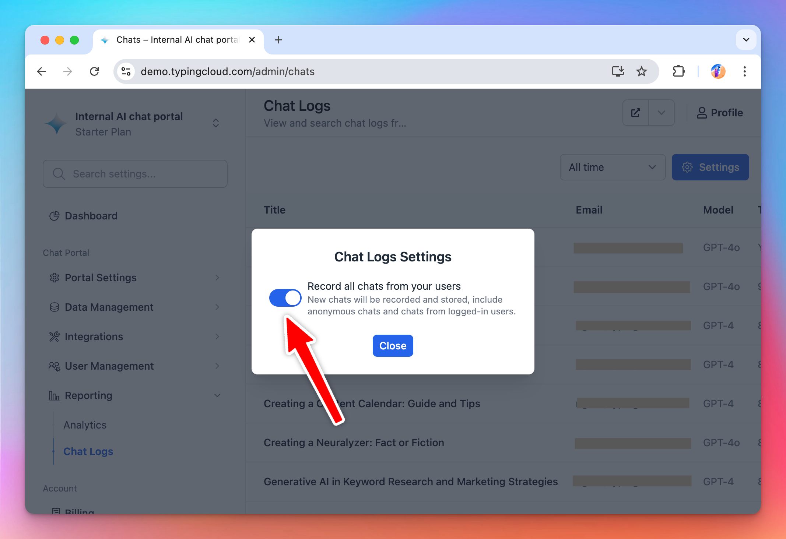

You can export all of your chat logs to an external system. The chat logs contain all the user messages in your chat instance.

This is useful for:

- Internal audit of the chat conversation
- Monitor the usage and analyze the AI model quality

This page will instruct you on how to setup your chat instance to export the chat logs.

## Step 1: Enable chat logs

By default, your users’ chat conversations are not logged. You can enable this by going to **Admin Panel → Reporting → Chat Logs → Settings → Enable Record all chats from your users**.

Once chat logs is enabled, you can start to see you chat logs via the Admin Panel and export them to an external system automatically via API (next section).



## Step 2: Create an API key for integration

Next, create an API key. This API key is needed for the external system to get the chat logs out of TypingMind.

Go to **Admin Panel → Integrations → API Integration** and click “Generate new API Key”.

Then copy the newly generated API key, you will need this in the next step.


## Step 3: Export chat logs via API

Use our Chatlogs API (see [API documentation here](https://api.typingmind.com)) to get the chat logs.

**API Hosts:**

1. For US instances: `https://api.typingmind.com`
2. For EU instances: `https://api.eu.typingmind.com`
3. For self-host instances: use your instance deployment URL.

**API Key:** add the API key to your `x-api-key` header to authenticate the request.

Example request:

```
curl https://{url_to_your_chat_instance}/api/v1/chatlogs?startUnixTime=1723210310&endUnixTime=1723610310 \
  -H 'x-api-key: {your_api_key}'
```

Example response:

```json
{
  "data": [
    {
      "chatID": "U9H8EEJpLL",
      "chatTitle": "AI Chat Support Inquiry",
      "createdAt": "2024-08-14T04:18:53.000Z",
      "recordedAt": "2024-08-14T04:19:07.000Z",
      "conversationText": "User: hello!\n\nAssistant: Hi there!"
    }
  ]
}
```

By default, the API will returns the last 100 matched conversations (depends on the `startUnixTime` and `endUnixTime` parameters).

Using this API, you can set an automation to export all of your users’ chats to an external system for auditing or analyzing.