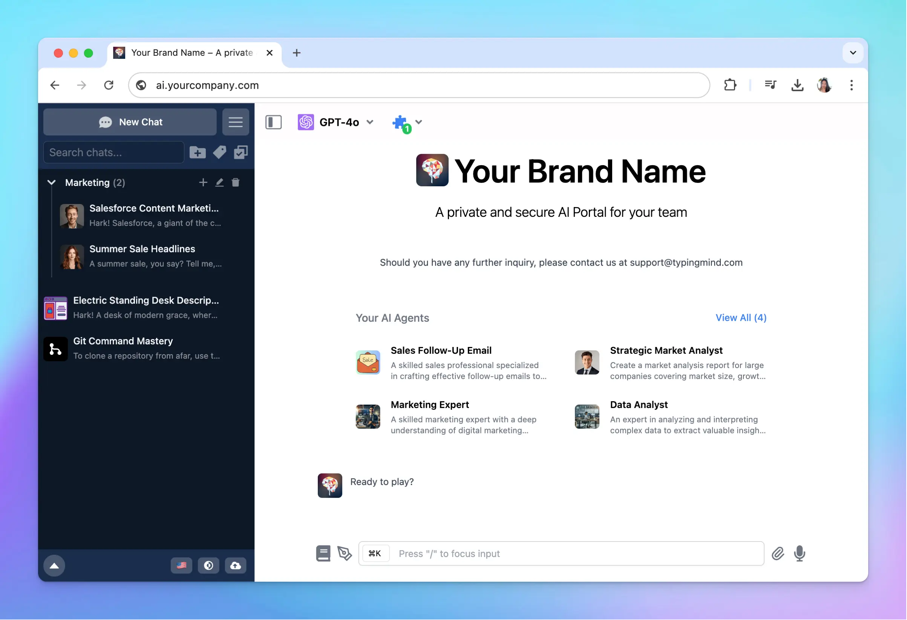

**TypingMind** offers a great opportunity not only to help you adopt AI at the forefront but also to make money by reselling the product. With [TypingMind’s Reseller Program](/typingmind-team/reseller-program), you can build your own business by adding value to the TypingMind AI Platform and reselling it at any price you choose.

In this article, we'll explore different ways to monetize TypingMind with comprehensive examples to help you get started.

# What is the TypingMind Reseller Program?

Generative AI is transforming how businesses operate around the world. [**TypingMind**](https://custom.typingmind.com/) helps companies by providing an AI platform where everyone can access the latest generative AI models via a unified and secure chat interface. With the help of AI, teams can deliver more output faster, thus increasing productivity.

We collaborate with Reseller Partners who use TypingMind as the technical platform for businesses, especially in local markets where companies may not be familiar with the latest generative AI technologies.

Our Reseller Program is designed to be profitable for partners, and we have successful resellers worldwide - in Germany, Canada, Thailand, and more.

Learn more about the [**TypingMind Reseller Program and Reseller Benefits**](https://docs.typingmind.com/typingmind-team/reseller-program).

# How to run your Reseller Program and monetize with TypingMind

TypingMind acts as your technical partner and platform provider to offer a sustainable and up-to-date platform.

And you, as a Reseller, are encouraged to add value on top of the platform and sell access to these enhanced services at any price you choose.

Here are some **simple and effective ways** to add value and make money with TypingMind:

---

## **1. Combine TypingMind with your consulting services**

If you have expertise in any field, you can combine TypingMind with consulting to create **value-added packages**.

### **Who is this for?**

Professionals like business consultants, marketers, or writers who want to offer something extra to their clients.

### **How it works**

Offer your consulting services and include access to TypingMind as a tool for your clients. Help them leverage TypingMind’s AI by showing how to generate content, create reports, or automate workflows.

### **Example**:

You're a marketing consultant in digital marketing strategies for small and medium-sized businesses.

You can develop a premium service package for your clients as follows:

- Monthly meetings to outline marketing goals and campaigns.
- Provide clients with access to a TypingMind chat instance under client branding with custom-built prompts, AI Agents tailored to their needs. For example, content creation, SEO optimizer, Ad copywriter, Marker research, etc.
- Offer continuously workshops or tutorials on how to effectively use TypingMind for marketing tasks.
- Provide ongoing consultation \*\*\*\*to assist clients in integrating AI-generated content into their marketing efforts.

### Pricing suggestions

- Charge your standard rate for strategic planning and consultation.
- Include a monthly fee for access to the customized TypingMind instance.
- Add fees for workshops and ongoing support, or bundle them into your overall package.

---

## 2. **Sell access to custom AI Agents, Prompts or Plugins (for task automation)**

You can **develop custom AI agents, special prompts, or plugins that can help automate tasks** (like generate powerpoint slides, schedule social posts, etc.) using TypingMind and sell them to businesses or individuals.

### **Who is this for?**

Prompt Engineers, AI Consultants, AI enthusiasts with industry expertise.

### **How it works**

Build AI agents or prompt templates that solve specific problems of your clients.

For example, you could create an AI agent that writes product descriptions for e-commerce websites or automates customer service replies for small businesses.

### **Example**

You're an expert in financial analysis with experience in investment banking and recognize that financial institutions need advanced tools to interpret vast amounts of financial data and generate insights.

You can create AI agents that can:

- Conduct ratio analysis, trend analysis, and compare data across multiple companies or time periods based on user input such as financial statements, market trends, and economic indicators.
- Produce comprehensive financial summaries, risk assessments, and investment recommendations.
- Respond to specific questions about financial metrics, projections, or the impact of certain events on investments.

### Pricing suggestions

You can sell access to these AI Agents as follows:

- Offer annual licenses to large organizations.
- Charge individual clients with monthly subscription based on different tiers

<aside>
  📌

  You can control the access of each user to each AI Agent and offer the AI Agents via different tiers, for example:

  * Basic plan: access to 1 AI Agent
  * Extended plan: access to 3 AI Agents
  * Premium plan: access to all AI Agents
</aside>

---

## 3. **Launch a training course**

If you enjoy teaching, you can **create and sell a training course** that provide AI-related knowledge.

### **Who is this for?**

Educators and trainers, consultants or coaches.

### **How it works**

Build a course that teaches people how to use TypingMind to improve their businesses. The course could focus on things like using AI to improve writing, automate customer service, or create better marketing content.

### **Example**

You are an experienced software developer with expertise in natural language processing (NLP) and recognize a demand for advanced training in AI-powered coding assistants.

You create an AI training course that helps students utilize AI in their coding tasks, for example:

- Debugging and error handling with AI
- AI in software testing
- Integrations
- AI as coding assistant

You can build custom AI Agents or prompts that help you with those tasks and show to your students how you guide the AI to provide high-quality responses.

All your students will have access to TypingMind to use your pre-built AI Agents and practice creating their own AI Agents.

### Pricing suggestions

- Charge a one-time fee for the course, and include TypingMind access as a bonus.
- You could also offer premium versions with personalized coaching or additional resources.

---

## 4. **Offer TypingMind as a white-label solution for your clients**

If you're working with businesses that want to use AI without involving their in-house team for development, you can **white-label TypingMind** and offer it as a customized solution.

### **Who is this for?**

Agencies or Business Consultants.

### **How it works**

You rebrand TypingMind with the company’s logo and customize it to their needs. They get a branded AI tool that feels like their own, while you handle the setup and maintenance.

### **Example**

You, as a digital marketing agency, could buy TypingMind, branded with your client look, and offer it to your clients as part of your marketing packages.

You will help:

- Provide API keys for different AI models
- Train the AI with custom training data to help them provide relevant answer.
- Build custom AI Agents and Prompts that help them in content creation, market research, social post scheduling, etc.
- Train the client’s staff in using these resources.
- And implement other integrations (if any)

Your clients will just need to purchase the solution and access all the setup you have done for them.

### Pricing suggestions

- Charge a setup fee for customization (Prompts, AI Agents, Plugins)
- A monthly fee for ongoing support, maintenance and AI model usage.

---

## 5. **Offer AI-powered customer support bot solutions**

Businesses are always looking to automate their processes. You can offer TypingMind as an **AI-powered customer service solution**.

### Who is this for?

Agencies, business consultants, AI specialists, Marketing and Sales consultants, etc.

### **How it works**

You provide businesses with a TypingMind-powered agent that automates tasks like responding to common customer inquiries. You handle the setup and management for your clients.

### **Example**

You could offer a customer support chatbot for small businesses where the bot automatically answers customer questions.

- Embed the chat bot into client’s website
- Connect the chatbot to their CRM and inventory systems for real-time information.
- Provide training sessions to the client's team on how to monitor the chatbot.
- Regularly check the chatbot's effectiveness and update its knowledge base.

### Pricing suggestions

- Provide monthly subscription for the chatbot access
- Charge access per user.

---

## 6. **Create a membership community**

You can **build a membership community** where members pay a monthly fee to access your customized TypingMind instance.

### Who is this for?

Content Creators and Educators, Community Builders.

### **How it works**

Create a subscription-based community that offers members exclusive access to TypingMind, along with other perks like monthly webinars, industry insights, or personalized AI tools.

### **Example**

You have a community called "AI MindHub" where members can discuss about AI innovation and their application. You decided to build an AI hub where all members can pay monthly to access your pre-built AI resources.

- Create a library of AI prompts and tools for productivity and task automation.
- Build custom AI agents to support members in their specific areas.
- Offer regular workshops and training to help members get the best results from AI.

### Pricing suggestions

Offer monthly or yearly memberships with different tiers:

- **Silver membership**
  - Use standard AI Agents and Prompts (you define)
  - Join in the exclusive community forums.
- **Gold membership**
  - All Silver features.
  - Access to advanced AI Agents, use AI Agents with plugins to complete tasks on autopiloit
  - Monthly group coaching webinars.
- **Platinum membership**
  - All Gold features.
  - One personalized coaching session per month.
  - Priority support

---

## Final thoughts

Monetizing TypingMind through its Reseller Program is a greeat way to build your own business around AI.

The possibilities are endless! Choose the path that suits your strengths, and start turning TypingMind into your next profitable venture!

If you still have questions about the Reseller Program, please contact us at [support@typingmind.com](mailto:support@typingmind.com), we are happy to help!