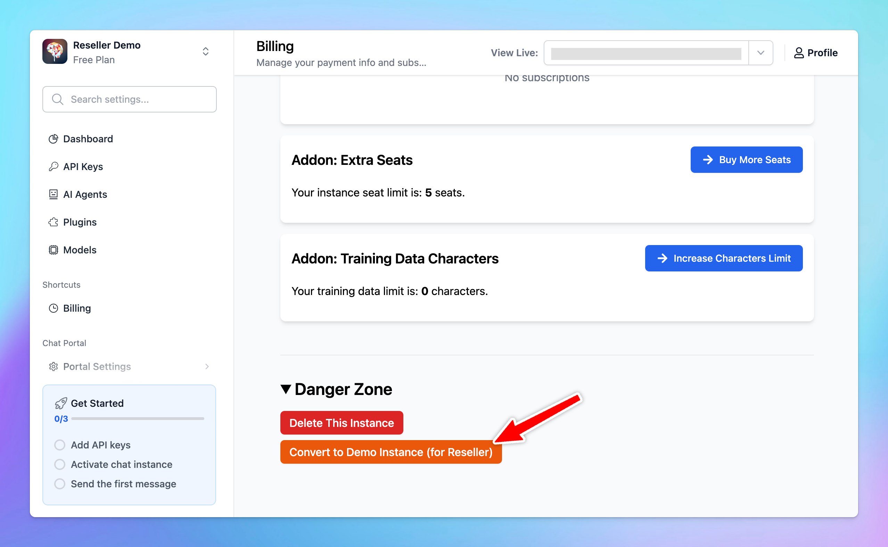

By joining our Reseller Program, you will get a **Reseller License and** **Free Demo Instance with 50 users available.** 

This demo instance allows resellers to showcase the platform to their potential customers effectively and experience its capabilities firsthand. Here’s what you need to know about this offer.

## **What is the Free Demo Instance?**

- The free demo instance is a fully functional environment provided to resellers (equivalent to the Professional Plan). It allows you to explore and demonstrate the platform's features to your end-users.
- It allows you to create unlimited AI Agents and Plugins, access all advanced features (Professional Plan access)
- This instance includes **50 user seats,** so you can showcase its capabilities to potential clients at scale.

## Demo Instance Requirements and Restrictions

The demo instance is created to be a trial environment with certain limits:

- 3 Admin Seats that can be access to the demo instance forever.
- All invited users can access the demo instance **for 14 days**.
- After this period, both their accounts and any data created within the instance will be suspended and deleted automatically. (exclude The owner of the demo instance)

**To obtain a demo instance, you must first purchase a Reseller License, priced at a one-time fee of $399.** You can acquire this license by following the steps outlined in our instructions.

## **How to Get a Reseller License and Your Free Demo Instance**

1. **Log in to the Admin Panel**: access your admin dashboard at [https://custom.typingmind.com/manage](https://custom.typingmind.com/manage) or Create a new instance at [https://custom.typingmind.com/signup](https://custom.typingmind.com/signup)
2. Go to **Billing → Manage Subscription** and cancel any active subscriptions to enable the switch to the demo instance.
3. In the **Danger Zone** section, select **"Convert to Demo Instance."**

1. Follow the prompts to **purchase the reseller license.** After purchasing, you will be granted you access to the demo instance.

1. After purchasing the demo instance, you will get the access to the demo instance.

<aside>
📌

Please note:

- Once you convert to a demo instance, you cannot revert back.
- The demo instance is intended for demon purposes only and should not be used to resell access to your clients. To provide official access for your clients, please create a separate chat instance specifically for that purpose.
- Each reseller is entitled to one free demo instance. For additional instances or custom solutions, please contact us.
</aside>

## Useful Resources

1. [Reseller Program Details](../Reseller%20Program%2041051738ee5a41c69a09578bb14ae964.md)