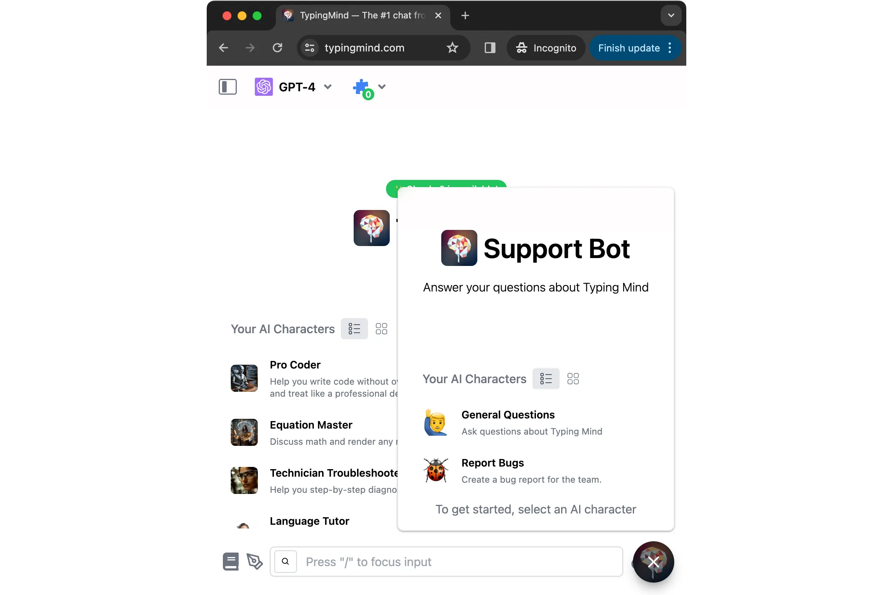
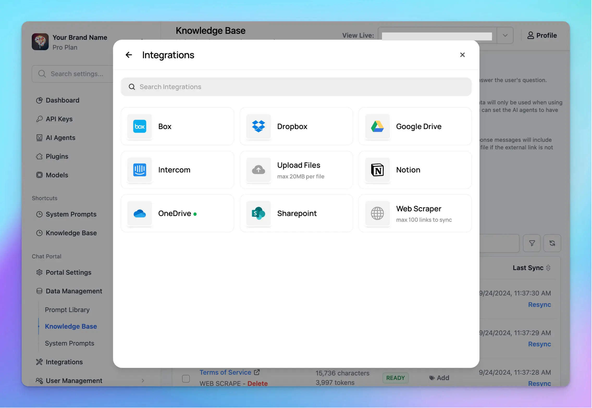

<Info>
  Public Mode and Widget have been removed from the app.

  Please refer to [Build an AI Coaching Agent](/typingmind-team/use-cases/build-an-ai-coaching-agent-for-your-members) instead for the updated setup and recommended workflow.
</Info>

Just so you know, we have built a **Support bot for [TypingMind.com](http://TypingMind.com)** to help resolve user queries directly through a chat widget on our website.

If you are curious about how we built it and want to make a version of support bot for your company, then check out this article for detailed guidelines!

<Tip>
  Please note that this support bot can only be done with TypingMind Team (custom.typingmind.com).

  With Typing Mind Custom, you can create a chat instance under your own domain that functions just like [TypingMind.com](http://typingmind.com/). It allows full control and customization of the chat instance through an Admin Panel.
</Tip>

## Step 1: Create a chat instance

In case you haven’t had a chat instance for TypingMind Custom yet, please sign up for one at [https://www.typingmind.com/new-deployment](https://www.typingmind.com/new-deployment)

<Tip>
  You can choose your hosting location: US and EU to better comply with your company policy.
</Tip>

## Step 2: Connect the chatbot with your API keys

After signing up, you will be landed in the Admin Panel, where you can customize almost everything on the chat interface.

To get the chatbot to work properly, you will need to **connect it with the chat model’s API key**:

- Go to **API keys** menu and **enter your API ke**y, currently, we offer:
  - OpenAI models: GPT-4 Turbo, GPT-3.5, GPT-4 Vision
  - Anthropic Claude: Claude 3, Claude Instant, etc.
  - Gemini models: Gemini 1.0, Gemini 1.5, Gemini 1.0 Pro Vision, Gemini Ultra

- Go to **Manage Models** menu and click **Add Custom Models** if you want to use Azure OpenAI, Perplexity, Mistral, etc. by adding custom models on your Admin Panel.

As for TypingMind Support bot, we currently using the latest GPT-4 Turbo model and found that it delivers pretty good results.

## Step 3: Upload your knowledge base

Connect your knowledge base to the chatbot to help the AI model generate accurate responses based on your company data.

- Go to the **Knowledge Base** menu
- Enable “**Enable Knowledge Base”**
- Click “**Add Data Source**”
- Select a data source to connect with your chat instance. It can be Web URLs, PDF files, Notion pages, Google Docs, and more.

Currently, we are training our support bot with knowledge mostly from our help center: [docs.typingmind.com](http://docs.typingmind.com)

However, uploading knowledge base isn’t enough for the bot to work properly. That’s why we also need the next step - set up Global System Instructions.

## Step 4: Set up Global System Instruction

The AI support bot will provide answers more accurately if you provide it with some rules and guidelines to follow.

- In the System prompts section, navigate the **Global System Instruction** to provide guidelines

Best practices to get the AI support bot to work in a manner:

- Create rules (for example, it shouldn’t answer when users ask a specific topic, it can only give short and concise answers, etc.)
- Provide your product’s basic information. Let the AI model know a quick overview of how your bot operates.

## Step 5: Create AI Agents

The TypingMind Support bot categorizes user queries based on their question types.

- If users ask for product guidelines, app information, etc, they should go with the “General Questions” character
- If they encounter any issues, they use “Report bug” to help resolve the issue or create a complete bug report so they can copy and send it directly to the TypingMind support team. This also helps the team investigate the issue more easily.

You can create as many AI Agents as you want:

- Go to **AI Agents** section
- Create AI Agent and enter the necessary guidelines. For example, within the “Report bug” character, you should guide the model on which questions to ask to track down the issue.

<Note>
  Please note that you can also connect knowledge base to your AI Agents, here’s the [guideline](https://custom.typingmind.com/features/ai-characters-with-custom-data) This allows the AI model to surf proper knowledge base for specific needs.
</Note>

## Step 6: Test your chatbot

Test your chatbot with multiple questions varied in different scenarios to ensure the chatbot answers correctly on your queries.

Update your system prompts and knowledge base accordingly, and continue until you are confident with the AI responses.

## Step 7: Control Access

Decide on how you want your user to access your support bot:

- Users need to sign up to use the bot: **Authorized mode**
- Only invited members can use the bot: **Private mode**

Currently, the TypingMind Support bot enables **Authorized Mode** with limited usage for users, details setup in Step 8.

- Go to Access Control
- Enable Authorized mode for your chat instance

## Step 8: Restrict usage

You can restrict usage on your Support bot to control cost and ensure fair use for your members.

- Go to Usage and Limit
- Choose the chat model you are currently using for the Support bot
- Control its visibility and its allowed usage

Detail on how to limit usage: [https://custom.typingmind.com/features/limit-chat-model-access](https://custom.typingmind.com/features/limit-chat-model-access)

FYI, TypingMind currently applies a limit of 200 characters per message for users.

## Step 9: Control Chat Features visibility

To ensure a no-hassle experience for your members, you should hide all unnecessary features on the chat interface:

- Go to Chat Features
- Disable options you do not want to show on the Chat UI

## Step 10: Set up your branding

Get the bot to work under your branding:

- Give your bot a name with your company tagline
- Upload your brand logo
- Set it up with your company domain (if any)
- Choose your chatbot language
- Pick a theme for the bot to match your brand style

## Step 11: Embed chat widget to your website

The final step is to embed the Support bot widget on your website.

- Go to Chat Widget
- Copy the code
- Paste it after the opening `<head>` tag on the page you want to add this widget.

## Step 12: Enable Chat logs for future monitor

This option allows you to view user chat history to make sure the AI model response as expected and adjust your guidelines accordingly:

- Go to Chat logs
- Click Settings on the top right corner
- Enable the option “**Record all chats from your users**”

## Conclusion

In case you need further guidelines or clarification, please send us an email to [support@typingmind.com](mailto:support@typingmind.com), we would be happy to provide further assistance.