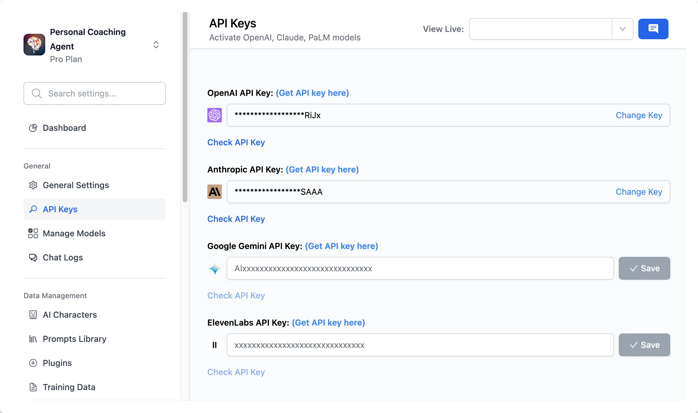

If you are looking to develop an AI Coaching agent and want to sell memberships to your users, follow these step-by-step instructions to get started:

<aside>
💡 Please note that this coaching bot can only be done with TypingMind Custom (custom.typingmind.com).

With Typing Mind Custom, you can create a chat instance under your own domain that functions just like [TypingMind.com](http://typingmind.com/). It allows full control and customization of the chat instance through an Admin Panel.

</aside>

# First, define your goals

First you will need to define what you are going to offer your users and how it should be delivered:

- The modules: career coaching, personal development, business development or educational tutor
- Membership tier: do you offer membership packages? What is the difference among packages?
- AI model: which AI model works best for specific case?

In this case, we are **assuming that you are building a coaching agent for business development** and looking for an option to sell access based on different packages. Here’s an example membership structure:

- **Free Members:** try basic features with the chatbot, limited interaction, get general advices, use GPT-3.5 or limited GPT-4
- **Tier 1 (Basic):** receive advice on business ideas and startup operations.
- **Tier 2 (Pro):** get advice on increasing revenue and scaling up strategies.
- **Tier 3 (Custom):** obtain hyper-personalized advice on fundraising, human resource management, and sustainability.

Let’s get started on how to build this type of chatbot!

# 9 steps to build a coaching agent on TypingMind Custom

## Step 1: Set up a chat instance

In case you haven’t had a chat instance for TypingMind Custom yet, please sign up for one at [https://www.typingmind.com/new-deployment](https://www.typingmind.com/new-deployment)

<aside>
💡 You can choose your hosting location: US and EU to better comply with your company policy.

</aside>

## Step 2: Connect the chatbot with your API keys

After signing up, you will be landed in the Admin Panel, where you can customize almost everything on the chat interface. 

To get the chatbot to work properly, you will need to **connect it with the chat model’s API key**:

- Go to **API keys** menu and **enter your API ke**y, currently, we offer:
    - `OpenAI models`: GPT-4 Turbo, GPT-3.5, GPT-4 Vision
    - `Anthropic Claude`: Claude 3, Claude Instant, etc.
    - `Gemini models`: Gemini 1.0, Gemini 1.5, Gemini 1.0 Pro Vision, Gemini Ultra

- Go to **Manage Models** menu and click **Add Custom Models** if you want to use Azure OpenAI, Perplexity, Mistral, etc. by adding custom models on your Admin Panel.

## Step 3: Customize the chatbot’s UI

### 1. Branding

Get the bot to work under your branding:

- Give your bot a name with your company tagline
- Upload your brand logo
- Set it up with your company domain (if any)
- Choose your chatbot language
- Pick a theme for the bot to match your brand style

Here’s how members will see on the chat interface:

### 2. Feature visibility

Determine which features should be visible in the chat interface. Navigate to the "**Chat Features**" section to enable or disable features on the user interface (UI).

Once a feature is disabled, it will no longer appear on the chat interface, meaning that your members will not be able to see or use it

## Step 4: Define user tags

Assigning tags to members helps you control member access to specific prompts and AI Agents. Below is an example:

- “free” as Free users
- “basic” as Basic users
- “pro” as Pro users
- “custom” as Custom users

## Step 5: Build AI Agent for each tier and restrict usage

<aside>
💡 Building AI Agents allow you to build multiple AI experts specialized in different use case for your members. You just need to provide the instructions (and training data if any) to the AI Agents to guide the AI model on how to answer the member queries.

More details at: [https://custom.typingmind.com/features/ai-characters-with-custom-data](https://custom.typingmind.com/features/ai-characters-with-custom-data)

</aside>

First you need to create **AI Agent** for different member tiers. Go to **AI Agents** section and click **Add Agents:**

- Free: use General Advice
- Basic: use Startup Advice
- Pro: use Sales Strategist
- Custom: use Financial Advisor

By default, these AI Agents will be shown on the chat UI and accessible by all members.

To prevent mix access of members from different tiers, you will need to limit the AI Agent access.

To do this, you should assign each AI Agents with different user tags that you have set in step 4:

Members can only see the AI Agent that you provide access for them.

## Step 6: Restrict chat model usage

You can restrict usage on your Coaching bot to control cost and ensure fair use for your members. 

- Go to **Usage and Limit**
- Choose the chat model you are currently using for the Coaching bot
- Control its visibility and its allowed usage

<aside>
💡 Detail on how to limit usage: [https://custom.typingmind.com/features/limit-chat-model-access](https://custom.typingmind.com/features/limit-chat-model-access)

</aside>

For example:

- **Free users** can only use GPT-3.5 and GPT-4 with cap at 30 messages / hour
- **Basic users** can use GPT-4 with cap at 70 messages / hour
- **Pro users** can use GPT-4 with cap at 150 messages / hour and use with other chat models such as Claude 3 Opus, Google Gemini 1.5

## Step 7: Connect with your payment system

Make use of our API to integrate with your existing payment system. Here’s more details: [https://custom.typingmind.com/features/api-access](https://custom.typingmind.com/features/api-access)

## Step 8: Test your chatbot

Test your chatbot with multiple questions varied in different scenarios to ensure the chatbot answers correctly on your queries. 

Update your system instruction and training data within the AI Agent accordingly, and continue until you are confident with the AI responses.

## Step 9: Enable Chat Logs to track how members engage with the chatbot

This option allows you to view user chat history to make sure the AI model response as expected and adjust your guidelines accordingly:

- Go to Chat logs
- Click Settings on the top right corner
- Enable the option “**Record all chats from your users**”

# Conclusion

TypingMind Custom offers 14-day free trial for all plans, no upfront cost. You can give it a try, explore the capabilities here [https://www.typingmind.com/new-deployment](https://www.typingmind.com/new-deployment)

In case you need further guidelines or clarification, please send us an email to [support@typingmind.com](mailto:support@typingmind.com), we would be happy to provide further assistance.