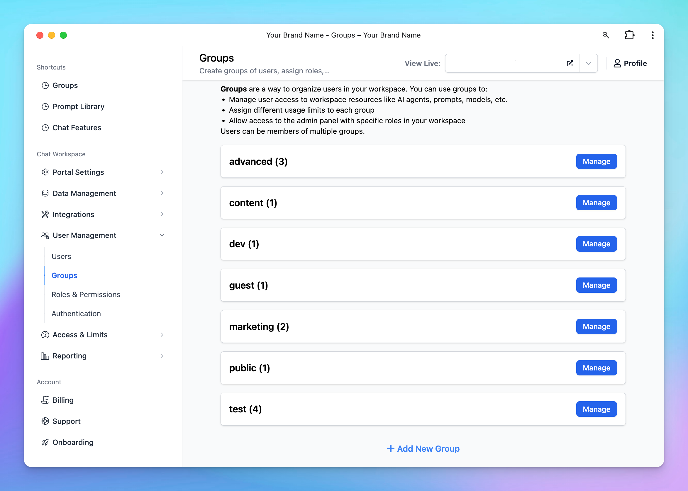
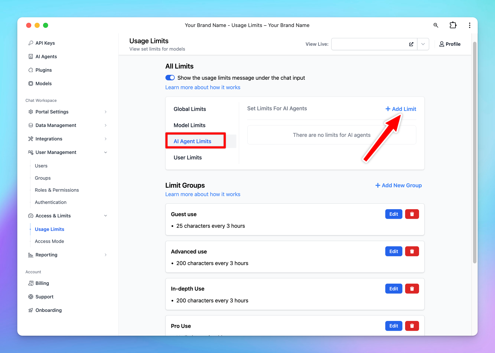

If you were concerned that managing users on TypingMind would be a challenge, you should now be able to set those concerns aside with **TypingMind User Groups**.

TypingMind User Group is built to help you organize and manage users more effectively in your AI workspace.

With User Group, you can:

- Allow user access to the admin panel with specific roles in your workspace
- Manage user access to workspace resources like AI agents, prompts, models, etc.
- Assign different usage limits to each group

Let’s see how it works!

## What is User Group?

**User Groups** allow you to organize your invited users into different categories or teams, called groups. These groups can then be used to:

- **Manage resource access**: control which AI agents, prompts, models, or other workspace resources are available to each group.
- **Set usage limits**: assign specific limits, such as model usage, number of messages a group can send, to each group to better manage your resources and cost.

You can also enable Admin Panel access with tailored [roles and permissions](Roles%20and%20Permissions%202256943d288b473b8139f6fb0fdc653f.md) for each user group. 

With User Groups, you can simplify and streamline the way you manage users in your workspace to ensure that resources and permissions align with the needs of specific teams or individuals.

**Please note that a user can also belong to multiple groups.**

<aside>
💡

The User Group feature is an upgraded version of TypingMind’s previous user tags. If you created tags for users before, those tags will be automatically converted into groups, and users assigned those tags will appear in the corresponding groups

</aside>

## How to use User Groups on TypingMind?

### **Step 1: Create a User Group**

- Go to the **Admin Panel** in your workspace.
- Navigate to the **Groups** section under **User Management**.
- Click on **Add New Group**.

/image%2020.png)

- Enter a **Group Name** that reflects the purpose or role of the group.
- *(Optional)* Enable **Admin Access** for this group if they can have access to the admin panel.
    - If you enable this option, ensure you assign appropriate **Admin Roles** to the group. These roles should align with the permissions you’ve defined in the [**Roles and Permissions**](Roles%20and%20Permissions%202256943d288b473b8139f6fb0fdc653f.md) settings.

- Click **Save** to create the new group

### Step 2: Add Members to the Group

You have two options to assign groups for users:

1. **Add members directly via group**
- Click **Manage** next to the created group
- Click **Add Members**

- Select the users you want to include in this group from the list.

1. Assign groups for users via User list
- Go to Users and click on a specific user
- Assign a group to the user

### Remove users from Groups

- To remove a user in a group, return to the **Manage** section of the group.
- Remove the desired user by clicking on “**Remove**” button next to their email account.

### Step 3: Control the resources and usage limit based on user groups

After completing your setup with user groups, you can use these groups to restrict member usage to specific chat models, prompts, or AI Agents. Please find the next section on how to do this.

## **Restrict AI Model, AI Agent or Prompt Usage with User Groups**

### **1. Restrict chat model usage**

You can manage and restrict the usage of AI models for your team members with the user groups through the following settings:

- Decide which AI models are accessible to specific user groups.
- Set limits on message usage for each AI model—control the number of messages or characters that can be sent (by specific user groups or all users) within a certain time frame.

### **How to set up model usage restrictions:**

 To set this up, please follow the steps below:

- Navigate to the "**Usage & Limit**" under the **Access & Limits** section in the Admin Panel.
- Click on **Model Limits** and select **Add Limit**.

- Choose the AI model you want to restrict
- Click to **Limit Group** —> **Add New Limit Group** —> Add limits for messages and characters

If you don’t want to impose limits, create a group called “No Limit” and leave the message and character limit fields empty.

<aside>
📌

Limit groups are reusable for future restriction settings and can be edited anytime. You’ll find them at the bottom of the **Usage Limits** page.

</aside>

- Scroll down to the **Apply for User Groups** section. Select the user groups you want to apply the limits to by choosing **Users in specific groups**.

<aside>
💡

**Example:** You want only the Content Team to use GPT-4o for content creation.

**Steps**:

- Assign the Content Team to a user group.
- Restrict GPT-4o model usage to that group by creating a limit group.
- Set appropriate message or character limits based on their needs.

</aside>

### **2. Restrict AI Agents access**

You can manage the AI Agents visibility and usage limit using User Groups following the below guidelines:

### **Option 1: Manage via Usage Limits (Same as Model Limit settings)**

- Navigate to the "**Usage & Limit**" under the **Access & Limits** section in the Admin Panel.
- Click on **AI Agent Limits** and select **Add Limit**.

- Select the AI Agents you want to set the limit
- Click to **Limit Group** —> **Add New Limit Group** —> Add limits for messages and characters
- Scroll down to the **Apply for User Groups** section. Select the user groups you want to apply the limits to by choosing **Users in specific groups / All users except users from specific groups.**

### **Option 2: Manage limit directly within AI Agent Settings**

- Go to **AI Agent** section
- Click **Edit** your current AI Agent or **Create new AI Agent**
- Navigate the Usage section within AI Agent settings:
    - **Set up Visibility**: choose the user group that can access to the AI Agent
    - **Set up Usage limits**: create a new limit group or select from existing limit groups to manage messages and characters users can send while using the AI Agent.

<aside>
📌

For example, if you want only Marketing group to use the Marketing Expert AI Agent, here are the steps:

- Add marketing team members to a user group “Marketing”
- Assign the "Marketing" group to the "Marketing Expert" AI Agent:
    - Set its visibility to the "Marketing" group.
    - Apply usage limits as needed for messages and characters.

</aside>

### **3. Restrict Prompt access**

You can control the prompt visibility to specific user groups as follows:

- Go to the **“Prompts Library”** section from the Admin Dashboard.
- Select **“Add Prompt”** to create a new prompt, or **“Edit”** an existing prompt.

- Scroll down to the **“Visibility”** section and select from the drop-down menu:
    - **“Visible only to users in specific groups”:** once you add groups, users in these certain groups are allowed to use the model
    - or **“Visible to all users except users from specific groups”:** once you add groups, users in these certain groups ARE NOT allowed to use the model.

<aside>
💡

**Example:**
If you want only members in the “Guest” group to access the “Content Improver” prompt, assign the “Guest” group to that prompt. Members in other groups will not have access.

</aside>

## Some important notes

- If a user belongs to multiple groups, they will have combined Admin access based on the union of those groups’ settings.
- In cases where usage limits overlap for specific users in a group, the more restrictive setting will typically apply (for example, if one group has a limit of 100 messages and another has 50, the user will be capped at 50).
- We recommend reviewing your group configurations to ensure consistent and clear permissions and to avoid any unexpected overlapped.

## Final thought

By leveraging **TypingMind User Groups**, you can customize your internal AI workspace to the custom needs of your teams. 

From controlling who accesses premium AI models and AI agents to setting strict usage limits to custom prompts, User Groups give you the granular control you need. This makes sure resources are used efficiently, securely, and by the right people, thus enhancing both productivity and collaboration in your AI workspace.

If you have any questions or need help fine-tuning your User Group settings, please feel free to reach out. We’re here to help you make the most of your AI workspace.

## Related Articles

[Usage Limits: Set Limits Per AI Model, Agent, and User](Usage%20Limits%20Set%20Limits%20Per%20AI%20Model,%20Agent,%20and%20U%2025c4f35edbc0408492fefc626ec5345a.md)